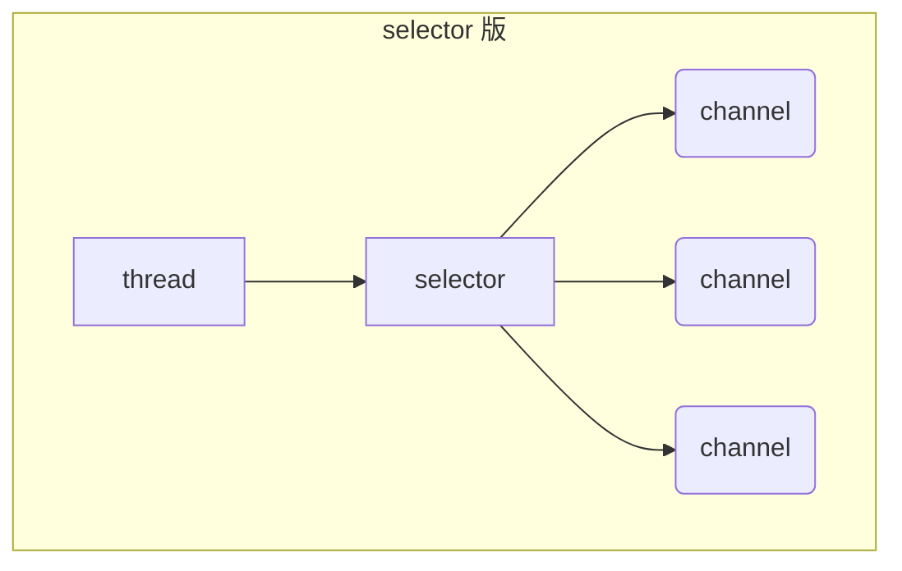

#### ByteBuffereChannel

```java
public static void main(String[] args) {
        try (FileChannel channel = new FileInputStream("data.txt").getChannel()) {
            //准备缓冲区  ByteBuffer抽象类不可以new 通过allocate静态方法直接分配缓冲区内存大小
            ByteBuffer buffer = ByteBuffer.allocate(10);
            while (true) {
                //才从channel中读取数据，向buffer中写入
                int len = channel.read(buffer);
                if (len == -1) {
                    break;
                }
                //将buffer模式切换为read读
                buffer.flip();
                //是否还有未读数据
                while (buffer.hasRemaining()) {
                  	//一次读一个字节
                    byte b = buffer.get();
                    System.out.println((char) b);
                }
                //切换写模式
                buffer.clear();
            }
        } catch (IOException e) {

        }
    }
```

**filp切换读模式  clear切换写模式 compact压缩切换写模式可以防止数据没读完就切换导致数据丢失**


**filp切换读模式，从头开始读，Position到buffer头部。**


**abcd读完后，切换clear写模式后，会恢复到buffer头部位置等待写**


#### ByteBuffer API

**除了通过channel的read方法可以往buffer中写入，也可以通过调用buffer的put方法来写入数据到buffer中。**

```java
//从channel中读取数据，向buffer中写入
int len = channel.read(buffer);
//通过buffer put方法写入buffer
buffer.put((char) c);

//从buffer读取数据同样有两种方式
调用channel的write方法
  channel.write(buffer);
调用buffer的get方法
  buffer.get();
/*
	💡：get方法会移动position指针，如果想要重复读取数据
	- 调用rewind方法将position置为0
	- 调用get(int i)方法获取索引 i 的内容，它不会移动指针
*/
```

#### 黏包、半包

网络上有多条数据发送给服务端，数据之间使用 \n 进行分隔
但由于某种原因这些数据在接收时，被进行了重新组合，例如原始数据有3条为

* Hello,world\n
* I'm zhangsan\n
* How are you?\n

变成了下面的两个 byteBuffer (黏包，半包)

* Hello,world\nI'm zhangsan\nHo
* w are you?\n

现在要求你编写程序，将错乱的数据恢复成原始的按 \n 分隔的数据。

```java
public static void main(String[] args) {
  ByteBuffer source = ByteBuffer.allocate(32);
  //                     11            24
  source.put("Hello,world\nI'm zhangsan\nHo".getBytes());
  split(source);

  source.put("w are you?\nhaha!\n".getBytes());
  split(source);
}
/*
	拆分source为完整的一句话。
*/
private static void split(ByteBuffer source) {
  //将buffer转换成读模式
  source.flip();
  int oldLimit = source.limit();
  for (int i = 0; i < oldLimit; i++) {
    if (source.get(i) == '\n') {
      //  i + 1 - source.position()就是获取完成的一句话的长度。从H到\n的长度，此时读模式下position是指向第一个字符的。
      ByteBuffer target = ByteBuffer.allocate(i + 1 - source.position());
      // 0 ~ limit
      source.limit(i + 1);
      target.put(source); // 从source 读，向 target 写
      debugAll(target);
      source.limit(oldLimit);
    }
  }
  /*这边不能使用clear，因为会clear会从来开始写，会导致 Ho 字符被覆盖。
  	compact会将第一次没有读完的数据向前移动，和下一次要读的数据结合在一起。
  */
  source.compact();
}
```

#### 遍历目录文件

```java
public static void main(String[] args) throws IOException {
    Path path = Paths.get("C:\\Program Files\\Java\\jdk1.8.0_91");
    AtomicInteger dirCount = new AtomicInteger();
    AtomicInteger fileCount = new AtomicInteger();
    Files.walkFileTree(path, new SimpleFileVisitor<Path>(){
      //这边用到了访问者模式。遍历是walkFileTree帮忙实现了，具体到文件内容的时候就可以通过SimpleFileVisitor来进行业务逻辑的实现。
        @Override
        public FileVisitResult preVisitDirectory(Path dir, BasicFileAttributes attrs) 
            throws IOException {
            System.out.println(dir);
            dirCount.incrementAndGet();
            return super.preVisitDirectory(dir, attrs);
        }

        @Override
        public FileVisitResult visitFile(Path file, BasicFileAttributes attrs) 
            throws IOException {
            System.out.println(file);
            fileCount.incrementAndGet();
            return super.visitFile(file, attrs);
        }
    });
    System.out.println(dirCount); // 133
    System.out.println(fileCount); // 1479
}
```

#### 拷贝多级目录

```java
long start = System.currentTimeMillis();
String source = "D:\\Snipaste-1.16.2-x64";
String target = "D:\\Snipaste-1.16.2-x64aaa";

Files.walk(Paths.get(source)).forEach(path -> {
    try {
        String targetName = path.toString().replace(source, target);
        // 是目录
        if (Files.isDirectory(path)) {
            Files.createDirectory(Paths.get(targetName));
        }
        // 是普通文件
        else if (Files.isRegularFile(path)) {
            Files.copy(path, Paths.get(targetName));
        }
    } catch (IOException e) {
        e.printStackTrace();
    }
});
long end = System.currentTimeMillis();
System.out.println(end - start);
```

## 💡网络编程

### 4.1 非阻塞 vs 阻塞

#### 阻塞

* 阻塞模式下，相关方法都会导致线程暂停
  * ServerSocketChannel.accept 会在没有连接建立时让线程暂停
  * SocketChannel.read 会在没有数据可读时让线程暂停
  * 阻塞的表现其实就是线程暂停了，暂停期间不会占用 cpu，但线程相当于闲置
* 单线程下，阻塞方法之间相互影响，几乎不能正常工作，需要多线程支持
* 但多线程下，有新的问题，体现在以下方面
  * 32 位 jvm 一个线程 320k，64 位 jvm 一个线程 1024k，如果连接数过多，必然导致 OOM，并且线程太多，反而会因为频繁上下文切换导致性能降低
  * 可以采用线程池技术来减少线程数和线程上下文切换，但治标不治本，如果有很多连接建立，但长时间 inactive，会阻塞线程池中所有线程，因此不适合长连接，只适合短连接

服务器端

```java
// 使用 nio 来理解阻塞模式, 单线程
// 0. ByteBuffer
ByteBuffer buffer = ByteBuffer.allocate(16);
// 1. 创建了服务器
ServerSocketChannel ssc = ServerSocketChannel.open();

// 2. 绑定监听端口
ssc.bind(new InetSocketAddress(8080));

// 3. 连接集合
List<SocketChannel> channels = new ArrayList<>();
while (true) {
    // 4. accept 建立与客户端连接， SocketChannel 用来与客户端之间通信
    log.debug("connecting...");
    SocketChannel sc = ssc.accept(); // 阻塞方法，线程停止运行
    log.debug("connected... {}", sc);
    channels.add(sc);
    for (SocketChannel channel : channels) {
        // 5. 接收客户端发送的数据
        log.debug("before read... {}", channel);
        channel.read(buffer); // 阻塞方法，线程停止运行
        buffer.flip();
        debugRead(buffer);
        buffer.clear();
        log.debug("after read...{}", channel);
    }
}
```

客户端

```java
SocketChannel sc = SocketChannel.open();
sc.connect(new InetSocketAddress("localhost", 8080));
System.out.println("waiting...");
```

#### 非阻塞

* 非阻塞模式下，相关方法都会不会让线程暂停
  * 在 ServerSocketChannel.accept 在没有连接建立时，会返回 null，继续运行
  * SocketChannel.read 在没有数据可读时，会返回 0，但线程不必阻塞，可以去执行其它 SocketChannel 的 read 或是去执行 ServerSocketChannel.accept 
  * 写数据时，线程只是等待数据写入 Channel 即可，无需等 Channel 通过网络把数据发送出去
* 但非阻塞模式下，即使没有连接建立，和可读数据，线程仍然在不断运行，白白浪费了 cpu
* 数据复制过程中，线程实际还是阻塞的（AIO 改进的地方）


服务器端，客户端代码不变

```java
// 使用 nio 来理解非阻塞模式, 单线程
// 0. ByteBuffer
ByteBuffer buffer = ByteBuffer.allocate(16);
// 1. 创建了服务器
ServerSocketChannel ssc = ServerSocketChannel.open();
ssc.configureBlocking(false); // 非阻塞模式
// 2. 绑定监听端口
ssc.bind(new InetSocketAddress(8080));
// 3. 连接集合
List<SocketChannel> channels = new ArrayList<>();
while (true) {
    // 4. accept 建立与客户端连接， SocketChannel 用来与客户端之间通信
    SocketChannel sc = ssc.accept(); // 非阻塞，线程还会继续运行，如果没有连接建立，但sc是null
    if (sc != null) {
        log.debug("connected... {}", sc);
        sc.configureBlocking(false); // 非阻塞模式
        channels.add(sc);
    }
    for (SocketChannel channel : channels) {
        // 5. 接收客户端发送的数据
        int read = channel.read(buffer);// 非阻塞，线程仍然会继续运行，如果没有读到数据，read 返回 0
        if (read > 0) {
            buffer.flip();
            debugRead(buffer);
            buffer.clear();
            log.debug("after read...{}", channel);
        }
    }
}
```

### 4.2 Selector



好处

* 一个线程配合 selector 就可以监控多个 channel 的事件，事件发生线程才去处理。避免非阻塞模式下所做无用功
* 让这个线程能够被充分利用
* 节约了线程的数量
* 减少了线程上下文切换

#### 创建

```java
Selector selector = Selector.open();
```

#### 绑定 Channel 事件

也称之为注册事件，绑定的事件 selector 才会关心 

```java
channel.configureBlocking(false);
SelectionKey key = channel.register(selector, 绑定事件);
```

* channel 必须工作在非阻塞模式
* FileChannel 没有非阻塞模式，因此不能配合 selector 一起使用
* 绑定的事件类型可以有
  * connect - 客户端连接成功时触发
  * accept - 服务器端成功接受连接时触发
  * read - 数据可读入时触发，有因为接收能力弱，数据暂不能读入的情况
  * write - 数据可写出时触发，有因为发送能力弱，数据暂不能写出的情况


#### 监听 Channel 事件

可以通过下面三种方法来监听是否有事件发生，方法的返回值代表有多少 channel 发生了事件

方法1，阻塞直到绑定事件发生

```java
int count = selector.select();
```


方法2，阻塞直到绑定事件发生，或是超时（时间单位为 ms）

```java
int count = selector.select(long timeout);
```


方法3，不会阻塞，也就是不管有没有事件，立刻返回，自己根据返回值检查是否有事件

```java
int count = selector.selectNow();
```


#### 💡 select 何时不阻塞

> * 事件发生时
>   * 客户端发起连接请求，会触发 accept 事件
>   * 客户端发送数据过来，客户端正常、异常关闭时，都会触发 read 事件，另外如果发送的数据大于 buffer 缓冲区，会触发多次读取事件
>   * channel 可写，会触发 write 事件
>   * 在 linux 下 nio bug 发生时
> * 调用 selector.wakeup()
> * 调用 selector.close()
> * selector 所在线程 interrupt

### 4.3 处理 accept 事件

客户端代码为

```java
public class Client {
    public static void main(String[] args) {
        try (Socket socket = new Socket("localhost", 8080)) {
            System.out.println(socket);
            socket.getOutputStream().write("world".getBytes());
            System.in.read();
        } catch (IOException e) {
            e.printStackTrace();
        }
    }
}
```

服务器端代码为

```java
@Slf4j
public class ChannelDemo6 {
    public static void main(String[] args) {
        try (ServerSocketChannel channel = ServerSocketChannel.open()) {
            channel.bind(new InetSocketAddress(8080));
            System.out.println(channel);
            Selector selector = Selector.open();
            channel.configureBlocking(false);
            channel.register(selector, SelectionKey.OP_ACCEPT);

            while (true) {
                int count = selector.select();
//                int count = selector.selectNow();
                log.debug("select count: {}", count);
//                if(count <= 0) {
//                    continue;
//                }

                // 获取所有事件
                Set<SelectionKey> keys = selector.selectedKeys();

                // 遍历所有事件，逐一处理
                Iterator<SelectionKey> iter = keys.iterator();
                while (iter.hasNext()) {
                    SelectionKey key = iter.next();
                    // 判断事件类型
                    if (key.isAcceptable()) {
                        ServerSocketChannel c = (ServerSocketChannel) key.channel();
                        // 必须处理
                        SocketChannel sc = c.accept();
                        log.debug("{}", sc);
                    }
                    // 处理完毕，必须将事件移除
                    iter.remove();
                }
            }
        } catch (IOException e) {
            e.printStackTrace();
        }
    }
}
```


#### 💡 事件发生后能否不处理

> 事件发生后，要么处理，要么取消（cancel），不能什么都不做，否则下次该事件仍会触发，这是因为 nio 底层使用的是水平触发

```java
@Slf4j
public class ChannelDemo6 {
    public static void main(String[] args) {
        try (ServerSocketChannel channel = ServerSocketChannel.open()) {
            channel.bind(new InetSocketAddress(8080));
            System.out.println(channel);
            Selector selector = Selector.open();
            channel.configureBlocking(false);
            channel.register(selector, SelectionKey.OP_ACCEPT);

            while (true) {
                int count = selector.select();
//                int count = selector.selectNow();
                log.debug("select count: {}", count);
//                if(count <= 0) {
//                    continue;
//                }

                // 获取所有事件
                Set<SelectionKey> keys = selector.selectedKeys();

                // 遍历所有事件，逐一处理
                Iterator<SelectionKey> iter = keys.iterator();
                while (iter.hasNext()) {
                    SelectionKey key = iter.next();
                    // 判断事件类型
                    if (key.isAcceptable()) {
                        ServerSocketChannel c = (ServerSocketChannel) key.channel();
                        // 必须处理
                        SocketChannel sc = c.accept();
                        sc.configureBlocking(false);
                        sc.register(selector, SelectionKey.OP_READ);
                        log.debug("连接已建立: {}", sc);
                    } else if (key.isReadable()) {
                        SocketChannel sc = (SocketChannel) key.channel();
                        ByteBuffer buffer = ByteBuffer.allocate(128);
                        int read = sc.read(buffer);
                        if(read == -1) {
                            key.cancel();
                            sc.close();
                        } else {
                            buffer.flip();
                            debug(buffer);
                        }
                    }
                    // 处理完毕，必须将事件移除
                    iter.remove();
                }
            }
        } catch (IOException e) {
            e.printStackTrace();
        }
    }
}
```

