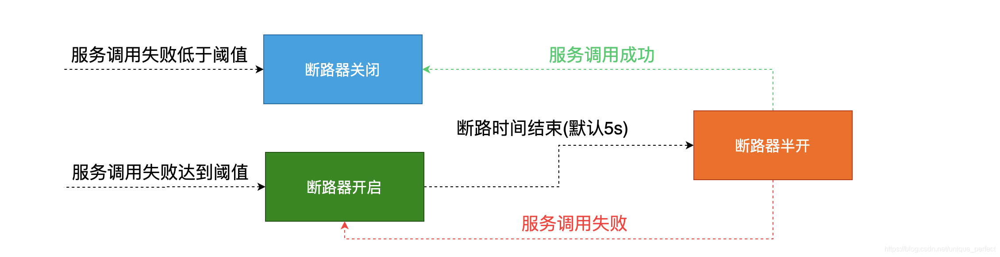
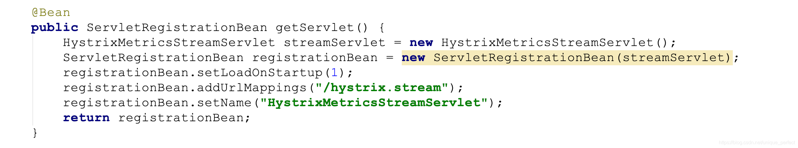
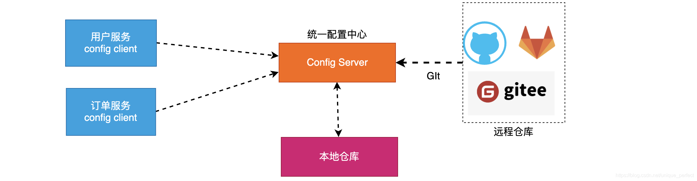
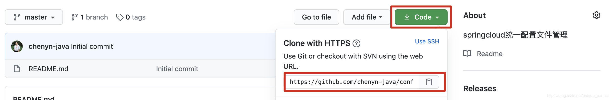
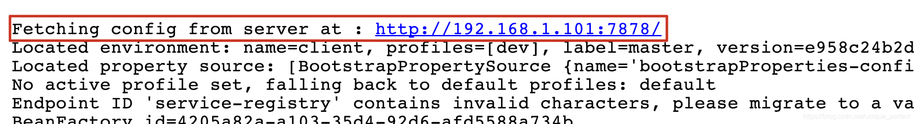
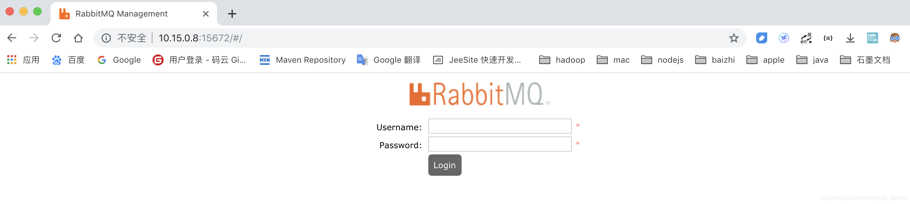
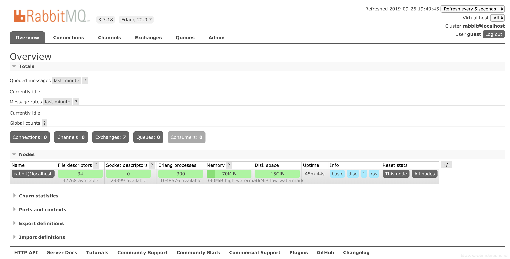
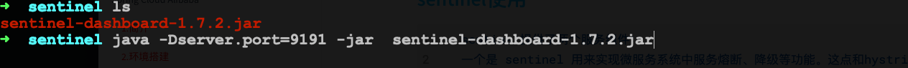
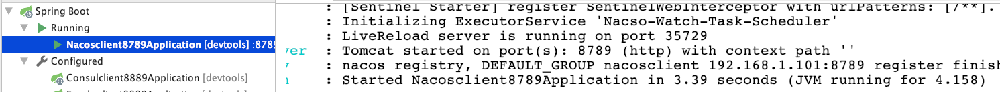

核心架构及其组件

```markdown
# 1 核心组件说明
eurekaserver、consul、nacos    服务注册中心组件
rabbion & openfeign  	 服务负载均衡 和 服务调用组件
hystrix & hystrix dashboard   服务断路器  和  服务监控组件
zuul、gateway 		服务网关组件
config 		 统一配置中心组件
bus        消息总线 
```

#### 版本选择

```markdown
Hoxton		版本基于springboot2.2.x版本进行构建  
```

###### 6.2.2.1 安装consul

```
启动consul服务
解压后到consul目录下打开cmd输入命令就直接启动了，运行命令
 consul agent -dev -ui -node=cy
-dev开发服务器模式启动，-node结点名为cy，-ui可以用界面
访问，默认能访问。
```

```
访问consul的web服务端口
http://localhost:8500
consul默认服务端口是8500
```

###### 6.2.2.2 开发consul客户端即微服务

```xml
 <!--引入consul依赖-->
<dependency>
  <groupId>org.springframework.cloud</groupId>
  <artifactId>spring-cloud-starter-consul-discovery</artifactId>
</dependency>
```

```markdown
# 2 编写properties配置
```

```properties
server.port=8889
spring.application.name=consulclient8889
spring.cloud.consul.host=localhost	 # 注册consul服务的主机
spring.cloud.consul.port=8500		#注册consul服务的端口号
spring.cloud.consul.discovery.register-health-check=false	    #关闭consu服务的健康检查[不推荐]
spring.cloud.consul.discovery.service-name=${spring.application.name} #指定注册的服务名称 默认就是应用名 
```

```markdown
# 3 启动服务查看consul界面服务信息
spring.cloud.consul.discovery.register-health-check=true # 则会报下面这个错误，改为false则不会，但不推荐。下面则是解决方案
```


  

###### 6.2.2.3 consul开启健康监控检查

```xml
<!-- 这个包是用做健康度监控的-->
<dependency>
  <groupId>org.springframework.boot</groupId>
  <artifactId>spring-boot-starter-actuator</artifactId>
</dependency> 
```

###### 6.2.2.4 consul关闭健康监控检查

```properties
server.port=8889
spring.application.name=consulclient8889
spring.cloud.consul.host=localhost		#注册consul服务的主机
spring.cloud.consul.port=8500		#注册consul服务的端口号
spring.cloud.consul.discovery.register-health-check=false	    #关闭consul服务的健康检查[不推荐]
spring.cloud.consul.discovery.service-name=${spring.application.name} #指定注册的服务名称 默认就是应用 
```

### 7 服务间通信方式 

```
总结:在springcloud中服务间调用方式主要是使用 http restful方式进行服务间调用

HTTP  rest 方式    json格式
RPC 方式          远程过程调用 
OSI ：物理层 数据链路	层 传输层（RPC） 会话层  表示层  应用层（HTTP）
比如Dubbo框架 虽然高效 但是只有两个系统必须都是java开发的才能使用Dubbo
```

#### 7.1 基于RestTemplate的服务调用

```markdown
# 1 说明
spring框架提供的RestTemplate类可用于在应用中调用rest服务，它简化了与http服务的通信方式，统一了RESTful的标准，封装了http链接， 我们只需要传入url及返回值类型即可。相较于之前常用的HttpClient，RestTemplate是一种更优雅的调用RESTful服务的方式。
```

##### 7.1.1 RestTemplate服务调用

```markdown
# 2 在商品服务中提供服务方法
```

```java
@RestController
@Slf4j
public class ProductController {
    @Value("${server.port}")
    private int port;
    @GetMapping("/product/findAll")
    public Map<String,Object> findAll(){
        log.info("商品服务查询所有调用成功,当前服务端口:[{}]",port);
        Map<String, Object> map = new HashMap<String,Object>();
        map.put("msg","服务调用成功,服务提供端口为: "+port);
        map.put("status",true);
        return map;
    }
} 
```

```markdown
# 3 在用户服务中使用restTemplate进行调用
```

```java
@RestController
@Slf4j
public class UserController {
    @GetMapping("/user/findAll")
    public String findAll(){
        log.info("调用用户服务...");
        //1.使用restTemplate调用商品服务
        RestTemplate restTemplate = new RestTemplate();
        String forObject = restTemplate.getForObject("http://localhost:9998/product/findAll", 
                                                     String.class);
        return forObject;
    }
}
```

```markdown
# 5 测试服务调用
```

```
浏览器访问用户服务 http://localhost:9999/user/findAll  
```

```markdown
# 6 总结
rest Template是直接基于服务地址调用没有在服务注册中心获取服务,也没有办法完成服务的负载均衡如果需要实现服务的负载均衡需要自己书写服务负载均衡策略。

# 7 restTemplate直接调用存在问题
1 直接使用restTemplate方式调用没有经过服务注册中心获取服务地址,代码写死不利于维护,当服务宕机时不能高效剔除
2 调用服务时没有负载均衡需要自己实现负载均衡策略
```

```java
@GetMapping("/user/findAll")
public String findAll(){
  log.info("进入用户服务...");
  //1.使用restTemplate调用商品服务
  RestTemplate restTemplate = new RestTemplate();
  String forObject = restTemplate.getForObject("http://"+randomHost()+"/product/findAll",
                                               String.class);
  return forObject;
}
public static String randomHost() {
  List<String> list = new ArrayList<>();
  list.add("localhost:9997");
  list.add("localhost:9998");
  int i = new Random().nextInt(2);
  return list.get(i);
}
```


#### 7.2 基于Ribbon的服务调用

```markdown
Spring Cloud Ribbon是一个基于HTTP和TCP的客户端负载均衡工具，它基于Netflix Ribbon实现。通过Spring Cloud的封装，可以让我们轻松地将面向服务的REST模版请求自动转换成客户端负载均衡的服务调用。
# 原理
根据请求id，先去服务注册中心获取对应的服务列表，然后根据默认轮询策略再选择一台可用节点。
# Ribbon负载均衡策略
通过源码可知，Ribbon底层的负载均衡策略父接口IRule，这个接口中提供了很多策略：
	轮询，随机，根据响应时间加权.  默认是轮询  
```

##### 7.2.1 Ribbon服务调用

```markdown
# 1 项目中引入依赖
说明: 
1 如果使用的是eureka client 和 consul client,无须引入依赖,因为在eureka,consul中默认集成了ribbon组件
2 如果使用的client中没有ribbon依赖需要显式引入如下依赖
```

```xml
<!--引入ribbon依赖-->
<dependency>
  <groupId>org.springframework.cloud</groupId>
  <artifactId>spring-cloud-starter-netflix-ribbon</artifactId>
</dependency>
```

```markdown
# 3 使用restTemplate + ribbon进行服务调用
使用discovery client  进行客户端调用
使用loadBalanceClient 进行客户端调用
使用@loadBalanced     进行客户端调用
```

```markdown
# 3.1 使用discovery Client形式调用
```

```java
@Autowired
private DiscoveryClient discoveryClient;

//获取服务列表
List<ServiceInstance> products = discoveryClient.getInstances("服务ID(服务名)");
for (ServiceInstance product : products) {
  log.info("服务主机:[{}]",product.getHost());
  log.info("服务端口:[{}]",product.getPort());
  log.info("服务地址:[{}]",product.getUri());
}
```

```markdown
# 3.2 使用loadBalance Client形式调用
```

```java
@Autowired
private LoadBalancerClient loadBalancerClient;
//根据负载均衡策略选取某一个服务调用
ServiceInstance product = loadBalancerClient.choose("服务ID");//地址  轮询策略，服务ID(服务名)
log.info("服务主机:[{}]",product.getHost());
log.info("服务端口:[{}]",product.getPort());
log.info("服务地址:[{}]",product.getUri());
```

```markdown
# 3.3 使用@loadBalanced
```

```java
//1.整合restTemplate + ribbon
@Bean
@LoadBalanced
public RestTemplate getRestTemplate(){
  return new RestTemplate();
}
//2.调用服务位置注入RestTemplate
@Autowired
private RestTemplate restTemplate;
//3.调用
String forObject = restTemplate.getForObject("http://服务ID/hello/hello?name=" + name, String.class);  // 服务ID(服务名)
```

##### 7.2.2 Ribbon负载均衡策略

```markdown
# 1 ribbon负载均衡算法
RoundRobinRule         		轮训策略	
RandomRule             		随机策略	随机选择 Server  
AvailabilityFilteringRule 可用过滤策略
会先过滤由于多次访问故障而处于断路器跳闸状态的服务，还
有并发的连接数量超过阈值的服务，然后对剩余的服务列表按
照轮询策略进行访问

WeightedResponseTimeRule  响应时间加权策略   
根据平均响应的时间计算所有服务的权重，响应时间越快服务
权重越大被选中的概率越高，刚启动时如果统计信息不足，则使用		
RoundRobinRule策略，等统计信息足够会切换到 WeightedResponseTimeRule

RetryRule        重试策略          
先按照RoundRobinRule的策略获取服务，如果获取失败则在制
定时间内进行重试，获取可用的服务。
 
BestAviableRule           最低并发策略     
会先过滤掉由于多次访问故障而处于断路器跳闸状态的服务，
然后选择一个并发量最小的服务
```


##### 7.2.3 修改服务的默认负载均衡策略

```markdown
# 1 修改服务默认随机策略
服务id.ribbon.NFLoadBalancerRuleClassName=com.netflix.loadbalancer.RandomRule
下面的products为服务的唯一标识
products.ribbon.NFLoadBalancerRuleClassName=com.netflix.loadbalancer.RandomRule
```


   

### 8 OpenFeign组件的使用

```java
String restTemplateForObject = restTemplate.getForObject("http://服务名/url?参数" + name, String.class);
```

```markdown
# 存在问题:
1 每次调用服务都需要写这些代码,存在大量的代码冗余
2 服务地址如果修改,维护成本增高
3 使用时不够灵活
```

#### 8.1 OpenFeign组件

```markdown
# 1 说明
https://cloud.spring.io/spring-cloud-openfeign/reference/html/
Feign是一个声明式的伪Http客户端，它使得写Http客户端变得更简单。使用Feign，只需要创建一个接口并注解。它具有可插拔的注解特性(可以使用springmvc的注解)，可使用Feign 注解和JAX-RS注解。Feign支持可插拔的编码器和解码器。Feign默认集成了Ribbon，默认实现了负载均衡的效果并且springcloud为feign添加了springmvc注解的支持。
```

##### 8.1.1 openFeign服务调用

```markdown
# 1 服务调用方法引入依赖OpenFeign依赖
```

```xml
<!--Open Feign依赖-->
<dependency>
    <groupId>org.springframework.cloud</groupId>
    <artifactId>spring-cloud-starter-openfeign</artifactId>
</dependency> 
```

```markdown
# 2 入口类加入注解开启OpenFeign支持
```

```java
@SpringBootApplication
@EnableFeignClients   //开启openfeign支持
public class Users9999Application {
    public static void main(String[] args) {
        SpringApplication.run(Users9999Application.class, args);
    }
} 
```

```markdown
# 3 创建一个客户端调用接口
```

```java
[一个接口一个注释]、
    1.零散  ?id=xx  queryString方式  url传参url/xx/xx    只有一个参数默认是？形式  多个需要加@ReuqestParam("name")注解   路径url使用@PathVariable("name")
    2.对象
   一般使用@PostMapping 
    application/json  @RequestBody 调用与接收都需要加这个注解
    3.数组或集合
    数组只能？形式 @RequestParam("name")
    集合 springmvc不能直接接收集合类型参数，必须封装成对象
    
openFeign相应处理
    自定义格式解析----用String接收----两次反序列化
    对象-->json   序列化
    json-->对象   反序列化
    fastJson依赖     JSONObject.parse()  返回JSONObject   这个返回的JSONObject实现了Map
    
    二次反序列化
    jsonObject.parseArray(aa.toString,BB.class)  返回值 List<BB>
    
//value属性用来指定:调用服务名称
@FeignClient("PRODUCTS")
public interface ProductClient {
	@GetMapping("/product/findAll") //书写服务调用路径
		String findAll();
} 
```
```markdown
# 4 使用feignClient客户端对象调用服务
```

```java
//注入客户端对象
@Autowired
private ProductClient productClient;

@GetMapping("/user/findAllFeignClient")
public String findAllFeignClient(){
  log.info("通过使用OpenFeign组件调用商品服务...");
  String msg = productClient.findAll();
  return msg;
}
```

```markdown
# 5 访问并测试服务
http://localhost:9999/user/findAllFeignClient 
```

##### 8.1.2 调用服务并传参

```markdown
# 1 说明
服务和服务之间通信,不仅仅是调用,往往在调用过程中还伴随着参数传递,接下来重点来看看OpenFeign在调用服务时如何传递参数
```

###### 8.1.2.1 GET方式调用服务传递参数  

2.用户服务中在product客户端中声明方法


   

```markdown
# 2 传递对象类型参数
商品服务定义对象
商品服务定义对象接收方法
用户服务调用商品服务定义对象参数方法进行参数传递
```

```java
//1.商品服务定义对象
@Data
public class Product {
    private Integer id;
    private String name;
    private Date bir;
} 
```

```java
//2.商品服务定义接收对象的方法
@PostMapping("/product/saveProduct")
public Map<String,Object> saveProduct(@RequestBody Product product){
  log.info("商品服务保存商品信息调用成功,当前服务端口:[{}]",port);
  log.info("当前接收商品名称:[{}]",product);
  Map<String, Object> map = new HashMap<String,Object>();
  map.put("msg","商品服务查询商品信息调用成功,当前服务端口: "+port);
  map.put("status",true);
  map.put("product",product);
  return map;
}
```

```java
//3.将商品对象复制到用户服务中
//4.用户服务中在product客户端中声明方法
@FeignClient("PRODUCTS")
public interface ProductClient {
  @PostMapping("/product/saveProduct")
  String saveProduct(@RequestBody Product product);
}
//注意:服务提供方和调用方一定要加入@RequestBody注解 
```

```java
// 5.在用户服务中调用保存商品信息服务
//注入客户端对象
@Autowired
private ProductClient productClient;

@GetMapping("/user/saveProduct")
public String saveProduct(Product product){
  log.info("接收到的商品信息:[{}]",product);
  String save = productClient.saveProduct(product);
  log.info("调用成功返回结果: "+save);
  return save;
} 
```

  

##### 8.1.3 OpenFeign超时设置

```markdown
# 1 超时说明
默认情况下,openFiegn在进行服务调用时,要求服务提供方处理业务逻辑时间必须在1S内返回,如果超过1S没有返回则OpenFeign会直接报错,不会等待服务执行,但是往往在处理复杂业务逻辑是可能会超过1S,因此需要修改OpenFeign的默认服务调用超时时间。
```

```markdown
# 4 修改OpenFeign默认超时时间
```

```properties
feign.client.config.PRODUCTS.connectTimeout=5000  # 配置指定服务连接超时
feign.client.config.PRODUCTS.readTimeout=5000		  # 配置指定服务等待超时
#feign.client.config.default.connectTimeout=5000  # 配置所有服务连接超时
#feign.client.config.default.readTimeout=5000			# 配置所有服务等待超时
```

##### 8.1.4 OpenFeign调用详细日志展示

```markdown
NONE  不记录任何日志
BASIC 仅仅记录请求方法，url，响应状态代码及执行时间
HEADERS 记录Basic级别的基础上，记录请求和响应的header
FULL 记录请求和响应的header，body和元数据
```

```markdown
# 2 开启日志展示
```

```properties
feign.client.config.PRODUCTS.loggerLevel=full  # 开启指定服务日志展示
#feign.client.config.default.loggerLevel=full  # 全局开启服务日志展示
logging.level.com.yxj.feignclients=debug # 指定feign调用客户端对象所在包,必须是debug级别
```

```markdown
# 3 测试服务调用查看日志
```

 

3 测试服务调用查看日志

```properties
feign.client.config.PRODUCTS.loggerLevel=full  # 开启指定服务日志展示
#feign.client.config.default.loggerLevel=full  # 全局开启服务日志展示
logging.level.com.yxj.feignclients=debug    # 指定feign调用客户端对象所在包,必须是debug级别
```


### 9 Hystrix组件使用

  

```markdown
# 1 说明
https://github.com/Netflix/Hystrix
译: 在分布式环境中，许多服务依赖项不可避免地会失败。
Hystrix是一个库，它通过添加延迟容忍和容错逻辑来帮助您控制这些分布式服务之间的交互。Hystrix通过隔离服务之间的访问点、停止它们之间的级联故障以及提供后备选项来实现这一点，所有这些都可以提高系统的整体弹性。

通俗定义: Hystrix是一个用于处理分布式系统的延迟和容错的开
源库，在分布式系统中，许多依赖不可避免的会调用失败，
超时、异常等，Hystrix能够保证在一个依赖出问题的情况下，
不会导致整体服务失败，避免级联故障(服务雪崩现象)，提高分
布式系统的弹性。
```

##### 9.1.1 服务雪崩

``` markdown
# 1 服务雪崩
在微服务之间进行服务调用是由于某一个服务故障，导致级联服务故障的现象，称为雪崩效应。雪崩效描述的是提供方不可用，导致消费方不可用并将不可用逐渐放大的过程。 
```

##### 9.1.2 服务熔断

```markdown
# 服务熔断
“熔断器”本身是一种开关装置，当某个服务单元发生故障之后，通过断路器的故障监控，某个异常条件被触发，直接熔断整个服务。向调用方法返回一个符合预期的、可处理的备选响应(FallBack),而不是时间的等待或者抛出调用方法无法处理的异常，就保证了服务调用方的线程不会被长时间占用，避免故障在分布式系统中蔓延，乃至雪崩。如果目标服务情况好转则恢复调用。服务熔断是解决服务雪崩的重要段。
```

##### 9.1.3 服务降级

```markdown
关闭系统中边缘服务 保证系统核心服务的正常运行  
淘宝 删除地址  确认收货  删除订单   取消支付   节省cpu  内存

# 服务降级图示
```

  

##### 9.1.4 降级和熔断总结

```markdown
# 1 共同点
目的很一致，都是从可用性可靠性着想，为防止系统的整体缓慢甚至崩溃
采用的技术手段；
最终表现类似，对于两者来说，最终让用户体验到的是某些功能暂时不可达或不可用；
粒度一般都是服务级别，当然，业界也有不少更细粒度的做法，比如做到数据持久层（允许查询，不允许增删改）；
自治性要求很高，熔断模式一般都是服务基于策略的自动触发，降级虽说可人工干预，但在微服务架构下，完全靠人显然不可能，开关预置、配置中心都是必要手段；

# 2 异同点
触发原因不太一样，服务熔断一般是某个服务（下游服务）故障引起，而服务降级一般是从整体负荷考虑；管理目标的层次不太一样，熔断其实是一个框架级的处理，每个微服务都需要（无层级之分），而降级一般需要对业务有层级之分（比如降级一般是从最外围服务开始）

# 3 总结
熔断必会触发降级,所以熔断也是降级一种,区别在于熔断是对调用链路的保护,而降级是对系统过载的一种保护处理
```


##### 9.1.5 服务熔断的实现

```markdown
# 服务熔断的实现思路
引入hystrix依赖,并开启熔断器(断路器)
模拟降级方法
进行调用测试
```

```markdown
# 1 项目中引入hystrix依赖
```

```xml
<!--引入hystrix-->
<dependency>
  <groupId>org.springframework.cloud</groupId>
  <artifactId>spring-cloud-starter-netflix-hystrix</artifactId>
</dependency>
```

```markdown
# 2 开启断路器
```

```java
@SpringBootApplication
@EnableCircuitBreaker  //用来开启断路器
public class Products9998Application {
    public static void main(String[] args) {
        SpringApplication.run(Products9998Application.class, args);
    }
}
```

```markdown
# 3 使用HystrixCommand注解实现断路
```

```java
//服务熔断
@GetMapping("/product/break")
@HystrixCommand(fallbackMethod = "testBreakFall" )
public String testBreak(int id){
  log.info("接收的商品id为: "+ id);
  if(id<=0){
    throw new RuntimeException("数据不合法!!!");
  }
  return "当前接收商品id: "+id;
}

public String testBreakFall(int id){
  return "当前数据不合法: "+id;
}
```

```markdown
# 5 总结
从上面演示过程中会发现如果触发一定条件断路器会自动打开,过
了一点时间正常之后又会关闭。那么断路器打开条件是什么呢？
```

```markdown
1  当满足一定的阀值的时候（默认10秒内超过20个请求次数）
2  当失败率达到一定的时候（默认10秒内超过50%的请求失败）
3  到达以上阀值，断路器将会开启
4  当开启的时候，所有请求都不会进行转发
5 一段时间之后（默认是5秒），这个时候断路器是半开状态，会让其中一个请求进行转发。如果成功，断路器会关闭，若失败，继续开启。重复4和5。
```

   

```java
//服务降级处理
public String testDefaultFallBack() {
  return port + "当前服务已经被降级处理!!!";
}

@GetMapping("/product/hystrix")
@HystrixCommand(defaultFallback = "testDefaultFallBack") 
public String testHystrix(String name) {
  log.info("接收名称为: " + name);
  int n = 1/0;
  return "服务[" + port + "]响应成功,当前接收名称为:" + name;
}
```

##### 9.1.6 服务降级的实现

```markdown
# 1 客户端openfeign + hystrix实现服务降级实现
引入hystrix依赖
配置文件开启feign支持hystrix
在feign客户端调用加入fallback指定降级处理
开发降级处理方法
```

```markdown
# 2 开启openfeign支持服务降级
```

```properties
feign.hystrix.enabled=true # 开启openfeign支持降级
```

```markdown
# 3 在openfeign客户端中加入Hystrix
```

```java
@FeignClient(value = "PRODUCTS",fallback = ProductFallBack.class)
public interface ProductClient {
    @GetMapping("/product/hystrix")
    String testHystrix(@RequestParam("name") String name);
} 
```

```markdown
# 4 开发fallback处理类
```

```java
@Component
public class ProductFallBack implements ProductClient {
    @Override
    public String testHystrix(String name) {
        return "我是客户端的Hystrix服务实现!!!";
    }
}
```


  

```markdown
# 注意:
如果服务端降级和客户端降级同时开启
要求服务端降级方法的返回值必须与客户端方法降级的返回值一致
```


##### 9.1.7 Hystrix Dashboard

```markdown
# 1 说明
Hystrix Dashboard的一个主要优点是它收集了关于每个HystrixCommand的一组
度量。Hystrix仪表盘以高效的方式显示每个断路器的运行状况。
```


  

```markdown
# 2 项目中引入依赖
```

```xml
<!--引入hystrix dashboard 依赖-->
<dependency>
  <groupId>org.springframework.cloud</groupId>
  <artifactId>spring-cloud-starter-netflix-hystrix-dashboard</artifactId>
</dependency>
```

```markdown
# 3 入口类中开启hystrix dashboard
```

```java
@SpringBootApplication
@EnableHystrixDashboard //开启监控面板
public class Hystrixdashboard9990Application {
	public static void main(String[] args) {
		SpringApplication.run(Hystrixdashboard9990Application.class, args);
  }
}
```

```markdown
# 4 启动hystrix dashboard应用
http://localhost:9990(dashboard端口)/hystrix
```


  

```markdown
# 5 监控的项目中入口类中加入监控路径配置[新版本坑],并启
动监控项目
```

```java
@Bean
public ServletRegistrationBean getServlet() {
  HystrixMetricsStreamServlet streamServlet = new HystrixMetricsStreamServlet();
  ServletRegistrationBean registrationBean = new ServletRegistrationBean(streamServlet);
  registrationBean.setLoadOnStartup(1);
  registrationBean.addUrlMappings("/hystrix.stream");
  registrationBean.setName("HystrixMetricsStreamServlet");
  return registrationBean;
}
```

  


```markdown
# 6 通过监控界面监控
```


  


```markdown
# 7 点击监控,一致loading,打开控制台发现报错[特别坑]
```

  

```markdown
# 解决方案
新版本中springcloud将jquery版本升级为3.4.1，
定位到monitor.ftlh文件中，js的写法如下：
	$(window).load(function() 
jquery 3.4.1已经废弃上面写法

# 修改方案 修改monitor.ftlh为如下调用方式：
	$(window).on("load",function()
	
编译jar源文件，重新打包引入后，界面正常响应。
```

  

###  10 Gateway组件使用

#### 10.1 什么是服务网关

```markdown
# 1 说明
网关统一服务入口，可方便实现对平台众多服务接口进行管控，对访问服务的身份认证、防报文重放与防数据篡改、功能调用的业务鉴权、响应数据的脱敏、流量与并发控制，甚至基于API调用的计量或者计费等等。

网关 =  路由转发 + 过滤器
	路由转发：接收一切外界请求，转发到后端的微服务上去；
在服务网关中可以完成一系列的横切功能，例如权限校验、限流以及监控等，这些都可以通过过滤器完成
	
# 2 为什么需要网关
网关可以实现服务的统一管理
网关可以解决微服务中通用代码的冗余问题(如权限控制,流量监控,限流等) 
```

#### 10.2 服务网关组件

##### 10.2.1 zuul

```markdown
# 1 原文翻译
https://github.com/Netflix/zuul/wiki
zul是从设备和网站到Netflix流媒体应用程序后端的所有请求的前门。作为一个边缘服务应用程序，zul被构建为支持动态
路由、监视、弹性和安全性。

# 2 zuul版本说明
目前zuul组件已经从1.0更新到2.0，但是作为springcloud官方不再推荐使用zuul2.0，但是依然支持zuul2.

# 3 springcloud 官方集成zuul文档
https://cloud.spring.io/spring-cloud-netflix/2.2.x/reference/html/#netflix-zuul-starter
```

##### 10.2.2 gateway

```markdown
# 1 原文翻译
https://spring.io/projects/spring-cloud-gateway
这个项目提供了一个在springmvc之上构建API网关的库。
springcloud gateway旨在提供一种简单而有效的方法来路由到api，并为api提供横切关注点，比如：安全性、监控/度量和弹性。

# 2 特性
基于springboot2.x 和 spring webFlux 和 Reactor 构建 
响应式异步非阻塞IO模型
动态路由
请求过滤
```

###### 10.2.2.1 开发网关动态路由

```markdown
# 1 翻译
网关配置有两种方式一种是快捷方式,一种是完全展开方式

# 2 创建项目引入网关依赖
```

```xml
<!--引入gateway网关依赖-->
<dependency>
  <groupId>org.springframework.cloud</groupId>
  <artifactId>spring-cloud-starter-gateway</artifactId>
</dependency>
```

```markdown
# 快捷方式配置路由
```

```markdown
# 2 编写网关配置
```

``` yaml
spring:
  application:
    name: gateway
  cloud:
    consul:
      host: localhost
      port: 8500
    gateway:
      routes:

   - id: user_route	# 指定路由唯一标识
     uri: http://localhost:9999/ # 指定路由服务的地址
     predicates:
       - Path=/user/**					  # 指定路由规则
       
   - id: product_route
     uri: http://localhost:9998/
     predicates:
        - Path=/product/**
server:
  port: 8989
```


```markdown
# 3 启动gateway网关项目

直接启动报错:
```

 

```
在启动日志中发现,gateway为了效率使用webflux进行异步
非阻塞模型的实现,因此和原来的web包冲突,去掉原来的web即可
```

  

```
再次启动成功启动
```


  

```markdown
# 4 测试网关路由转发
测试通过网关访问用户服务: http://localhost:8989/user/findOne?productId=21
测试通过网关访问商品服务: http://localhost:8989/product/findOne?productId=1
```

```
java方式配置路由
```

```java
@Configuration
public class GatewayConfig {
    @Bean
    public RouteLocator customRouteLocator(RouteLocatorBuilder builder) {
        return builder.routes()
                .route("order_route", r -> r.path("/order/**")
                        .uri("http://localhost:9997/"))
                .build();
    }
} 
```

###### 10.2.2.2 查看网关路由规则列表

```markdown
# 1 说明
gateway提供路由访问规则列表的web界面,但是默认是关闭的,
如果想要查看服务路由规则可以在配置文件中开启
```

```yaml
management:
  endpoints:
    web:
      exposure:
        include: "*"   #开启所有web端点暴露
```

```
访问路由管理列表地址
http://localhost:8989/actuator/gateway/routes
```

######   10.2.2.3 配置路由服务负载均衡

```markdown
# 1 说明
现有路由配置方式,都是基于服务地址写死的路由转发,能不能
根据服务名称进行路由转发同时实现负载均衡的呢?

# 2 动态路由以及负载均衡转发配置
```

```yaml
spring:
  application:
    name: gateway
  cloud:
    consul:
      host: localhost
      port: 8500
    gateway:
      routes:

         - id: user_route
           #uri: http://localhost:9999/
           uri: lb://users				# lb代表转发后台服务使用负载均衡,users代表服务注册中心上的服务名
           predicates:
             - Path=/user/**

         - id: product_route
         #uri: http://localhost:9998/
         uri: lb://products          # lb(loadbalance)代表负载均衡转发路由
         predicates:
             - Path=/product/**
      discovery:
         locator:
           enabled: true 							#开启根据服务名动态获取路由  
```

###### 10.2.2.4 常用路由predicate(断言,验证)

```markdown
# 1 Gateway支持多种方式的predicate
```

  

```
After=2020-07-21T11:33:33.993+08:00[Asia/Shanghai]  	# 指定日期之后的请求进行路由
Before=2020-07-21T11:33:33.993+08:00[Asia/Shanghai]     #  指定日期之前的请求进行路由
Between=2017-01-20T17:42:47.789-07:00[America/Denver], 2017-01-21T17:42:47.789-07:00[America/Denver]

Cookie=username,yxj	# 基于指定cookie的请求进行路由
Cookie=username,[A-Za-z0-9]+	#基于指定cookie的请求进行路由	

测试
curl http://localhost:8989/user/findAll --cookie "username=zhangsan"
	
Header=X-Request-Id, \d+	#  基于请求头中的指定属性的正则匹配路由(这里全是整数)
测试
curl http://localhost:8989/user/findAll -H "X-Request-Id:11"

Method=GET,POST # 指定的请求方式请求进行路由

官方更多: https://cloud.spring.io/spring-cloud-static/spring-cloud-gateway/2.2.3.RELEASE/reference/html/#the-cookie-route-predicate-factory
```

```markdown
# 2 使用predicate
```

```yaml
spring:
  application:
    name: gateway
  cloud:
    consul:
      host: localhost
      port: 8500
    gateway:
      routes:
        - id: user_route
          #uri: http://localhost:9999/
          uri: lb://users
          predicates:
            - Path=/user/**
            - After=2020-07-21T11:39:33.993+08:00[Asia/Shanghai]
            - Cookie=username,[A-Za-z0-9]+
            - Header=X-Request-Id, \d+ 
```

###### 10.2.2.5 常用的Filter以及自定义filter

```markdown
# 1 原文翻译
官网: 
https://cloud.spring.io/spring-cloud-static/spring-cloud-gateway/2.2.3.RELEASE/reference/html/#gatewayfilter-factories

路由过滤器允许以某种方式修改传入的HTTP请求或传出的HTTP响
应。路由筛选器的作用域是特定路由。springcloudgateway包括许多
内置的GatewayFilter工厂。

# 2 作用
当我们有很多个服务时，比如下图中的user-service、order-service、
product-service等服务，客户端请求各个服务的Api时，每个服务都
需要做相同的事情，比如鉴权、限流、日志输出等。
```

  

  


```markdown
# 3 使用内置过滤器
```


  

```
使用方式如下:
```

```yaml
spring:
  application:
    name: gateway
  cloud:
    gateway:
      routes:
        - id: product_route
          #uri: http://localhost:9998/
          uri: lb://products     # lb: 使用负载均衡策略   products代表注册中心的具体服务名
          predicates:
            - Path=/product/**
            #- After=2020-07-30T09:45:49.078+08:00[Asia/Shanghai]
          filters:
            - AddRequestParameter=id,34
            - AddResponseHeader=username,yxj
```

```markdown
# 4 使用自定义filter
```

  

### 11 Config组件使用

#### 11.1 什么是Config

```markdown

# 统一配置中心组件流程图
```

  

#### 11.2 Config Server开发

```markdown
# 1 引入依赖
```

```xml
<!--引入统一配置中心-->
<dependency>
  <groupId>org.springframework.cloud</groupId>
  <artifactId>spring-cloud-config-server</artifactId>
</dependency>
```

```markdown
# 2 开启统一配置中心服务
```

```java
@SpringBootApplication
@EnableConfigServer
public class Configserver7878Application {
	public static void main(String[] args) {
		SpringApplication.run(Configserver7878Application.class, args);
	}
} 
```

```xml
<!--引入统一配置中心-->
<dependency>
  <groupId>org.springframework.cloud</groupId>
  <artifactId>spring-cloud-config-server</artifactId>
</dependency>
```


```markdown
# 3 修改配置文件
```

```properties
server.port=7878
spring.application.name=configserver
spring.cloud.consul.host=localhost
spring.cloud.consul.port=8500
```

```markdown
# 4 直接启动服务报错
没有指定远程仓库的相关配置
```


  

```markdown
# 5 创建远程仓库
github创建一个仓库
```


  

```markdown
# 6 复制仓库地址
https://github.com/yxj-java/configservers.git
```

  

```markdown
# 7 在统一配置中心服务中修改配置文件指向远程仓库地址
```

```properties
spring.cloud.config.server.git.uri=https://github.com/yxj-java/configservers.git
#spring.cloud.config.server.git.username=       私有仓库访问用户名
#spring.cloud.config.server.git.password=				私有仓库访问密码
```

```markdown
# 8 再次启动统一配置中心
```

```markdown
# 9 拉取远端配置 [三种方式][]
1 http://localhost:7878/test-xxxx.properties
2 http://localhost:7878/test-xxxx.json
3 http://localhost:7878/test-xxxx.yml
```

  


```markdown
# 10 拉取远端配置规则
label/name-profiles.yml
	label   代表去那个分支获取 默认使用master分支
	name    代表读取那个具体的配置文件文件名称
	profile 代表读取配置文件环境

远程仓库有test-dev.yml   # 则name=test、profile=dev.
```

  

```markdown
# 11.查看拉取配置详细信息
http://localhost:7878/client/dev       
[client:代表远端配置名称][dev:代表远程配置的环境]
```


  

```markdown
# 12 指定分支和本地仓库位置
```

```properties
spring.cloud.config.server.git.basedir=/localresp 		#一定要是一个空目录,在首次会将该目录清空
spring.cloud.config.server.git.default-label=master   #指定使用远程仓库中那个分支中内容
```


#### 11.3 Config Client开发

```markdown
# 1 项目中引入config client依赖
```

```xml
<!--引入config client-->
<dependency>
  <groupId>org.springframework.cloud</groupId>
  <artifactId>spring-cloud-starter-config</artifactId>
</dependency>
```

```markdown
# 2 编写配置文件
```

```properties
spring.cloud.config.discovery.enabled=true                #开启统一配置中心服务
spring.cloud.config.discovery.service-id=configserver     #指定统一配置服务中心的服务唯一标识
spring.cloud.config.label=master													#指定从仓库的那个分支拉取配置	
spring.cloud.config.name=client														#指定拉取配置文件的名称
spring.cloud.config.profile=dev														#指定拉取配置文件的环境
```

```properties
# 3 远程仓库创建配置文件
client.properties									
[用来存放公共配置][]
spring.application.name=configclient
spring.cloud.consul.host=localhost
spring.cloud.consul.port=8500

client-dev.properties  							
[用来存放研发相关配置][注意:这里端口为例,以后不同配置分别存放]
server.port=9099

client-prod.properties						
[用来存放生产相关配置][]
server.port=9098
```

  


```markdown
# 4 启动客户端服务进行远程配置拉取测试
直接启动过程中发现无法启动直接报错
```


  

```
报错原因
项目中目前使用的是application.properties启动项目,使用这个配置文件在springboot项目启动过程中不会等待远程配置拉取,直接根据配置文件中内容启动,因此当需要注册中心,服务端口等信息时,远程配置还没有拉取到,所以直接报错
```


  

```
解决方案
应该在项目启动时先等待拉取远程配置,拉取远程配置成功之后再根据远程配置信息启动即可,为了完成上述要求springboot官方提供了一种解决方案,就是在使用统一配置中心时应该将微服务的配置文件名修改为bootstrap.(properties|yml),bootstrap.properties作为配置启动项目时,会优先拉取远程配置,远程配置拉取成功之后根据远程配置启动当前应用。
```


  

```
再次启动服务
```

  

  

#### 11.4 手动配置刷新

```markdown
# 1 说明
在生产环境中,微服务可能非常多,每次修改完远端配置之后,不可能对
所有服务进行重新启动,这个时候需要让修改配置的服务能够刷新远
端修改之后的配置,从而不要每次重启服务才能生效,进一步提高微服
务系统的维护效率。在springcloud中也为我们提供了手动刷新配置
和自动刷新配置两种策略,这里我们先试用手动配置文件刷新。

# 2.在config client端加入刷新暴露端点
```

```properties
management.endpoints.web.exposure.include=*            #开启所有web端点暴露  [推荐使用这种] 
```

```markdown
# 3 在需要刷新代码的类中加入刷新配置的注解
```

```java
@RestController
@RefreshScope
@Slf4j
public class TestController {
    @Value("${name}")
    private String name;
    @GetMapping("/test/test")
    public String test(){
      log.info("当前加载配置文件信息为:[{}]",name);
      return name;
    }
} 
```

```markdown
# 4 在远程配置中加入name并启动测试
```

 

```markdown
# 5 启动之后直接访问
```


  

```markdown
# 6 修改远程配置
```


  

```markdown
# 7 修改之后在访问
发现并没有自动刷新配置?
必须调用刷新配置接口才能刷新配置
```


  

```markdown
# 8 手动调用刷新配置接口
curl -X POST http://localhost:9099/actuator/refresh
```


  

```markdown
# 9 在次访问发现配置已经成功刷新
```


 

### 12 Bus组件的使用

#### 12.1 什么是Bus

```markdown
# 1 翻译
https://spring.io/projects/spring-cloud-bus
springcloudbus使用轻量级消息代理将分布式系统的节点连接
起来。然后，可以使用它来广播状态更改（例如配置更改）或其
他管理指令。AMQP和Kafka broker实现包含在项目中。或者，
在类路径上找到的任何springcloudstream绑定器都可以作为传输使用。

通俗定义: bus称之为springcloud中消息总线,主要用来在微服务系统
中实现远端配置更新时通过广播形式通知所有客户端刷新配置信息,避
免手动重启服务的工作
```

#### 12.2 实现配置刷新原理

  


#### 12.3 搭建RabbitMQ服务

```markdown
# 1 下载rabbitmq安装包 [可以直接使用docker安装更方便]
官方安装包下载:https://www.rabbitmq.com/install-rpm.html#downloads
[注意:][这里安装包只能用于centos7.x系统]
```


  

```markdown
# 2 将rabbitmq安装包上传到linux系统中
	erlang-22.0.7-1.el7.x86_64.rpm
	rabbitmq-server-3.7.18-1.el7.noarch.rpm

# 3 安装Erlang依赖包
	rpm -ivh erlang-22.0.7-1.el7.x86_64.rpm

# 4 安装RabbitMQ安装包(需要联网)
	yum install -y rabbitmq-server-3.7.18-1.el7.noarch.rpm
		注意:默认安装完成后配置文件模板在:/usr/share/doc/rabbitmq-server-3.7.18/rabbitmq.config.example目录中,需要将配置文件复制到/etc/rabbitmq/目录中,并修改名称为rabbitmq.config

# 5 复制配置文件
	cp /usr/share/doc/rabbitmq-server-3.7.18/rabbitmq.config.example /etc/rabbitmq/rabbitmq.config

# 6 查看配置文件位置
	ls /etc/rabbitmq/rabbitmq.config

# 7 修改配置文件(参见下图:)
	vim /etc/rabbitmq/rabbitmq.config 
```

  

```
将上图中配置文件中红色部分去掉`%%`,以及最后的`,`逗号 修改为下图:
```


  

```markdown
# 8 执行如下命令,启动rabbitmq中的插件管理
rabbitmq-plugins enable rabbitmq_management

出现如下说明:
Enabling plugins on node rabbit@localhost:
rabbitmq_management
The following plugins have been configured:
 rabbitmq_management
 rabbitmq_management_agent
 rabbitmq_web_dispatch
Applying plugin configuration to rabbit@localhost...
The following plugins have been enabled:
 rabbitmq_management
 rabbitmq_management_agent
 rabbitmq_web_dispatch

set 3 plugins.
Offline change; changes will take effect at broker restart.

# 9 启动RabbitMQ的服务
systemctl start rabbitmq-server
systemctl restart rabbitmq-server
systemctl stop rabbitmq-server

# 10 查看服务状态(见下图:)
systemctl status rabbitmq-server
rabbitmq-server.service - RabbitMQ broker
Loaded: loaded (/usr/lib/systemd/system/rabbitmq-server.service; disabled; vendor preset: disabled)
Active: active (running) since 三 2019-09-25 22:26:35 CST; 7s ago
Main PID: 2904 (beam.smp)
Status: "Initialized"
CGroup: /system.slice/rabbitmq-server.service
        ├─2904 /usr/lib64/erlang/erts-10.4.4/bin/beam.smp -W w -A 64 -MBas ageffcbf -MHas ageffcbf -
        MBlmbcs...
        ├─3220 erl_child_setup 32768
        ├─3243 inet_gethost 4
        └─3244 inet_gethost 4
 .........
```

  

```markdown
# 11 关闭防火墙服务
	systemctl disable firewalld
    Removed symlink /etc/systemd/system/multi-user.target.wants/firewalld.service.
    Removed symlink /etc/systemd/system/dbus-org.fedoraproject.FirewallD1.service.
	systemctl stop firewalld   

# 12 访问web管理界面
	http://10.15.0.8:15672/
```

  

```markdown
# 13 登录管理界面
	username:  guest
	password:  guest
```


  

```markdown
# 14 MQ服务搭建成功
```


#### 12.4 实现自动配置刷新

```markdown
# 1 在所有项目中引入bus依赖
```

```xml
<!--引入bus依赖-->
<dependency>
  <groupId>org.springframework.cloud</groupId>
  <artifactId>spring-cloud-starter-bus-amqp</artifactId>
</dependency>
```

```markdown
# 2 配置统一配置中心连接到mq
```

```properties
spring.rabbitmq.host=localhost											
	#连接主机
spring.rabbitmq.port=5672														#连接mq端口
spring.rabbitmq.username=user												
 	#连接mq用户名
spring.rabbitmq.password=password										
	#连接mq密码
```

```markdown
# 3 远端配置中加入连接mq配置 
```

```markdown
# 4 启动统一配置中心服务
正常启动
```


  

```markdown
# 5 启动客户端服务
加入bus组件之后客户端启动报错
原因springcloud中默认链接不到远程服务器不会报错,但是在使用bus消息总线时必须开启连接远程服务失败报错
```


  

```
spring.cloud.config.fail-fast=true
```


  

```markdown
# 6 修改远程配置后在配置中心服务通过执行post接口刷新配置
curl -X POST http://localhost:7878/actuator/bus-refresh
```


 

```markdown
# 7 通过上述配置就实现了配置统一刷新
```

#### 12.5 指定服务刷新配置

```markdown
# 1 说明
默认情况下使用curl -X POST http://localhost:7878/actuator/bus-refresh这种方式刷新配置是全部广播形式,也就是所有的微服务都能接收到刷新配置通知,但有时我们修改的仅仅是某个服务的配置,这个时候对于其他服务的通知是多余的,因此就需要指定服务进行通知

# 2 指定服务刷新配置实现
指定端口刷新某个具体服务: curl -X POST http://localhost:7878/actuator/bus-refresh/configclient:9090
指定服务id刷新服务集群节点: curl -X POST http://localhost:7878/actuator/bus-refresh/configclient
 	[注意]:[configclient代表刷新服务的唯一标识]
```


#### 12.6 集成webhook实现自动刷新

```markdown
# 1 配置webhooks
添加webhooks
在webhooks中添加刷新配置接口
```

  

  


```markdown
# 2 解决400错误问题
在配置中心服务端加入过滤器进行解决(springcloud中一个坑)
```

```java
@Component
public class UrlFilter  implements Filter {
    @Override
    public void init(FilterConfig filterConfig) throws ServletException {

    }
     
    @Override
    public void doFilter(ServletRequest request, ServletResponse response, FilterChain chain) throws IOException, ServletException {
        HttpServletRequest httpServletRequest = (HttpServletRequest)request;
        HttpServletResponse httpServletResponse = (HttpServletResponse)response;
     
        String url = new String(httpServletRequest.getRequestURI());
     
        //只过滤/actuator/bus-refresh请求
        if (!url.endsWith("/bus-refresh")) {
            chain.doFilter(request, response);
            return;
        }
     
        //获取原始的body
        String body = readAsChars(httpServletRequest);
     
        System.out.println("original body:   "+ body);
     
        //使用HttpServletRequest包装原始请求达到修改post请求中body内容的目的
        CustometRequestWrapper requestWrapper = new CustometRequestWrapper(httpServletRequest);
     
        chain.doFilter(requestWrapper, response);
     
    }
     
    @Override
    public void destroy() {
     
    }
     
    private class CustometRequestWrapper extends HttpServletRequestWrapper {
        public CustometRequestWrapper(HttpServletRequest request) {
            super(request);
        }
     
        @Override
        public ServletInputStream getInputStream() throws IOException {
            byte[] bytes = new byte[0];
            ByteArrayInputStream byteArrayInputStream = new ByteArrayInputStream(bytes);
     
            return new ServletInputStream() {
                @Override
                public boolean isFinished() {
                    return byteArrayInputStream.read() == -1 ? true:false;
                }
     
                @Override
                public boolean isReady() {
                    return false;
                }
     
                @Override
                public void setReadListener(ReadListener readListener) {
     
                }
     
                @Override
                public int read() throws IOException {
                    return byteArrayInputStream.read();
                }
            };
        }
    }
     
    public static String readAsChars(HttpServletRequest request)
    {
     
        BufferedReader br = null;
        StringBuilder sb = new StringBuilder("");
        try
        {
            br = request.getReader();
            String str;
            while ((str = br.readLine()) != null)
            {
                sb.append(str);
            }
            br.close();
        }
        catch (IOException e)
        {
            e.printStackTrace();
        }
        finally
        {
            if (null != br)
            {
                try
                {
                    br.close();
                }
                catch (IOException e)
                {
                    e.printStackTrace();
                }
            }
        }
        return sb.toString();
    }

}
```

  


### 13 Spring Cloud Alibaba 微服工具集

```
版本: 2.2.1
```

```markdown
# 1 原文翻译
https://spring.io/projects/spring-cloud-alibaba
阿里云为分布式应用开发提供了一站式解决方案。它包含了开发分布式应用程序所需的所有组件，使您可以轻松地使用springcloud开发应用程序。有了阿里云，你只需要添加一些注解和少量的配置，就可以将Spring云应用连接到阿里的分布式解决方案上，用阿里中间件搭建一个分布式应用系统。
```

#### 13.2 环境搭建

```markdown
# 1 构建项目并引入依赖
```

```xml
<!--定义springcloud版本-->
<properties>
  <spring.cloud.alibaba.version>2.2.1.RELEASE</spring.cloud.alibaba.version>
</properties>

<!--全局引入springcloudalibaba下载依赖地址,并不会引入依赖-->
<dependencyManagement>
  <dependencies>
    <dependency>
      <groupId>com.alibaba.cloud</groupId>
      <artifactId>spring-cloud-alibaba-dependencies</artifactId>
      <version>${spring.cloud.alibaba.version}</version>
      <type>pom</type>
      <scope>import</scope>
    </dependency>
  </dependencies>
</dependencyManagement> 
```


#### 13.3 Nacos

##### 13.3.1 什么是Nacos Name Service & Configurations Services

  

```
https://nacos.io/zh-cn/index.html
Nacos 致力于帮助您发现、配置和管理微服务。Nacos 提供了一组简单易用的特性集，帮助您快速实现动态服务发现、服务
配置、服务元数据及流量管理。
```

```
总结:Nacos就是微服务架构中服务注册中心以及统一配置中心,用来替换原来的(eureka,consul)以及config组件
```


##### 13.3.2 安装Nacos

```markdown
# 1 准备环境

64 bit OS，支持 Linux/Unix/Mac/Windows，推荐选用 Linux/Unix/Mac。
64 bit JDK 1.8+；下载 & 配置。
Maven 3.2.x+；下载 & 配置。

# 2 下载nacos [本次课程版本:][1.3.0版本]
https://github.com/alibaba/nacos/releases 
```

  

```markdown
# 3 解压缩安装包到指定位置
bin  			启动nacos服务的脚本目录
conf 			nacos的配置文件目录
target 		nacos的启动依赖存放目录
data		  nacos启动成功后保存数据的目录 
```

##### 13.3.3 启动安装服务

```
linux/unix/mac启动
打开终端进入nacos的bin目录执行如下命令 
./startup.sh -m standalone      单机启动      ·因为nacos默认执行的是集群模式，必须满足多个节点   

windows启动
在 cmd中 
执行 startup.cmd -m standalone 或者双击startup.cmd运行文件。 
```

```markdown
# 4 访问nacos的web服务管理界面
http://localhost:8848/nacos/
用户名 和 密码都是nacos
```

##### 13.3.4 开发服务注册到nacos

```markdown
# 1 创建项目并引入依赖
```

```xml
<!--引入nacos client的依赖-->
<dependency>
    <groupId>com.alibaba.cloud</groupId>
    <artifactId>spring-cloud-starter-alibaba-nacos-discovery</artifactId>
</dependency>
```

```markdown
# 2 配置注册地址
```

```properties
server.port=8789   # 指定当前服务端口
spring.application.name=nacosclient    # 指定服务名称
spring.cloud.nacos.server-addr=localhost:8848	 # 指定nacos服务地址
spring.cloud.nacos.discovery.server-addr=${spring.cloud.nacos.server-addr}  # 指定注册中心地址							
management.endpoints.web.exposure.include=*			# 暴露所有web端点
```

```markdown
# 3 加入启动服务注册注解 [注意]:[新版本之后这步可以省略不写]
```


  

```markdown
# 4 查看nacos的服务列表
```


  

##### 13.3.5 使用nacos作为配置中心

```markdown
# 1 从nacos获取配置
```

```markdown
# 1 创建项目并引入nacons配置中心依赖
```

```xml
<!--引入nacos client依赖-->
<dependency>
  <groupId>com.alibaba.cloud</groupId>
  <artifactId>spring-cloud-starter-alibaba-nacos-discovery</artifactId>
</dependency>

<!--引入nacos config 依赖-->
<dependency>
  <groupId>com.alibaba.cloud</groupId>
  <artifactId>spring-cloud-starter-alibaba-nacos-config</artifactId>
</dependency>
```

```markdown
# 2 配置配置中心地址
```

```properties
spring.cloud.nacos.server-addr=localhost:8848								# 远程配置中心的地址
spring.cloud.nacos.config.group=DEFAULT_GROUP								# 读取配置的分组
spring.cloud.nacos.config.file-extension=properties					# 指定读取文件后缀
spring.application.name=config															# 指定读取文件的前缀
spring.profiles.active=prod																	# 指定读取文件的具体环境
```


- 方式一


```markdown
# 3 在nacos中创建配置
```


  

  

```markdown
# 4 编写控制器测试配置读取情况
```

```java
@RestController
@Slf4j
public class HelloController {
    //注入配置
    @Value("${user.name}")
    private String username;
    @GetMapping("/hello/config")
    public String config(){
        log.info("用户名: [{}]",username);
        return username;
    }
}
```

```markdown
# 5 启动项目方式测试配置读取
```


  

  

```markdown
# 2 DataId
```

```markdown
用来读取远程配置中心的中具体配置文件其完整格式如下:
${prefix}-${spring.profile.active}.${file-extension}
a. prefix 默认为 spring.application.name 的值，也可以通过配置项 spring.cloud.nacos.config.prefix来配置。
	
b. spring.profile.active 即为当前环境对应的 profile，详情可以参考 Spring Boot
文档。 注意：当 spring.profile.active 为空时，对应的连接符 - 也将不
存在，dataId 的拼接格式变成 ${prefix}.${file-extension}
	
c. file-exetension 为配置内容的数据格式，可以通过
配置项 spring.cloud.nacos.config.file-extension 来配置。目前
只支持 properties 和 yaml 类型。
```

```markdown
# 3 实现自动配置刷新
```

```
自动刷新
默认情况下nacos已经实现了自动配置刷新功能,如果需要刷新配置
直接在控制器中加入@RefreshScope注解即可
```


```markdown
# 1 命名空间(namespace)
https://github.com/alibaba/spring-cloud-alibaba/wiki/Nacos-config
namespace命名空间是nacos针对于企业级开发设计用来针对
于不同环境的区分,比如正在企业开发时有测试环境,生产环境,
等其他环境,因此为了保证不同环境配置实现隔离,提出了
namespace的概念,默认在nacos中存在一个public命名空间所
有配置在没有指定命名空间时都在这个命名空间中获取配置,在
实际开发时可以针对于不能环境创建不同的namespace空间。
默认空间不能删除!
```

  

```markdown
# 2 创建其他命名空间
每个命名空间都有一个唯一id,这个id是读取配置时指定空间的唯一标识
```

  

  


```markdown
# 3 在配置列表查看空间
```


  

```markdown
# 4 在指定空间下载创建配置文件
```


  

```markdown
# 5 项目中使用命名空间指定配置
```


  

```markdown
# 6 测试配置
```


  

```
配置分组
```

```markdown
# 1 配置分组(group)
配置分组是对配置集进行分组，通过一个有意义的字符串（如 Buy 或 Trade ）
来表示，不同的配置分组下可以有相同的配置集（Data ID）。当您在
Nacos 上创建一个配置时，如果未填写配置分组的名称，则配置分组
的名称默认采用 DEFAULT_GROUP 。配置分组的常见场景：可用于
区分不同的项目或应用，例如：学生管理系统的配置集可以定义一个
group为：STUDENT_GROUP。
```

  


```markdown
# 2 创建分组
```


  

 

```markdown
# 3 读取不同分组的配置
```

  

### 14 sentinel 流量卫兵

#### 14.1 什么是sentinel

  

```markdown
# 1 说明
https://spring-cloud-alibaba-group.github.io/github-pages/hoxton/en-us/index.html#_how_to_use_sentinel
https://github.com/alibaba/Sentinel/wiki
翻译:随着微服务的普及，服务调用的稳定性变得越来越重要。
Sentinel以“流量”为突破口，在流量控制、断路、负载保护等多个领域进行工作，保障服务可靠性。
通俗:用来在微服务系统中保护微服务对的作用 如何 服务雪崩 
服务熔断  服务降级 就是用来替换hystrix

# 2 特性
丰富的应用场景：Sentinel 承接了阿里巴巴近 10 年的双十一大促流量的核心场景，例如秒杀（即突发流量控制在系统容量
可以承受的范围）、消息削峰填谷、集群流量控制、实时熔断下游不可用应用等。

完备的实时监控：Sentinel 同时提供实时的监控功能。您可以在控制台中看到接入应用的单台机器秒级数据，甚至 500 台以下规模的集群的汇总运行情况。

广泛的开源生态：Sentinel 提供开箱即用的与其它开源框架/库的整合模块，
例如与 Spring Cloud、Dubbo、gRPC 的整合。您只需要引入相应的依赖并进行简单的配置即可快速地接入 Sentinel。
```

  


#### 14.2 sentinel使用

```
sentinel提供了两个服务组件：
一个是sentinel用来实现微服务系统中服务熔断、降级等功能。这
点和hystrix 类似
一个是 sentinel dashboard 用来监控微服务系统中流量调用
等情况。这点和hystrix 类似
```

​	

##### 14.2.1 sentinel dashboard的安装

```markdown
# 1 下载
https://github.com/alibaba/Sentinel/releases
```


  

```markdown
# 2 启动
仪表盘是个jar包可以直接通过java命令启动 如: java -jar 方式运行 默认端口为 8080
java -Dserver.port=9191 -jar  sentinel-dashboard-1.7.2.jar
```


  

```markdown
# 3 访问web界面
http://localhost:9191/#/login
```


  

```markdown
# 4 登录
用户名&密码: sentinel
```


  

##### 14.2.2 sentinel实时监控服务

```markdown
# 1 创建项目引入依赖
```

```xml
<!--引入nacos client依赖-->
<dependency>
  <groupId>com.alibaba.cloud</groupId>
  <artifactId>spring-cloud-starter-alibaba-nacos-discovery</artifactId>
</dependency>

<!--引入sentinel依赖-->
<dependency>
    <groupId>com.alibaba.cloud</groupId>
    <artifactId>spring-cloud-starter-alibaba-sentinel</artifactId>
</dependency>
```


```markdown
# 2 配置
```

```properties
server.port=8789
spring.application.name=nacosclient
spring.cloud.nacos.server-addr=localhost:8848
spring.cloud.nacos.discovery.server-addr=${spring.cloud.nacos.server-addr}

spring.cloud.sentinel.enabled=true		 # 开启sentinel 默认开启
spring.cloud.sentinel.transport.dashboard=localhost:9191 # 连接dashboard
spring.cloud.sentinel.transport.port=8719		 # 与dashboard通信的端口 
```

```markdown
# 3 启动服务
```

 

```markdown
# 4 访问dashboard界面查看服务监控
发现界面什么都没有? 
默认情况下sentiel为延迟加载,不会在启动之后立即创建服务监控,需要对服务进行调用时才会初始化
```


  


```markdown
# 5 开发服务
```

```java
@RestController
@Slf4j
public class SentinelController {
    @GetMapping("/sentinel/test")
    public String test(){
        log.info("sentinel test");
        return "sentinel test ";
    }

    @GetMapping("/sentinel/test1")
    public String test1(){
        log.info("sentinel test1");
        return "sentinel test1 ";
    }

} 
```

```markdown
# 6 启动进行调用
http://localhost:8789/sentinel/test
```


  

```markdown
# 7 查看监控界面
```


  

##### 14.2.3 sentinel 流量控制

```markdown
# 1 说明
流量控制（flow control），其原理是监控应用流量的 QPS 或并发线程数等指标，当达到指定的阈值时对流量进行控制，以避免被瞬时的流量高峰冲垮，从而保障应用的高可用性。

同一个资源可以创建多条限流规则。FlowSlot 会对该资源的所有限流规则依次遍历，直到有规则触发限流或者所有规则遍历完毕。

一条限流规则主要由下面几个因素组成，我们可以组合这些元素来实现不同的限流效果：
resource：资源名，即限流规则的作用对象
count: 限流阈值
grade: 限流阈值类型（QPS 或并发线程数）
limitApp: 流控针对的调用来源，若为 default 则不区分调用来源
strategy: 调用关系限流策略
controlBehavior: 流量控制效果（直接拒绝、Warm Up、匀速排队）

流量控制主要有两种统计类型，一种是统计并发线程数，另外一种则是统计 QPS
```

###### 14.2.3.1 QPS限流

```markdown
# 1 配置QPS流量控制
```

  

```markdown
# 2 测试
每秒只能最大接收1个请求,超过1个报错
```


  

###### 14.2.3.2 线程数限流

```markdown
# 1 配置线程数限流
```

  

```markdown
# 2 访问测试
```


  

###### 14.2.3.3 流控模式

```markdown
# 1 说明
直接:标识流量控制规则到达阈值直接触发流量控制
关联: 当两个资源之间具有资源争抢或者依赖关系的时候，这两个资源便具有了关联。比如对数据库同一个字段的读操作和写操作存在争抢，读的速度过高会影响写得速度，写的速度过高会影响读的速度。如果放任读写操作争抢资源，则争抢本身带来的开销会降低整体的吞吐量。可使用关联限流来避免具有关联关系的资源之间过度的争抢，举例来说，read_db 和 write_db 这两个资源分别代表数据库读写，我们可以给 read_db 设置限流规则来达到写优先的目的：设置 strategy 为 RuleConstant.STRATEGY_RELATE 同时设置 refResource 为 write_db。这样当写库操作过于频繁时，读数据的请求会被限流。
```


  

```
链路限流: https://github.com/alibaba/Sentinel/wiki/%E6%B5%81%E9%87%8F%E6%8E%A7%E5%88%B6
```

###### 14.2.3.4 流控效果

```
直接拒绝:（RuleConstant.CONTROL_BEHAVIOR_DEFAULT）
方式是默认的流量控制方式，当QPS超过任意规则的阈值后，新的请求就会被立即拒绝，拒绝方式为抛出FlowException。

Warm Up:方式，即预热/冷启动方式。当系统长期处于低水位的情况下，当流量突然增加时，直接把系统拉升到高水位可能瞬间把系统压垮。通过"冷启动"，让通过的流量缓慢增加，在一定时间内逐渐增加到阈值上限，给冷系统一个预热的时间，避免冷系统被压垮。

匀速排队:(RuleConstant.CONTROL_BEHAVIOR_RATE_LIMITER）方式
会严格控制请求通过的间隔时间，也即是让请求以均匀的速度通过，对应的是漏桶算法。 只能对请求进行排队等待
```

##### 14.2.4 熔断降级

```markdown
# 1 说明
https://github.com/alibaba/Sentinel/wiki/%E7%86%94%E6%96%AD%E9%99%8D%E7%BA%A7
除了流量控制以外，对调用链路中不稳定的资源进行熔断降级也是保障高可用的重要措施之一。由于调用关系的复杂性，如果调用链路中的某个资源不稳定，最终会导致请求发生堆积。Sentinel 熔断降级会在调用链路中某个资源出现不稳定状态时（例如调用超时或异常比例升高），对这个资源的调用进行限制，让请求快速失败，避免影响到其它的资源而导致级联错误。当资源被降级后，在接下来的降级时间窗口之内，对该资源的调用都自动熔断（默认行为是抛出 DegradeException）。
```

###### 14.2.4.1 降级策略

```
平均响应时间 (DEGRADE_GRADE_RT)：
当 1s 内持续进入 N 个请求，对应时刻的平均响应时间（秒级）均超过阈值（count，以 ms 为单位），那么在接下的时间窗口（DegradeRule 中的 timeWindow，以 s 为单位）之内，对这个方法的调用都会自动地熔断（抛出 DegradeException）。注意 Sentinel 默认统计的 RT 上限是 4900 ms，超出此阈值的都会算作 4900 ms，若需要变更此上限可以通过启动配置项
-Dcsp.sentinel.statistic.max.rt=xxx 来配置。
```


  

```
异常比例 (DEGRADE_GRADE_EXCEPTION_RATIO)：
当资源的每秒请求量 >= N（可配置），并且每秒异常总数占通过量的比值超过阈值（DegradeRule 中的 count）之后，资源进入降级状态，即在接下的时间窗口（DegradeRule 中的 timeWindow，以 s 为单位）之内，对这个方法的调用都会自动地返回。异常比率的阈值范围是 [0.0, 1.0]，代表 0% - 100%。
```


  

```
异常数 (DEGRADE_GRADE_EXCEPTION_COUNT)：
当资源近 1 分钟的异常数目超过阈值之后会进行熔断。注意由于统计时间窗口是分钟级别的，若 timeWindow 小于 60s，则结束熔断状态后仍可能再进入熔断状态。
```


  

##### 14.2.5 SentinelResource注解

```markdown
# 1 说明
https://github.com/alibaba/Sentinel/wiki/%E6%B3%A8%E8%A7%A3%E6%94%AF%E6%8C%81
```


  

 

```java
@GetMapping("/sentinel/test1")
    @SentinelResource(value = "aa",blockHandler = "fallBack",fallback = "fall")
    public String test1(int id){
        log.info("sentinel test1");
        if(id<0)		
            throw new RuntimeException("非法参数!!!");
        }
        return "sentinel test1 :"+id;
    }
		//降级异常处理
    public String fallBack(int id,BlockException e){
            if(e instanceof FlowException){
                return "当前服务已被流控! "+e.getClass().getCanonicalName();
            }
            return "当前服务已被降级处理! "+e.getClass().getCanonicalName();
    }
		//异常处理
    public String fall(int id){
        return "当前服务已不可用!";
    }
```


### 15 整合环境公共依赖

```
spring boot 2.2+

springcloud Hoxton

springcloud alibaba 2.2.1+
```


```markdown
# 1 构建项目并引入依赖
```

```xml
<properties>
  <java.version>1.8</java.version>
  <spring-cloud.version>Hoxton.SR6</spring-cloud.version>
  <spring.cloud.alibaba.version>2.2.1.RELEASE</spring.cloud.alibaba.version>
</properties>

<dependencyManagement>
  <dependencies>
    <!--引入springcloud alibaba-->
    <dependency>
      <groupId>com.alibaba.cloud</groupId>
      <artifactId>spring-cloud-alibaba-dependencies</artifactId>
      <version>${spring.cloud.alibaba.version}</version>
      <type>pom</type>
      <scope>import</scope>
    </dependency>
    <!--引入springcloud-->
    <dependency>
      <groupId>org.springframework.cloud</groupId>
      <artifactId>spring-cloud-dependencies</artifactId>
      <version>${spring-cloud.version}</version>
      <type>pom</type>
      <scope>import</scope>
    </dependency> 
  </dependencies>
</dependencyManagement>
```

