> 上下文切换

线程在切换前会保存上一个任务的状态，以便下次切换回这个任务时，可以再加载这个任务的状态。所以任务从保存到再加载的过程就是一次`上下文切换`。

### 怎么减少上下文切换

1. 无锁并发编程 

   将数据的ID按照Hash算法取模分段，不同的线程处理不同段的数据。

2. CAS算法 

   Java的Atomic包<原子类>

3. 使用最少线程 

   避免创建不必要的线程

4. 协程 在单线程里实现多任务的调度，并在单线程里维持多个任务间的切换

> 避免死锁

1. 避免一个线程同时拥有多个锁

2. 避免一个线程在锁内同时占用多个资源，尽量保证每个锁只占用一个资源

3. 尝试使用定时锁，使用lock.tryLock(timeout)来替代使用内部锁机制

4. 对于数据库锁，加锁和解锁必须在一个数据库连接里，否则会出现解锁失败的情况

>volatile的应用

1. volatile是轻量级的synchronized，他在多处理器开发中保证了共享变量的"可见性"。

   即当一个线程修改了一个共享变量的值，另一个线程也能读到这个修改的值。

3. volatile不会引起上下文切换和调度。


> Synchronized java里每一个对象都可以作为锁

1. 对于普通同步方法，锁的是当前实例对象

2. 对于静态同步方法，锁的是当前类的Class对象

3. 对于同步方法块，锁是Synchronized括号里配置的对象


### synchronized 的底层怎么实现

1. **同步代码块**(Synchronization)基于进入和退出管程(Monitor)对象实现。每个对象有一个监视器锁（monitor）。当monitor被占用时就会处于锁定状态，线程执行monitorenter指令时尝试获取monitor的所有权，过程如下：

- 如果monitor的进入数为0，则该线程进入monitor，然后将进入数设置为1，该线程即为monitor的所有者。

- 如果线程已经占有该monitor，只是重新进入，则进入monitor的进入数加1.

- 如果其他线程已经占用了monitor，则该线程进入阻塞状态，直到monitor的进入数为0，再重新尝试获取monitor的所有权。

2. **被 synchronized 修饰的同步方法**并没有通过指令monitorenter和monitorexit来完成（理论上其实也可以通过这两条指令来实现），不过相对于普通方法，其常量池中多了ACC_SYNCHRONIZED标示符。JVM就是根据该标示符来实现方法的同步的：当方法调用时，调用指令将会检查方法的 ACC_SYNCHRONIZED 访问标志是否被设置，如果设置了，执行线程将先获取monitor，获取成功之后才能执行方法体，方法执行完后再释放monitor。在方法执行期间，其他任何线程都无法再获得同一个monitor对象。 其实本质上没有区别，只是方法的同步是一种隐式的方式来实现，无需通过字节码来完成

   ### 为什么notify和wait方法必须在synchronized方法中使用？

   #### 1、依赖锁对象的监视器monitor

   这是因为调用这三个方法之前必须拿要到当前锁对象的监视器monitor对象，也就是说notify/notifyAll和wait方法依赖于monitor对象，又因为monitor存在于对象头的Mark Word中(存储monitor引用指针)，而synchronized关键字可以获取monitor ，所以，notify/notifyAll和wait方法必须在synchronized代码块或者synchronized方法中调用。

   #### 2、避免lost wake up问题

   因为会导致lost wake up问题，就是唤不醒消费者

   为了避免出现这种lost wake up问题，Java强制我们的wait()/notify()调用必须要在一个同步块中。

   ### jdk1.6以后对synchronized锁做了哪些优化

   **锁的级别从低到高：**
   无锁 -> 偏向锁 -> 轻量级锁 -> 重量级锁
   **锁分级别原因：**

   没有优化以前，sychronized是重量级锁（悲观锁），使用 wait 和 notify、notifyAll 来切换线程状态非常消耗系统资源；线程的挂起和唤醒间隔很短暂，这样很浪费资源，影响性能。所以 JVM 对 sychronized 关键字进行了优化，把锁分为 无锁、偏向锁、轻量级锁、重量级锁 状态。

   **无锁**：没有对资源进行锁定，所有的线程都能访问并修改同一个资源，但同时只有一个线程能修改成功，其他修改失败的线程会不断重试直到修改成功。

   **偏向锁**：对象的代码一直被同一线程执行，不存在多个线程竞争，该线程在后续的执行中自动获取锁，降低获取锁带来的性能开销。偏向锁，指的就是偏向第一个加锁线程，该线程是不会主动释放偏向锁的，只有当其他线程尝试竞争偏向锁才会被释放。

   **偏向锁的撤销**，需要在某个时间点上没有字节码正在执行时，先暂停拥有偏向锁的线程，然后判断锁对象是否处于被锁定状态。如果线程不处于活动状态，则将对象头设置成无锁状态，并撤销偏向锁；

   如果线程处于活动状态，升级为轻量级锁的状态。

   **轻量级锁**：轻量级锁是指当锁是偏向锁的时候，被第二个线程 B 所访问，此时偏向锁就会升级为轻量级锁，线程 B 会通过自旋的形式尝试获取锁，线程不会阻塞，从而提高性能。

   当前只有一个等待线程，则该线程将通过自旋进行等待。
   **两种情况轻量锁会升级到重量锁：**

   1. 当自旋超过一定的次数时
   2. 第三个线程来访时

   **重量级锁**：指当有一个线程获取锁之后，其余所有等待获取该锁的线程都会处于阻塞状态。

   重量级锁通过对象内部的监视器（monitor）实现，而其中 monitor 的本质是依赖于底层操作系统的 **Mutex Lock**实现，操作系统实现线程之间的切换需要从用户态切换到内核态，切换成本非常高。

>JAVA如何实现原子操作？

1. 使用循环CAS操作。
2. 使用锁机制

除了偏向锁，JVM实现锁的方式都用了循环CAS，即当一个线程想进入同步块的时候就是用循环CAS的方式来获取锁，当他退出的时候使用循环CAS释放锁。

> CAS的缺点

CAS虽然很好的解决了原子操作，但是仍存在三大问题

1. ABA 问题

   例如一个值原来是A，变成了B，又变成了A，使用CAS进行检查时会发现他没有变化。其实是变化了，解决方法就是在变量前添加版本号，每次变量更新就在变量前的版本号上加1。

2. 循环时间长开销大 

   如果自旋CAS长时间不成功，会给CPU带来非常大的执行开销。

3. 只能保证一个共享变量的原子操作 

   要保证多个共享变量就要用锁，但是也可以把多个共享变量合并成一个共享变量来操作例如i=2,j=a，合并就是ij=2a，然后用CAS来操作ij。`AtomicReference类`就可以把多个变量放在一个对象里来进行CAS操作。

> JAVA内存模型（JMM）

Java线程之间的通信由Java内存模型控制，JMM决定一个线程对共享变量的写入何时对另一个线程可见。JMM定义了线程和主内存的抽象关系：

​	线程之间的共享变量存储在主内存中，每个线程都有一个私有的本地内存，本地内存中存储了该线程以读/写共享变量的副本，本地内存是JMM的一个抽象概念，并不是真实存在。

​	线程A要与线程B之间通信的话，必须经历两个步骤：

1. 线程A把本地内存A中更新过的共享变量刷新到主内存中去

2. 线程B到主内存中读取线程A之前已经更新过的共享变量

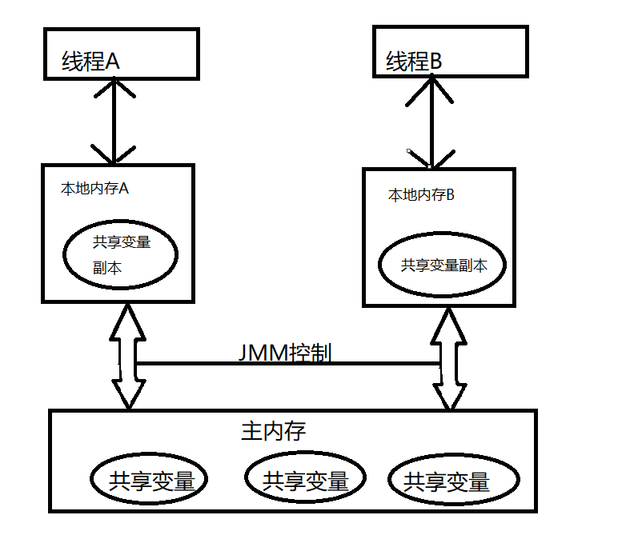


JMM通过控制`主内存与每个线程的本地内存之间的交互`，来为java程序员`提供内存的可见性保证。`

`为了保证内存可见性，Java编译器在生成指令序列的适当位置会插入内存屏障指令来禁止特定类型的处理器重排序。`

>happens-before

JSR-133内存模型使用happens-before的概念来阐述操作之间的内存可见性。`在JMM中，如果一个操作执行的结果需要对另一个操作可见，那么这两个操作之间必须存在happens-before关系。`

`happens-before仅仅要求前一个操作（执行的结果）对后一个操作可见，且前一个操作按顺序排在第二个操作之前。`

> 重排序

是指编译器和处理器为了优化程序性能而对指令序列进行重新排序的一种手段

> Volatile 

- 可见性：对一个volatile变量的读，总是能看到（任意线程）对这个volatile变量最后的写入

- 原子性：对任意单个volatile变量的读/写具有原子性，但类似于volatile++这种复合操作不具有原子性

  当写一个volatile变量时，JMM会把该线程对应的本地内存中的共享变量值刷新到主内存

  当读一个volatile变量的时候，JMM会把该线程对应的本地内存置为无效。线程接下来将会从主内存中读取共享变量。

  > > 总结：

  - 线程A写一个volatile变量，实质上是线程A向接下来将要读这个volatile变量的某个线程出（其对共享变量所做的修改的）消息。
  - 线程B读一个volatile变量，实质上是线程B接收了之前某个线程发出的（在写这个volatile变量之前对共享变量所做的修改的）消息。
  - 线程A写一个volition变量，随后线程B读这个volatile变量，这个过程实际上是线程A通过主内存向线程B发送消息。

> 锁内存语义

在ReentrantLock中，调用lock（）方法获取锁，unlock（）方法释放锁。

ReentrantLock的实现依赖于同步器框架AbstractQueuedSynchronizer(AQS)。

AQS使用一个整型的volatile变量（命名为state）来维护同步状态。这个volatile变量是ReentrantLock内存语义实现的关键。

ReentrantLock分为公平锁和非公平锁。

使用公平锁的加锁lock（）轨迹为：

1. ReentrantLock::lock()
2. FailSync::lock()
3. AbstractQueuedSynchronizer:acquire(int arg)
4. ReentrantLock:tryAcquire(int acquires)

在第四步真正开始加锁，源代码中 加锁方法首先读volatile变量的state

源代码中，释放锁的最后修改volatile变量的state值

非公平锁的释放和公平锁完全一样。非公平锁的获取锁，lock（）的轨迹为：

1. ReentrantLock::lock()

2. NonfairSync::lock()

3. AbstractQueuedSynchronizer:compareAndSetState(int expect,int update);

   在第三步真正开始加锁，源码以原子操作的方式更新state变量，compareAndSet简称CAS。

如果当前状态等于预期值，则以原子方式将同步状态设置为给定的更新值。此操作具有volatile读和写的内存语义。这也意味着，编译器不能堆CAS和CAS前后的任意内存操作重排序。

> 总结：

- 公平锁和非公平锁释放时，最后都要写一个volatile变量state
- 公平锁获取时，首先会读volatile变量
- 非公平锁获取时，首先会用CAS更新volatile变量，这个操作同时具有volatile读和写的内存语义

> concurrent包的实现

volatile变量的读/写和CAS可以实现线程之间的通信。 	 
concurrent包的实现模式通用化：

1. 首先，声明共享变量为volatile
2. 使用CAS的原子条件更新来实现线程之间的同步
3. 配合以volatile的读/写和CAS所具有的volatile读和写的内存语义来实现线程间的通信

AQS：非阻塞数据结构和原子变量类（java.util.concurrrent.atomic包中的类），这些concurrent包中的基础类都是使用这种模式来实现的，而concurrent包中的高层类又是依赖于这些基础类来实现的。

> final

对于final域，编译器和处理器要遵守两个重排序规则

1. 在构造函数内对一个final域的写入，与随后把这个被构造对象的引用赋值给一个引用变量，这两个操作之间不能重排序。
2. 初次读一个包含final域的对象的引用，与随后初次读这个final域，这两个操作之间不能重排序。

> 写final域的重排序规则

1. JMM禁止编译器把final域的写重排序到构造函数之外
2. 编译器会在final域写之后，构造函数return之前，插入一个StoreStore屏障，禁止处理器把final域的写重排序到构造函数之外。 

> 读final域的重排序规则

​	在一个线程中，初次读对象引用与初次读该对象包含的final域，JMM禁止处理器重排序这两个操作（这个规则只针对处理器），编译器会在读final域操作的前面插入一个LoadLoad屏障。

> happens-before

1. 如果一个操作happens-before另一个操作，那么第一个操作的执行结果将对第二个操作可见，而且第一个操作的执行顺序在第二个操作之前。
2. 两个操作之间存在happens-before关系，并不意味着java平台的具体实现必须要按照happens-before关系指定的顺序来执行，如果重排序之后的执行结果，与按happens-before关系来执行的一致，那么这种重排序也不非法。	

as-if-serial语义保证单线程内程序的执行结果不会被改变，happens-before关系保证正确同步的多线程程序的执行结果不被改变。

> 线程、程序、进程

`线程`是一个比进程更小的执行单位，一个进程在其执行的过程中可以产生多个线程。与进程不同的是同类的多个线程共享同一块内存空间和一组系统资源，所以系统在产生一个线程，或是在各个线程之间作切换工作时，负担要比进程小得多，也正因为如此，线程也被称为轻量级进程。
`程序`是含有指令和数据的文件，被存储在磁盘或其他的数据存储设备中，也就是说程序是静态的代码。
`进程`是程序的一次执行过程，是系统运行程序的基本单位，因此进程是动态的。系统运行一个程序即是一个进程从创建，运行到消亡的过程。当程序在执行时，将会被操作系统载入内存中。进程间不会相互影响，但如果一个进程愿意被别人调用，其它进程是可以调用它的。就像你可以通过浏览器进程打开摄像头进程一样。
`线程和进程最大的不同`在于基本上各`进程是独立的`，而各`线程则不一定`，因为同一进程中的线程极有可能会相互影响。

> 并发

1. 并发执行的进程数目不受限于CPU数目。
2. 进程就是应⽤程序在内存中分配的空间，也就是正在运⾏的程序，各个进程之间互不⼲扰。同时进程保存着程序每⼀个时刻运⾏的状态。
3. CPU采⽤时间⽚轮转的⽅式运⾏进程：CPU为每个进程分配⼀个时间段，称作它的时间⽚。如果在时间⽚结束时进程还在运⾏，则暂停这个进程的运⾏，并且CPU分配给另⼀个进程（这个过程叫做上下⽂切换）。如果进程在时间⽚结束前阻塞或结束，则CPU⽴即进⾏切换，不⽤等待时间⽚⽤完。当进程暂停时，它会保存当前进程的状态（进程标识，进程使⽤的资源等），在下⼀次切换回来时根据之前保存的状态进⾏恢复，接着继续执⾏。
4. 让⼀个线程执⾏⼀个⼦任务，这样⼀个进程就包含了多个线程，每个线程负责⼀个单独的⼦任务。
5. 进程让操作系统的并发性成为了可能，⽽线程让进程的内部并发成为了可能。

> 线程状态

- NEW        初始状态  线程被构建，但还没执行start()方法
- Runnable   运行状态  就绪和运行统称 运行中 
- Blocked     阻塞状态
- Waiting      等待状态  
- Time_Waiting   超时等待状态
- Terminated    终止状态

> 阻塞，等待，挂起，休眠的区别

阻塞是线程的状态，等待、挂起和休眠是让线程进入阻塞状态的不同行为。

在线程调用同步方法时，在没有获取到锁的情况下，线程将进入阻塞出状态。

等待是线程因为需要等待外部某个条件而进入阻塞，等条件满足后再继续运行(比如等待IO信号)。

挂起线程主动让出CPU，等别的线程去唤醒它（比如join）。

休眠是线程主动让出CPU一段时间而进入阻塞状态，等时间到之后再继续运行(比如sleep(time))。


**注意**：阻塞状态是线程阻塞在进入Synchronized关键字修饰的方法或代码块（获取锁）时的状态。

但是阻塞在java.concurrent包中的Lock接口的线程状态却是等待状态，因为java.concurrent包中Lock接口对于阻塞的实现都使用了LockSupport类中的相关方法。


在构建守护线程（Daemon），不能依靠finally语句块中的内容来确保执行关闭或清理资源的逻辑

### 锁

> AQS队列同步器

是用来构建锁或者其他同步组件的基本框架，使用了一个int成员变量表示同步状态。通过内置的FIFO队列来完成资源获取线程的排队工作。

同步器的主要是用方式是继承，子类通过继承同步器并实现他的抽象方法来管理同步状态，在抽象方法的实现过程中免不了要对同步状态进行更改，这时就需要同步器提供的3个方法

1. getState()
2. getState(int newState)
3. compareAndSetState(int expect,int update)

来进行操作，因为他们能保证状态的改变是安全的，

> acquire方法

```java
public final void acquire(int arg) {
        if (!tryAcquire(arg) &&
            acquireQueued(addWaiter(Node.EXCLUSIVE), arg))
            selfInterrupt();
    }
```

​	以独占模式获取同步状态，忽略中断。也就是说由于线程获取同步状态失败后进入同步队列中，后续对线程进行中断操作时，线程不会从同步队列中移出。

​	 通过调用至少一次tryAcquire来实现，成功返回。 否则线程排队，可能重复阻塞和解除阻塞，调用tryAcquire直到成功。 此方法可用于实现方法Lock.lock 。
参形：arg - 获取参数。

​	 这个值被传递给tryAcquire ，但在其他方面没有被解释，并且可以代表你喜欢的任何东西

tryAcquire：尝试以独占模式获取。 此方法应查询对象的状态是否允许以独占模式获取它，如果允许则获取它。此方法始终由执行获取的线程调用。 如果此方法报告失败，如果该线程尚未排队，则获取方法可以将该线程排队，直到由某个其他线程的释放发出信号。 这可用于实现方法Lock.tryLock() 

​	如果同步状态获取失败，则构造同步节点（Node.EXCLUSIVE 用于独占，Node.SHARED 用于共享）并通过addWaiter(Node node)方法将该节点添加到同步队列的尾部，最后调用acquireQueued(Node node)方法，使得该节点“死循环”获取同步状态。如果获取不到则阻塞节点中的线程，而被阻塞线程的唤醒主要依靠前驱节点的出队或阻塞线程被中断来实现。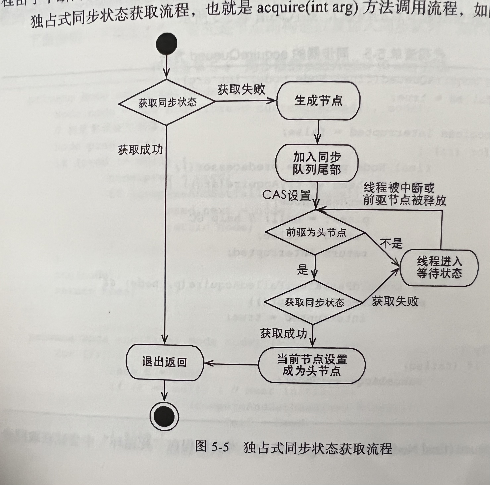


**总结：**在获取同步状态时，同步器维护一个同步队列，获取状态失败的线程都会被加入到队列中并在队列中进行自旋；移出队列（或停止自旋）的条件是前驱节点为头节点且成功获取了同步状态。在释放同步状态时，同步器调用tryRelease(int arg)方法释放同步状态，然后唤醒头节点的后继节点。

> 共享式同步状态获取与释放

共享式获取与独占式最主要的区别就是同一时刻能否有多个线程同时获取到同步状态。

通过调用acquireShared(int arg)方法可以共享式地获取同步状态。

在acquireShared方法中，同步器调用tryAcquireShared(int arg)方法尝试获取同步状态。当返回值大于0时，表示能够获取到同步状态。因此，在共享式获取的自旋过程中，成功获取到同步状态并退出自旋的条件就是tryAcquireShared的返回值大于等于0。

​	和独占式一样，共享式获取也需要释放同步状态，通过调用releaseShared(int arg)方法可以释放同步状态。不过共享式的释放能够支持多个线程同时访问的并发组件（如Semaphore），和独占式的区别在于truReleaseShared(int arg)方法必须保证同步状态(或者资源数)线程安全释放，一般是通过循环和CAS来保证的，因为释放同步状态的操作会同时带来多个线程。

> 独占式超时获取同步状态

通过调用同步器的doAcquireNanos(int arg,long nanosTimeout)方法可以超时获取同步状态，即在指定的时间段内获取同步状态，如果获取到同步状态则返回true。该方法提供了传统的同步操作（比如Synchronized关键字）所不具备的特性。

在java5之前，当一个线程获取不到锁而被阻塞在Synchronized之外时，对该线程进行中断操作，此时该线程的中断标志会被修改，但线程依旧会阻塞在Synchronized上，等待着获取锁。在java5中，同步器提供了acquireInterruptibly(int arg)方法，这个方法在等待获取同步状态时，如果当前线程被中断，会立刻返回，并抛出InterruptedException。


### 重入锁

就是支持重进入的锁，表示该锁能支持一个线程对资源的重复加锁。除此之外，该锁的还支持获取锁时的公平性和非公平性的选择。

Mutex是一个不支持重进入的锁，而Synchronized隐式的支持重进入，比如一个Synchronized修饰的递归方法，在方法执行时，执行线程在获取了锁之后仍能连续多次的获得该锁，而不像Mutex由于获取了锁，而在下一次获取锁的时候出现阻塞自己的情况。

ReentrantLock虽然没能像Synchronized一样支持隐式的重进入，但是在调用lock()方法时，已经获取到锁的线程，能够再次调用lock()方法获取锁而不被阻塞。

先对锁进行获取的请求一定先被满足，那么这个锁是公平的，反之，是不公平的。公平的获取锁，也就是等待时间最长的线程最优先能获取锁。ReetrantLock提供了一个构造函数，能够控制锁是否公平的。

公平锁能够减少饥饿发生的概率，等待越久的请求越是能够得到优先满足。

ReentrantLock是通过组合自定义同步器来实现锁的获取和释放，非公平性（默认的）

对于非公平锁，只要CAS	设置同步状态成功，则表示当前线程获取了锁。

为什么非公平性锁可能使线程饥饿，为什么还是默认的？ 因为线程上下文切换开销大。

> 读写锁

Mutex和ReentrantLock都是排他锁。而读写锁在同一时刻允许多个线程访问，但是在写线程访问时，所有的读线程和其他写线程均被阻塞。读写锁维护了一对锁，一个读锁和一个写锁。通过分离读锁和写锁，使得并发性相比一般的排他锁有了很大提升。

java并发包提供读写锁的实现是ReentrantReadWriteLock。

ReentrantReadWriteLock的特性：

- 公平性选择  支持非公平（默认）和公平的锁获取方式，吞吐量还是非公平优于公平
- 重进入  读线程获取锁之后，能够再次获取读锁，而写线程在获取了写锁之后能够再次获取写锁，同时也可以获取读锁。
- 锁降级   遵循获取写锁，获取读锁再释放写锁的次序，写锁能够降级成为读锁。

> 写锁的获取与释放   ReentrantReadWriteLock的tryAcquire方法

​	写锁是一个支持重进入的排它锁，如果当前线程已经获取了写锁，则增加写状态。如果当前线程在获取写锁时，读锁已经被获取（读状态不为0）或者该线程不是已经获取写锁的线程，则当前线程进入等待状态。

​	如果读锁存在，则写锁不能被获取。原因在于：读写锁要确保写锁的操作对读锁可见，如果允许读锁在已被获取的情况下对写锁的获取，那么正在运行的其他读线程就无法感知到当前写线程的操作。因此，只有等待其他读线程都释放了读锁，写锁才能被当前线程获取，而写锁一旦被获取，则其他读写线程的后续访问均被阻塞。

​	写锁的释放和ReentrantLock的释放过程基本类似，每次释放都会减少写状态，当写状态为0时表示写锁已经被释放，从而等待的读写线程能够继续访问读写锁，同时前一次写线程的修改对后续读写线程可见。

> 读锁的获取与释放

​	读锁是一个支持重进入的共享锁，他能够被多个线程同时获取，在没有其他写线程访问（或者写状态为0）时，读锁总是会被成功地获取，而所做的也只是（线程安全的）增加读状态。如果当前线程已经获取了读锁，则增加读状态。如果当前线程在获取读锁时，写锁已被其他线程获取，则进入等待状态。

在tryAcquireShared(int unused)方法中，如果其他线程已经获取了写锁，则当前线程获取读锁失败，进入等待状态。如果当前线程获取了写锁或者写锁未被获取，则当前线程（线程安全，依靠CAS保证）增加读状态，成功获取读锁。

> 锁降级

写锁降级为读锁。

是指把持住有的写锁，再获取到读锁，随后释放写锁的过程。

锁降级中读锁的获取是否必要呢？是必要的，主要是为了保证数据的可见性

ReentrantReadWriteLock不支持锁升级，目的也是为了保证数据可见性，如果读锁已被多个线程获取，其中任意线程成功获取了写锁并更新了数据，则其更新对其他获取到读锁的线程是不可见的。

### LockSupport

当需要阻塞或唤醒一个线程的时候，都会使用LockSupport工具类来完成相应工作

park开头的方法过来阻塞当前线程，unpark方法来唤醒一个被阻塞的线程。

### Condition接口

任意一个java对象，都有一组监视器方法（Object），主要包括wait()、wait(long timeout)、notify()、notifyAll()方法，这些方法和synchronized同步关键字配合，可以实现等待/通知模式。

Condition接口也提供了类似Object的监视器方法，与Lock配合可以实现等待/通知模式。

| 对比                                                 | Object监视器            | Condition监视器                                        |
| ---------------------------------------------------- | ----------------------- | ------------------------------------------------------ |
| 前置条件                                             | 获取对象的锁            | 调用Lock.lock()  lock.new Condition()获取Condition对象 |
| 调用方式                                             | 直接调用  object.wait() | 直接调用  condition.await()                            |
| 等待队列个数                                         | 一个                    | 多个                                                   |
| 当前线程释放锁并进入等待状态，在等待状态中不响应中断 | 不支持                  | 支持                                                   |
| 当前线程释放锁并进入等待状态到将来的某个时间         | 不支持                  | 支持                                                   |

Condition定义了`等待/通知`两种类型的方法，当前线程调用这些方法的时候，需要先获取Condition对象关联的锁。`Condition对象时由Lock对象的newCondition()方法来获取的，也就是Condition是依赖Lock的`

常用方法:

- await()   当前线程进入等待状态直到被通知(signal)或中断
- signal()  唤醒一个等待在Condition上的线程，该线程从等待方法返回前必须获得与Condition相关联的锁
- signalAll() 同上


> 有界队列

是一种特殊的队列，当队列为空时，队列的获取操作将会阻塞获取线程，直到队列中有新增元素，当队列已满时，队列的插入操作将会阻塞插入线程，直到队列出现“空位”

> Condition实现分析

ConditionObject是同步器AQS的内部类，每个Condition对象都包含着一个队列（等待队列），该队列是Condition对象实现等待/通知的关键。

1. 等待队列  

   等待队列是一个FIFO队列，在队列中每一个节点都包含了一个线程引用，该线程就是在Condition对象上等待的线程，如果一个线程调用了Condition.await()方法，那么该线程将会释放锁，构造成节点加入等待队列并进入等待状态。同步队列和等待队列中节点类型都是同步器的静态内部类AQS.Node

2. 等待

   调用await()方法会使当前线程进入等待队列，并释放锁，同时线程状态变为等待状态。当从await()方法返回时，当前线程一定是回去了Condition关联的锁，如果从队列（同步队列和等待队列）的角度看await()方法，当调用await()方法时，相当于同步队列的首节点（获取了锁的节点）移动到Condition等待队列中。但是也不是直接加入到等待队列中，而是通过addConditionWaiter()方法把当前线程构造成一个新的节点加入到等待队列中

3. 通知

​		调用Condition的signal()方法，将会唤醒在等待队列中等待时间最长的节点（首节点），在唤醒节点之前，会将节点移动到同步队列中。调用该方法的前提条件是必须获取了锁。

​		通过调用同步器的enq(Node node)方法，等待队列中的头节点线程安全的移动到同步队列。当节点移动到同步队列后，当前线程再使用LockSupport唤醒该节点的线程。


## ConcurrentHashMap

##### ConcurrentHashMap是线程安全且效率高的HashMap。

> 为什么使用ConcurrentHashMap

1. HashMap线程不安全，可能导致程序死循环

   在多线程环境下，使用HashMap进行put操作会引起死循环。之所以会发生死循环，是因为多线程会导致HashMap的Entry链表形成环形数据结构，一旦形成环形数据结构，Entry的next节点永远不为空，就会产生死循环获取Entry。

2. HashTable效率非常低下

​		因为HashTable容器使用的是Synchronized来保证线程安全，在多线程竞争的情况下，效率会非常低下，因为当一个线程访问HashTable容器的同步方法，其他线程再次访问的时候，会进入阻塞或者轮询的状态，如线程1使用put方法进行元素添加，线程2不但不能使用put方法进行添加元素，也不能使用get方法获取元素。所以竞争越激烈效率越低。

3. ConcurrentHashMap的锁分段技术可有效提升并发访问率

​		HashTable之所以在竞争激烈的并发环境下效率低下的原因是所有访问HashTable的线程都必须竞争同一把锁，假设容器有多把锁，每一把锁用于锁容器其中一部分数据，那么当多线程访问容器里不同数据段的数据时，线程间就不会存在锁竞争，从而可以有效提高并发访问效率，这就是ConcurrentHashMap使用的锁分段技术。首先将数据分为一段一段的存储，给每一段配一把锁，当一个线程占用锁访问其中一个段数据的时候，其他段的数据也能被其他线程访问。

> ConcurrentHashMap的结构

​		ConcurrentHashMap是由Segment数据结构和HashEntry数据结构组成。

​		Segment是一种可重入锁（ReentrantLock），在ConcurrentHashMap中扮演锁的角色；HashEntry则用与存储键值对数据。一个ConcurrentHashMap里包含一个Segment数组，Segment的结构和HashMap类似，是一种数组和链表结构。一个Segment包含一个HashEntry数组，每一个HashEntry是一个链表结构的元素，每个Segment守护着一个HashEntry数组里的元素，当对HashEntry数组的数据进行修改的时候，必须获取到与他对应的Segment锁。

> ConcurrentHashMap的初始化

​		ConcurrentHashMap的初始化方法是通过initialCapacity、loadFactor和concurrenyLevel等几个参数来初始化segment数组、段偏移量segmentShift、段掩码segmentMask和每个segment里的HashEntry数组来实现的。

​		concurrenyLevel的最大值是65535，这意味着segments数组的最大长度为65535，对应的二进制是16位。

​		输入参数initialCapacity是ConcurrentHashMap的初始化容量，loadFactor是每个segment的负载因子，在构造方法里需要通过这两个参数来初始化数组中的每个segment。

​		ConcurrentHashMap使用分段锁Segment来保护不同段的数据，那么在插入和获取元素的时候，必须先通过散列算法定位到Segment。可以看到ConcurrentHashMap会首先使用Wang/Jenkins hash的变种算法对元素的hashCode进行一次再散列。之所以再散列，是为了减少散列冲突，使元素能够均匀地分布在不同的Segment上，从而提高容器的存取效率。

> ConcurrentHashMap的操作

- get操作

​	Segment的get操作实现非常简单且高效，先进行一次再散列，然后使用这个散列值通过散列运算定位到Segment，再通过散列算法定位到元素。get操作的高效就在于整个get操作过程不需要加锁，除非读到的值是空才会加锁重读。

​		ConcurrentHashMap的get操作是如何做到不加锁的呢？

​		get方法里将要使用的共享变量都定义成volatile类型，如用于统计当前Segment大小的count字段和用于存储值的HashEntry的value。定义成volatile类型，能够在线程之间保持可见性，能够被多线程同时读，并且保证不会读到过期的值。但是只能被单线程写（有一种情况可以被多线程写，就是写入的值不依赖与原值），在get操作里只需要读不需要写共享变量count和value，所以可以不用加锁。

​		之所以不会读到过期的值，是因为根据java内存模型的happen before原则，对volatile字段的写入操作先于读操作，即使两个线程同时修改和获取volatile变量，get操作也能拿到最新的值，这是用volatile替换锁的经典应用场景。

​		定位Segment使用的是元素的hashcode通过再散列后得到的值的高位，而定位HashEntry直接使用的是再散列后的值，其目的就是避免两次散列后的值一样，虽然元素在Segment里散列开了，但是却没有在HashEntry里散列开。

- put 操作

  由于put方法需要对共享变量进行写入操作，所以为了线程安全，在操作共享变量时必须加锁，put方法首先定位到Segment，然后在Segment里进行插入操作。插入操作需要经历两个步骤

  1. 判断是否需要对Segment里的HashEntry数组进行扩容
  2. 定位添加元素的位置，然后将其放在HashEntry数组里

  (1) 是否需要扩容

  在插入元素前会先判断Segment里的HashEntry数组是否超过容量（Threshold），如果超过阈值，则对数组进行扩容。Segment的扩容比HashMap更恰当，因为HashMap是插入元素后判断元素是否已经达到阈值，如果达到就扩容，但是很有可能扩容之后没有新元素加入，导致进行了一次无效的扩容。

  （2）如何扩容

  首先会创建一个容量是原来两倍的数组，然后将原数组里的元素进行再散列后插入到新数组中。为了高效，ConcurrentHashMap不会对整个容器进行扩容，而是对某个Segment进行扩容。

  - size操作

    如果要统计整个ConcurrentHashMap里元素的大小，就必须统计所有Segment里元素的大小后求和。虽然相加时可以获取每个Segment的count最新值，但是可能累加前使用的count发生了变化，那么统计结果可能就不准了，所以，最安全的做法是在统计size的时候把所有的Segment的put，remove和clean方法全部锁住，但是这种做法显然很低效。

    因为在累加count操作过程中，之前累加过的count发生变化的几率非常小，所以ConcurrentHashMap的做法是先尝试2次通过不锁住Segment的方式来统计各个Segment大小，如果统计的过程中，容器的count发生变化，则再采用加锁的方式来统计所有Segment的大小。

    #### 那么ConcurrentHashMap是如何判断在统计的时候容器是否发生了变化呢？

    ​	使用modcount变量，在put、remove和clean方法里操作元素前都会将变量modcount进行加1，那么在统计size前后比较modcount是否发生变化，从而得知容器的大小是否发生变化。

> ConcurrrentLinkedQueue

​		如果要实现一个线程安全的队列有两种实现方式：

1. 使用阻塞算法
2. 使用非阻塞算法

使用阻塞算法可以使用一个锁或者两个锁来实现，使用非阻塞算法可以通过循环CAS来实现

#### 如何使用非阻塞算法实现ConcurrrentLinkedQueue

ConcurrrentLinkedQueue是一个基于链接节点的无界线程安全队列，采用先进先出的规则对节点进行排序，当添加一个元素时，会添加到节点末尾，获取一个元素的时候，会返回队列头部的元素，采用wait-free（即CAS算法）来实现。

> ConcurrrentLinkedQueue结构

ConcurrrentLinkedQueue由head和tail节点组成，每个节点（Node）由节点元素（item）和指向下一个节点（next）的引用组成，节点与节点之间通过next关联，从而组成一张链表结构的队列，默认情况下head节点存储的元素为空，tail节点等于head节点。

```java
private transient volatile Node<E> tail = head;
```

#### 入队列

入队列就是将入队节点添加到队列的尾部，入队主要做两件事

1. 将入队节点设置成当前队列尾节点的下一个节点
2. 更新tail节点

如果tail节点的next节点不为空，则将入队节点设置成tail节点，如果tail节点的next节点为空，则将入队节点设置成tail的next节点，所以tail节点不总是尾节点。

整个入队列的过程就是两件事

1. 定位出尾节点
2. 使用CAS算法对入队节点设置成尾节点的next节点，如不成功则重试。

💡`Tip: 入队方法永远返回true，所以不要通过返回值判断入队是否成功。`

### 阻塞队列

阻塞队列（BlockingQueue）是一个支持两个附加操作的队列，这两个附加的操作支持阻塞的插入和移除方法。

1. 支持阻塞的插入方法：意思是当队列满时，队列会阻塞插入元素的过程，直到队列不满

2. 支持阻塞的移除方法：意思是当队列为空时，获取元素的过程会等待队列不为空。

   阻塞队列常用于生产者和消费者的场景

> 阻塞队列的实现原理

如果队列是空的，消费者会一直等待，当生产者添加元素时，消费者是如何知道当前队列有元素的呢？

使用通知模式实现，就是当生产者往满的队列里添加元素的时候会阻塞住生产者，当消费者消费了一个队列中的元素后，会通知生产者当前队列可用。

可以查看JDK源码ArrayBlockingQueue使用了Condition实现

当往队列里插入一个元素时，如果队列不可用，那么阻塞生产者主要通过LockSupport的park(this)来实现。


### Fork/Join框架

是java7提供的一个用于并行执行任务的框架，是一个把大任务分割成若干个小任务，最终汇总每个小任务结果后得到大任务结果的框架。

### 工作窃取算法

指某个线程从其他队列里窃取任务来执行

为了减少窃取任务线程和被窃取任务线程之间的竞争，通常会使用双端队列，被窃取任务线程永远从双端队列的头部拿任务执行，而窃取任务的线程永远从双端队列的尾部拿任务执行。

优点：充分利用线程进行并行计算，减少了线程之间的竞争。

缺点：在某些情况下还是存在竞争，比如双端队列里只有一个任务时，并且该算法会消耗了更多的系统资源，比如创建多个线程和多个双端队列。

### 并发工具类

> 等待多线程完成的CountDownLatch

CountDownLatch允许一个或多个线程等待其他线程完成操作。

​		假如有一个需求，需要解析一个excel文件中的多个sheet的数据，此时可以考虑使用多线程，每个线程解析一个sheet中的数据，等到所有的sheet都解析完成之后，程序需要提示解析完成。在这个需求中，要实现主线程等待所有线程完成sheet解析操作，最简单的做法就是使用join()方法。

​		join用于让当前线程等待join线程执行结束，其实现原理是不断检查join线程是否存活，如果join线程存活则让当前线程永远等待。其中wait(0)表示永远等待下去。代码如下：

```java
while(isAlive){
    wait(0);
}
```

直到join线程终止后，线程的this.notifyAll()方法会被调用。

在jdk1.5之后的并发包中提供的CountDownLatch也可以实现join的功能。

CountDownLatch的构造函数接收一个int类型的参数作为计数器，如果你想等待N个点完成，这里就传入N，当调用CountDownLatch的countDown方法时，N就会减1，CountDownLatch的await方法会阻塞当前线程，直到N变为0,。由于countDown方法可以用在任何地方，所以这里说的N个点，可以是N个线程，也可以是1个线程中的N个步骤。用在多个线程时，只需要把这个CountDownLatch的引用传递到线程里即可。

如果有某个解析sheet的线程处理的比较慢，我们不可能让主线程一直等待，所以可以使用另外一个带指定时间的await方法----await(long time,TimeUnit unit)这个方法等待特定时间后，就会不再阻塞当前线程，join也有类似的方法。

注意：计数器必须大于0，只是等于0的时候，计数器就是0，调用await方法时不会阻塞当前线程，CountDownLatch不可能重复初始化或者修改CountDownLatch对象的内部计数器的值。一个线程调用CountDownLatch方法happen-before，另一个线程调用await方法。

>同步屏障CyclicBarrier

字面意思是可循环的屏障，作用是，让一组线程到达一个屏障（也可以叫做同步点）时被阻塞，直到最后一个线程到达屏障时，屏障才会开门，所有被屏障拦截的线程才会继续运行。

默认的构造方法是CyclicBarrier（int parties），其参数表示屏障拦截的线程数量，每个线程调用await方法告诉CyclicBarrier我已经到达了屏障，然后当前线程被阻塞。

CyclicBarrier可用于多线程计算数据，最后合并计算结果的场景，例如:用一个Excel保存了用户所有银行流水，每个sheet保存一个账户近一年的每笔银行流水，现在需要统计用户的日均银行流水，先用多线程处理每个sheet里的银行流水，都执行完了之后，得到每个sheet的日均银行流水，最后，再用barrierAction用这些线程的计算结果，计算出整个Excel的日均银行流水。

> CyclicBarrier和CountDownLatch的区别

CountDownLatch的计数器只能使用一次，而CyclicBarrier的计数器可以使用reset()方法重置，所以CyclicBarrier能处理更为复杂的业务。例如计算发生错误，可以重置计数器，并让线程重新计算一次。

### 控制并发线程数的Semaphore

Semaphore（信号量）是用来控制同时访问特定资源的线程数量，它通过协调各个线程，以保证合理的使用公共资源。

> 使用场景

Semaphore可以用于做流量控制，特别是公用资源有限的应用场景，比如数据库连接。

Semaphore的用法也很简单，首先线程使用Semaphore的acquire()方法获取一个许可证，使用完之后调用release()方法归还许可证，还可以通过tryAcquire()方法尝试获取许可证。

### 线程间交换数据的Exchanger

Exchanger（交换者）是一个用于线程之间协作的工具类。Exchanger用于进行线程间的数据交换，他提供一个同步点，在这个同步点，两个线程可以交换彼此的数据，这个线程通过exchange方法交换数据，如果第一个线程先执行exchange()方法，它会一直等待第二个线程也执行exchange()方法，当两个线程都达到同步点时，这两个线程就可以交换数据，将本线程生产出来的数据传递给对方。

Exchange可以用于遗传算法

## Java中的线程池

好处：

1. 降低资源消耗    通过重复利用已创建的线程降低线程创建和销毁造成的消耗
2. 提高响应速度    当任务到达时，任务可以不需要等待线程创建就能立即执行
3. 提高线程的可管理性    线程是稀缺资源，如果无限制的创建，不仅会消耗系统资源，还会降低系统的稳定性，使用线程池可以进行统一分配，调优和监控

> 线程池实现原理

1. 线程池判断核心线程池中的线程是否都在执行任务，如果不是，则创建一个新的工作线程来执行任务，如果核心线程池里的线程都在执行任务，则进入到下个流程。
2. 线程池判断工作队列是否已经满，如果工作队列没有满，则将新提交的任务存储在这个工作队列中。如果队列满了，则进入下个流程。
3. 线程池判断线程池的线程是否都处于工作状态，如果没有，则新建一个新的工作线程来执行任务，如果满了，则交给饱和策略来处理这个任务。

ThreadPoolExecutor执行execute()方法的示意图：

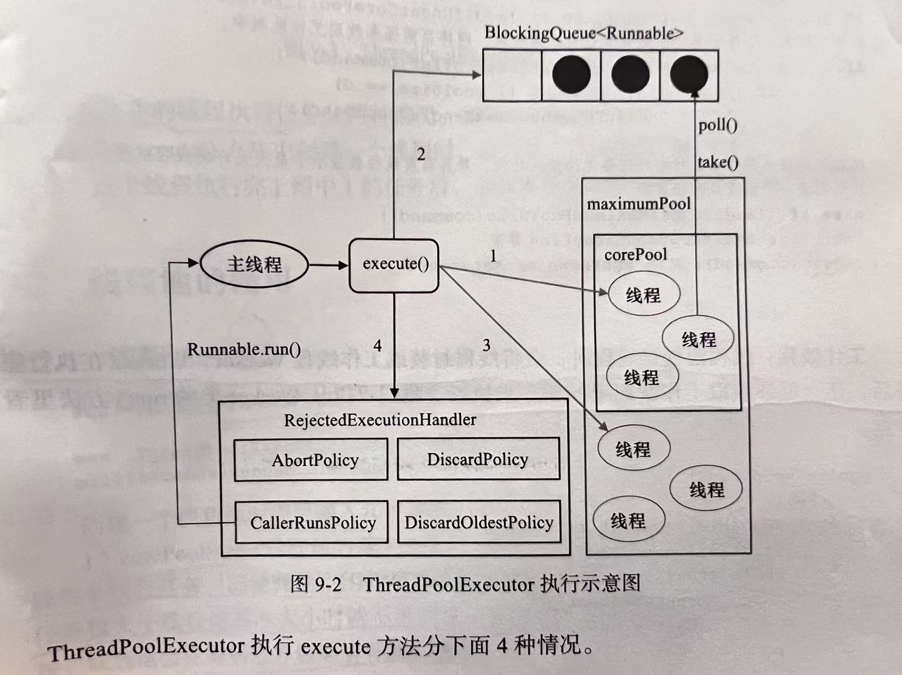

1. 如果当前运行的线程少于corePoolSize，则创建新线程来执行任务（这一步需要获取全局锁）
2. 如果运行的线程等于或多于corePoolSize，则将任务加入到BlockingQueue
3. 如果无法将任务加入到BlockingQueen（队列已满），则创建新的线程来处理任务（需要全局锁）
4. 如果创建新线程将使当前运行的线程超出maximunmPoolSize，任务将被拒绝，并调用RejectedExecutionHandler.rejectedExecution()方法

ThreadPoolExecutor采取以上步骤的设计思路，是为了在执行execute()方法时，尽可能地避免获取全局锁。在ThreadPoolExecutor完成预热之后（当前运行的线程数大于等于corePoolSize），几乎所有的executor()方法调用都是执行步骤2，而步骤2不需要获取全局锁。

工作线程：线程池创建线程时，会将线程封装成工作线程Worker，Worker在执行完任务后，还会循环获取工作队列里的任务来执行，可以通过Worker类中的run()方法看到这点。

线程池中的线程执行任务分两种情况：

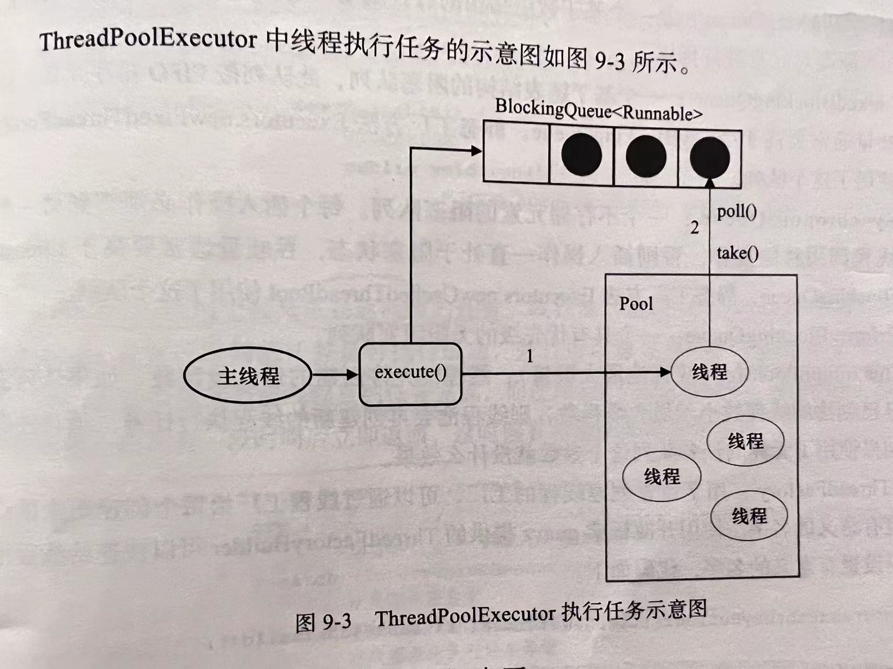

1. 在execute()方法中创建一个线程时，会让这个线程执行当前任务
2. 这个线程执行完上图1的任务后，会反复从BlockingQueue中获取任务来执行

> 线程池的使用

可以通过ThreadPoolExecutor来创建一个线程

```java
new ThreadPoolExecutor(corePoolSize,maximumPoolSize,keepAliveTime,milliseconds,runnableTaskQueue,handler);
```

1. corePoolSize:线程池的基本大小，当提交一个任务到线程池的时候，线程池会创建一个线程来执行任务，即使其他空闲的基本线程能够执行新任务也会创建线程，等到需要执行的任务数大于线程池基本大小时就不再创建。如果调用了线程池的prestartAllCoreThreads()方法，线程池会提前创建并启动所有基本线程。

2. runnableTaskQueue（任务队列）：用于保存等待执行的任务的阻塞队列

3. maximumPoolSize(线程池最大数量)：线程池允许创建的最大线程数，如果队列满了，并且已创建的线程数小于最大线程数，则线程池会再创建新的线程执行任务，如果使用了无界任务队列这个参数就没有什么效果。

4. ThreadFactory：用于设置创建线程的工厂，可以通过线程工厂给每个创建出来的线程设置更有意义的名字。

5. RejectedExecutionHandler（饱和策略）：当队列和线程池都满了，说明线程池处于饱和状态，那么必须采取一种策略处理提交的新任务。这个策略默认就是AbortPolicy，表示无法处理新任务时抛出异常。JDK1.5中java线程池提供了4种策略：

   - AbortPolicy：直接抛出异常
   - CallerRunsPolicy：只有调用者所在线程来运行任务
   - DiscardOldestPolicy：丢弃队列里最近的一个任务，并执行当前任务
   - DiscardPolicy：不处理，丢弃

   也可以实现RejectedExecutionHandler接口自定义策略，如记录日志或持久化存储不能处理的任务

   keepAliveTime(线程活动保持时间)：线程池的工作线程空闲后，保持存活的时间。所以，如果任务很多，并且每个任务执行的时间比较短，可以调大时间，提高线程的利用率。

   TimeUnit（线程活动保持时间的单位）

   

> 向线程池提交任务

可以使用两个方法提交任务

1. execute()

   用于提交不需要返回值的任务，所以无法判断任务是否被线程池执行成功，execute()方法输入的任务是一个Runnable类的实例。

2. submit()

​		用于提交需要返回值的任务，线程池会返回一个future类型的对象，通过这个future对象可以判断任务是否执行成功，并且可以通过future的get方法来获取返回值，get方法会阻塞当前线程直至任务完成，而使用get(long timeout,TimeUnit unit)方法则会阻塞当前线程一段时间后立即返回，这时候有可能任务没有执行完。


### 关闭线程池

可以通过线程池的shutdown和shutdownNow方法来关闭线程池，他们的原理是遍历线程池中的工作线程，然后逐个调用线程的interrupt方法来中断线程，所以无法响应中断的任务可能永远无法终止。

区别：shutdownNow首先将线程池的状态设为STOP，然后尝试停止所有的正在执行或暂停任务的线程，并返回等待执行任务的列表，而shutdown只是线程池的状态设置成SHUTDOWN状态，然后中断所有没有正在执行任务的线程。

只要调用了这两个关闭方法中的任意一个，isShutdown方法就会返回true。当所有的任务都已关闭后，才表示线程池关闭成功，这时调用isTerminaed方法会返回true。至于应该调用哪一种方法来关闭线程池，应该由提交到线程池的任务特性决定，通常调用shutdown方法来关闭线程池，如果任务不一定要执行完，可以调用shutdownNow。

### Executor框架

在java中，使用线程来异步执行任务。工作单元包括Runnable和Callable，而执行机制由Executor框架机制提供。

> Executor框架的两级调度模型

在HotSport VM的线程模型中，java线程（java.lang.Thread）被一对一映射为本地操作系统线程，java线程启动时会创建一个本地操作系统线程，当该java线程终止时，这个操作系统线程也会被回收，操作系统会调度所有线程并将他们分配给可用的CPU。  

> Executor框架的结构

Executor主要由三部分组成：

- 任务： 包括被执行任务需要实现的接口   Runnable接口或Callable接口
- 任务的执行：包括任务执行机制的核心接口Executor，以及继承自Executor的ExecutorService接口Executor框架有两个关键类实现了ExecutorService接口（ThreadPoolExecutor和ScheduledThreadPoolExecutor）。
- 异步计算结果：包括接口Future和实现Future接口的FutureTask类

> Executor包含的主要的类和接口

- Executor是一个接口，它是Executor框架的基础，它将任务的提交和任务的执行分离开来

- ThreadPoolExecutor 是线程池的核心实现类，用来执行被提交的任务

- ScheduledThreadPoolExecutor  是一个实现类，可以在给定的延迟后运行命令，或者定期执行命令。ScheduledThreadPoolExecutor  比Timer更灵活，更强大。

- Future接口和实现Future接口的FutureTask类，代表异步计算的结果

- Runnable接口和Callable接口的实现类，都可以被ThreadPoolExecutor 或ScheduledThreadPoolExecutor  执行

  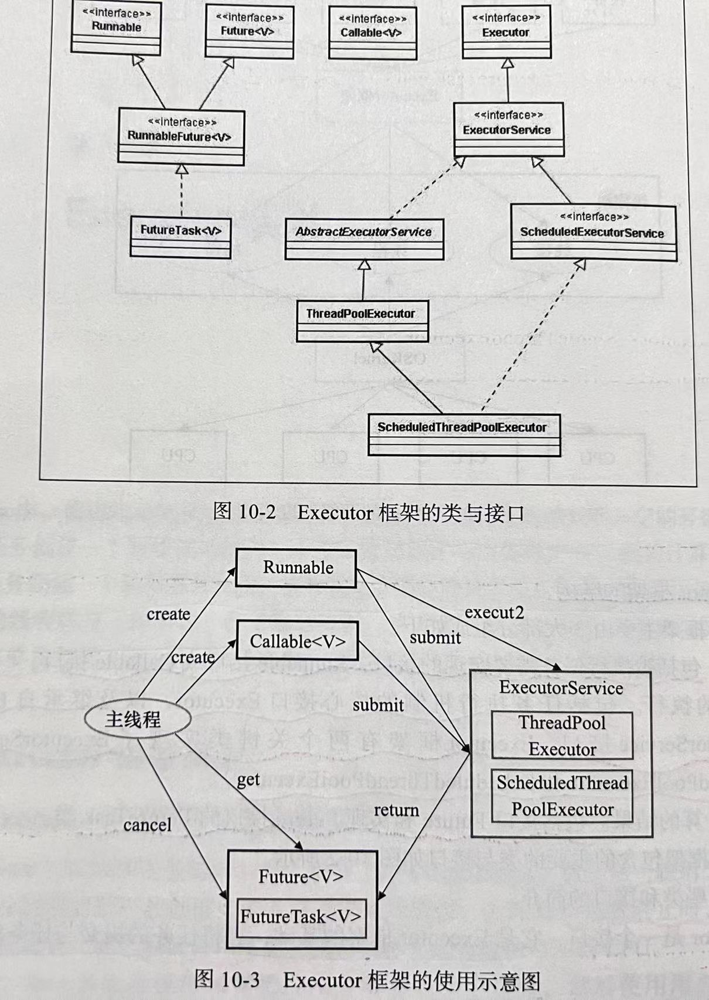

主线程首先要创建实现Runnable或者Callable接口的任务对象。工具类Executors可以把一个Runnable对象封装成一个Callable对象（Executor.callable(Runnable task)或Executor.callable(Runnable task,Object resule)）。

然后可以把Runnable对象交给ExecutorService执行（ExecutorService.execute(Runnable command)），或者也可以把Runnable对象或Callable对象提交给ExecutorService执行（ExecutorService.submit(Runnable task)或ExecutorService.submit(Callable<T> task)）。

如果执行ExecutorService.submit(...),ExecutorService将返回一个实现Future接口的对象（FutureTask对象），由于FutureTask实现了Runnable，也可以创建FutureTask，然后直接交给ExecutorService执行

最后，主线程可以执行FutureTask.get()方法来等待任务执行完成，主线程也可以执行FutureTask.cancel(boolean mayInterruptIfRunning)来取消此任务的执行。

>Executor框架的成员

1. ThreadPoolExecutor

   通常使用工厂类Executors创建,Executors可以创建三种类型的ThreadPoolExecutor：SingleThreadExecutor、FixedThreadPool和CachedThreadPool

   - SingleThreadExecutor：创建使用单个线程	适用于需要保证顺序执行各个任务，并且在任意时间点，都不会有多个线程活动的场景

   - FixedThreadPool：创建使用固定线程数    适用于为了满足资源管理的需求，而需要限制的昂前线程数量的应用场景，它适用于负载比较重的服务器

   - CachedThreadPool：创建一个会根据需要创建新线程    是大小无界的线程池，适用于执行很多的短期异步任务的小程序，或者负载矫情的服务器

2. ScheduledThreadPoolExecutor

   通常使用工厂类Executors创建，Executors可以创建两种类型的ScheduledThreadPoolExecutor

   - ScheduledThreadPoolExecutor 	包含若干线程的ScheduledThreadPoolExecutor

   ​	适用于需要多个后台线程执行周期任务，同时为了满足资源管理的需求而需要限制后台线程的数量的应用场景。

   - SingleThreadScheduledExecutor  只包含一个线程的ScheduledThreadPoolExecutor

   ​	适用于需要单个后台线程执行周期任务，同时需要保证顺序的执行各个任务的应用场景

3. Future接口

   Future接口和实现Future接口的FutureTask类用来表示异步计算的结果。把Runnable接口或Callable接口的实现类提交（submit）给ThreadPoolExecutor或ScheduledThreadPoolExecutor时，ThreadPoolExecutor或ScheduledThreadPoolExecutor会向我们返回一个FutureTask对象

4. Runnable接口和Callable接口

​		Runnable接口和Callable接口的实现类都可以被ThreadPoolExecutor或ScheduledThreadPoolExecutor执行，区别在于Runnable不会返回结果，Callable可以返回结果。

​		除了可以实现Callable接口的对象外，还可以使用工厂类Executors类把一个Runnable包装成一个Callable。

把一个Runnable包装成一个Callable的API如下：

public static Callable<Object> callable(Runnable task)   

把一个Runnable和一个待返回的结果包装成一个Callable的API：

public static <T> Callable(Runnable task,T result)

> ThreadPoolExecutor

是Executor框架最核心的类，是线程池的实现类。由下列四个组件构成

1. corePool：核心线程池的大小

2. maximumQueue：最大线程池的大小

3. BlockingQueue：用来暂时保存任务的工作队列

4. RejectedExecutorHandler：当ThreadPoolExecutor已经关闭或ThreadPoolExecutor已经饱和时（达到了最大线程池大小且工作队列已满），execute()方法将要调用的Handler

   通过工具类可以创建三种ThreadPoolExecutor

   - FixedThreadPool
   - SingleThreadExecutor
   - CachedThreadPool

   FixedThreadPool：可重用固定线程数的线程池

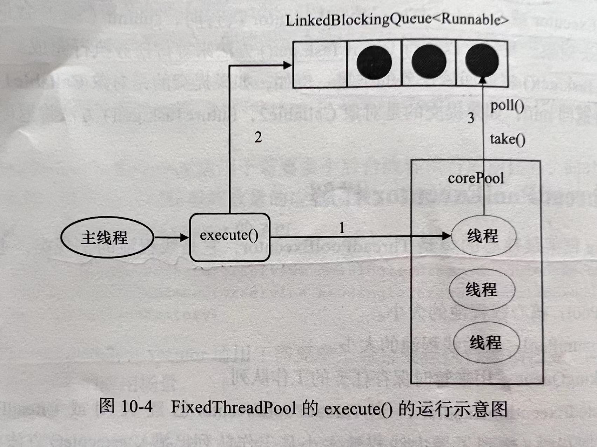

1. 如果当前运行的线程数少于corePoolSize，则创建新线程来执行任务

2. 在线程池完成预热后（当前运行的线程数等于corePoolSize），将任务加入到LinkedBlockingQueue。

3. 线程执行完1中的任务后，会在循环中反复从LinkedBlockingQueue获取任务来执行

   FixedThreadPool使用无界队列LinkedBlockingQueue作为线程池的工作队列（队列的容量为Integer.MAX_VALUE）。使用无界队列作为工作队列会对线程池带来如下影响：

   1. 当线程池中的线程数达到corePoolSize后，新任务将在无界队列中等待，因此线程池中的线程数不会超过corePoolSize。
   2. 由于1，使用无界队列时maximumPoolSize将是一个无效参数
   3. 由于1和2，使用无界队列时keepAliveTime将是一个无效参数
   4. 由于使用无界队列，运行中的FixedThreadPool（未执行方法shutdown()或shutdownNow()）不会拒绝任务（不会调用RejectedExecutionHandler.rejectedExecution方法）

> SingleThreadExecutor

​		是使用单个worker线程的Executor。

SingleThreadExecutor的corePoolSize和maximumPoolSize被设置为1，其他参数与FixedThreadPool相同。SingleThreadExecutor使用无界队列LinkedBlockingQueue作为线程池的工作队列（队列的容量为Integer.MAX_VALUE）。SingleThreadExecutor使用无界队列作为工作队列对线程池带来的影响与FixedThreadPool相同。

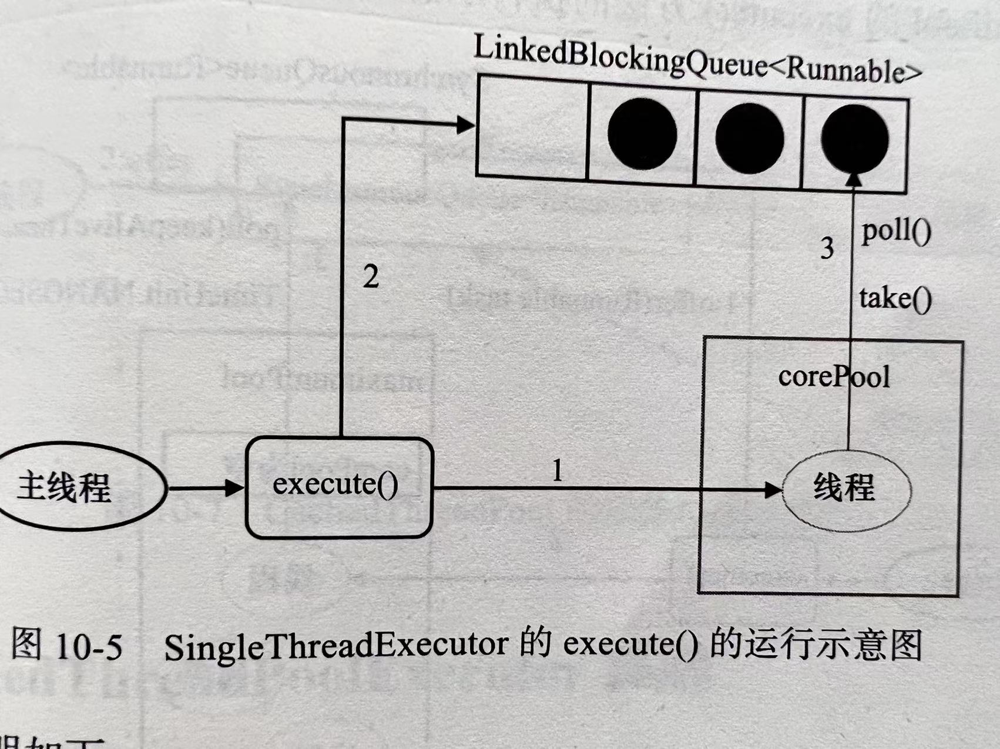

1. 如果当前运行的线程数少于corePoolSize（即线程池中无运行的线程），则创建一个新线程来执行任务
2. 在线程池完成预热后（当前线程池有一个运行的线程），将任务加入到LinkedBlockingQueue中
3. 线程执行完1中的任务后，会在一个无限循环中反复从LinkedBlockingQueue获取任务来执行。

> CachedThreadPool

CachedThreadPool是一个需要创建新线程的线程池

CachedThreadPool的corePoolSize被设置为0，即 corePoolSize为空，maximumPoolSize被设置为Integer.MAX_VALUE，即maximumPool是无界的。这里把keepAliveTime设置为60s，意味着CachedThreadPool中的空闲线程等待新任务的最长时间为60s，空闲线程超过60s会被终止。


FixedThreadPool和SingleThreadExecutor使用无界队列LinkedBlockingQueue作为线程池的工作队列。CachedThreadPool使用没有容量的SynchronousQueue作为线程池的工作队列，但CachedThreadPool的maximumPool是无界的。这意味着，如果主线程提交任务的速度高于maximumPool中线程处理任务的速度时，CachedThreadPool会不断创建新线程。极端情况下，CachedThreadPool会因为创建过多线程而耗尽CPU和内存资源。

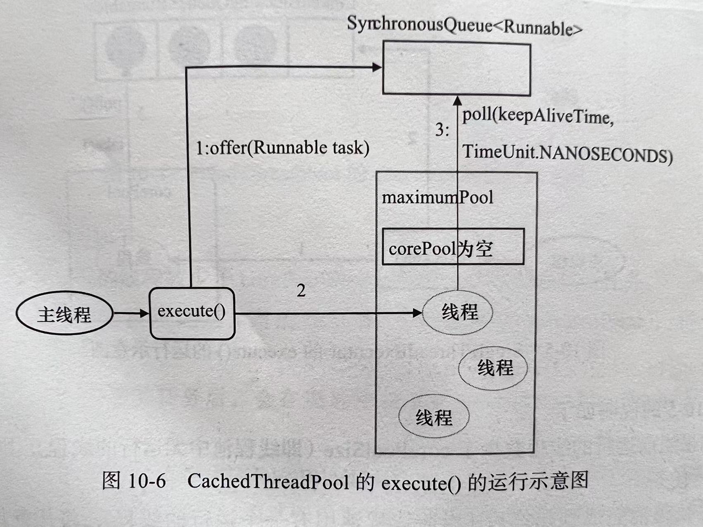

1. 首先执行 SynchronousQueue. offer（Runnable task)。如果当前 maximumPool中有2

   闲线程正在执行 SynchronousQueue. poll (keepAliveTime, TimeUnit.NANOSECONDS)，那么

   主线程执行offer操作与空闲线程执行的poll操作配对成功，主线程把任务交给空闲线程执行，execute() 方法执行完成；否则执行下面的步骤2）。

2. 当初始 maximumPool 为空，或者maximumPool 中当前没有空闲线程时，将没有线

   程执行 SynchronousQueue. poll (keepAliveTime, Time Unit. NANOSECONDS)。这种情况下，

   步骤1）将失败。此时 CachedThreadPool 会创建一个新线程执行任务，execute()方法执行

   完成。

3. 在步骤2）中新创建的线程将任务执行完后，会执行 SynchronousQueue. poll

   (keepAliveTime, Time Unit. NANOSECONDS)。这个poll操作会让空闲线程最多在synchronousQueue中等待 60秒钟。如果60 秒钟内主线程提交了一个新任务(主线程执行步骤1）），那么这个空闲线程将执行主线程提交的新任务；否则，这个空闲线程将终止。由于空闲60秒的空闲线程会被终止，因此长时问保持空闲的 CachedThreadPool 不会使用任何资源。
   前面提到过，SynchronousQueue 是一个没有容量的阻塞队列。每个插人操作必须等待另
   一个线程的对应移除操作，反之亦然。CachedThreadPool使用 SynchronousQueue，把主线程
   提交的任务传递给空闲线程执行。CachedThreadPool中任务传递的示意图如图所示。

   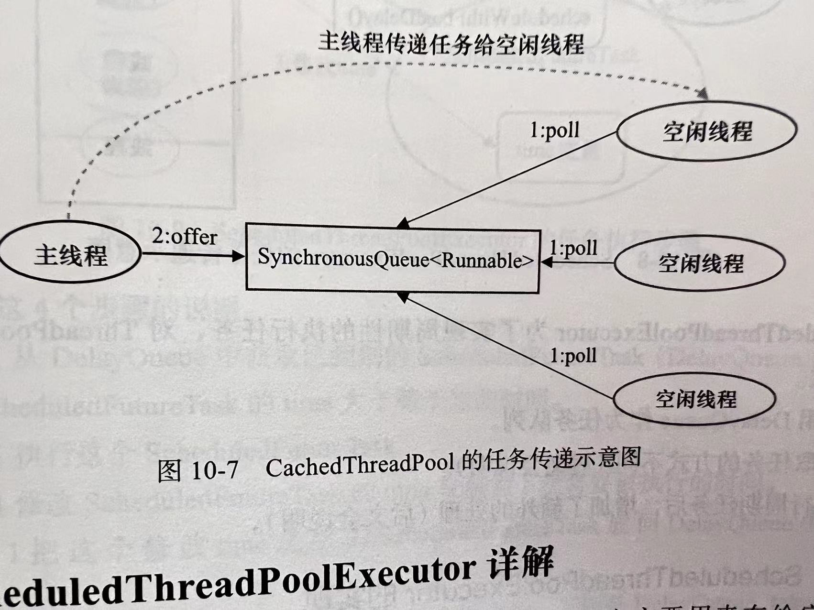

   > ScheduledThreadPoolExecutor 详解

   ScheduledThreadPoolExecutor 继承自 ThreadPoolExecutor。它主要用来在给定的延迟之后运行任务，或者定期执行任务。ScheduledThreadPoolExecutor的功能与 Timer 类似，但ScheduledThreadPoolExecutor 功能更强大、更灵活。Timer 对应的是单个后台线程，而
   ScheduledThreadPoolExecutor 可以在构造函数中指定多个对应的后合线程数。

   > Scheduled ThreadPoolExecutor 的运行机制

   ScheduledThreadPoolExecutor 的执行示意图（本文基于 JDK6）如图所示。

   DelayQueue 是一个无界队列，所以 ThreadPoolExecutor 的maximumPoolSize 在 

   ScheduledThreadPoolExecutor 中没有什么意义（设置maximumPoolSize 的大小没有什么效果)。
   ScheduledThreadPoolExecutor 的执行主要分为两大部分。
   1）当调用 ScheduledThreadPoolExecutor 的 scheduleAtFixedRate()方法或者 

   scheduleWithFixedDelay()方法时，会向ScheduledThreadPoolExecutor的 DelayQueue 添加一个实现了RunnableScheduledFutur 接口的 ScheduledFutureTask。
   2）线程池中的线程从 DelayQueue 中获取 ScheduledFutureTask，然后执行任务。

   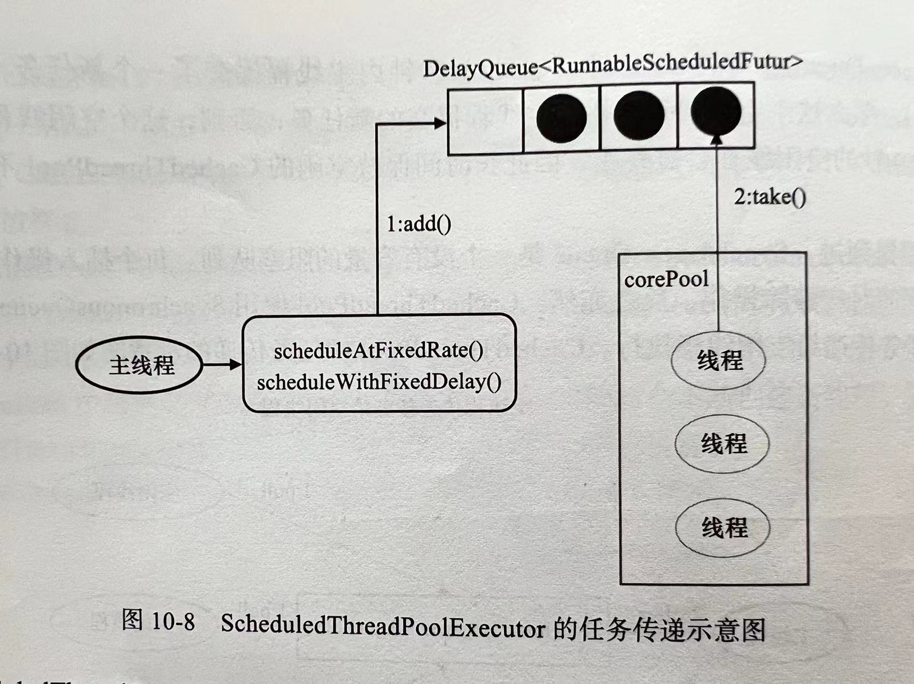

ScheduledThreadPoolExecutor为了实现周期性的执行任务，对ThreadPoolExecutor做了如下修改

- 使用DelayQueue作为任务队列
- 获取任务的方式不同
- 执行周期任务后，增加了额外的处理

> ScheduledThreadPoolExecutor 的实现

ScheduledThreadPoolExecutor 会把待调度的任务 (ScheduledFutureTask)放到一个 DelayQueue 中
ScheduledFutureTask 主要包含了个成员变量，如下。

- long 型成员变量 time，表示这个任务将要被执行的具体时间。

- long 型成员变量 sequenceNumber，表示这个任务被添加到 ScheduledThreadPoolExecutor

  中的序号。

- long 型成员变量 period，表示任务执行的间隔周期。

  DelayQueue封装了一个PriorityQueue，这个PriorityQueue 会对队列中的 Scheduled-

  FutureTask 进行排序。排序时，time 小的排在前面（时间早的任务将被先执行)。如果两个

  ScheduledFutureTask 的 time 相同，就比较sequenceNumber, sequenceNumber 小的排在前面

  (也就是说，如果两个任务的执行时间相同，那么先提交的任务将被先执行)。

  首先，让我们看看 Scheduled ThreadPoolExecutor 中的线程执行周期任务的过程。下图为Scheduled ThreadPoolExecutor 中的线程 1执行某个周期任务的4个步骤。

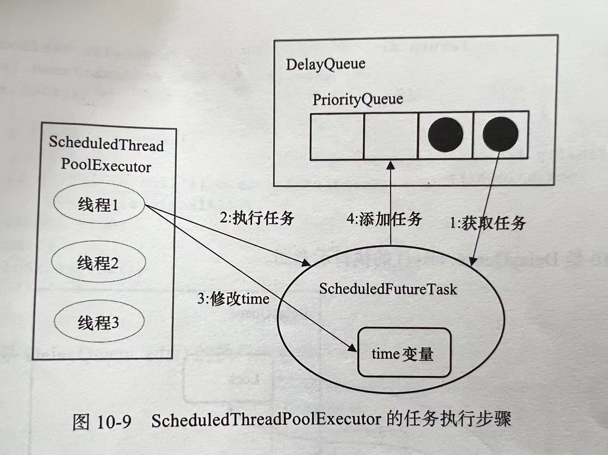

下面是对这 4个步骤的说明。
1）线程1从DelayQueue 中获取已到期的 ScheduledFutureTask (DelayQueue. take())。到
期任务是指 ScheduledFutureTask 的time 大于等于当前时间。
2）线程 1执行这个 ScheduledFutureTask。
3）线程1修改 ScheduledFutureTask 的time 变量为下次将要被执行的时间。
4）线程1把这个修改time之后的ScheduledFutureTask放回DelayQueue中 (DelayQueue. add())


> 异步模型    

​	使⽤  Runnable  和  Thread  来创建⼀个新的线程。但是它们有⼀个弊端，就是  run  ⽅法是没有返回值的。⽽有时候我们希望开启⼀个线程去执⾏⼀个任务，并且这个任务执⾏完成后有⼀个`返回值`。JDK提供了  `Callable  接⼝`与 `Future  类`为我们解决这个问题，这也是所谓的`异步模型`
Callable  与  Runnable  类似，同样是只有⼀个抽象⽅法的函数式接⼝。不同的是，  Callable  提供的⽅法是有返回值的，⽽且⽀持泛型。

```java
@FunctionalInterface
public interface Callable {
    V call() throws Exception;
}
```

`Callable  ⼀般是配合线程池⼯具  ExecutorService  来使⽤的。`
ExecutorService 可以使⽤  submit  ⽅法来让⼀个  Callable  接⼝执⾏。它会返回⼀个Future,后续的程序可以通过这个 Future 的 get ⽅法得到结果
	Java程序中对线程所设置的优先级只是给操作系统⼀个建议，操作系统不⼀定会采纳。⽽真正的调⽤顺序，是由操作系统的线程调度算法决定的。

> 乐观锁 悲观锁

**悲观锁**：
悲观锁就是我们常说的锁。对于悲观锁来说，它总是认为每次访问共享资源时会发⽣冲突，所以必须对每次数据操作加上锁，以保证临界区的程序同⼀时间只能有⼀个线程在执⾏。
**乐观锁**：
乐观锁⼜称为"⽆锁"，顾名思义，它是乐观派。乐观锁总是假设对共享资源的访问没有冲突，线程可以不停地执⾏，⽆需加锁也⽆需等待。⽽⼀旦多个线程发⽣冲突，乐观锁通常是使⽤⼀种称为`CAS`的技术来保证线程执⾏的安全性。由于⽆锁操作中没有锁的存在，因此不可能出现死锁的情况，也就是说乐观锁天⽣免疫死锁。乐观锁多⽤于"读多写少"的环境，避免频繁加锁影响性能；⽽悲观锁多⽤于"写多读少"的环境，避免频繁失败和重试影响性能。

# JUC源码分析

> CAS和Unsafe

```java
public class AtomicInteger extends Number implements java.io.Serializable {
    private static final long serialVersionUID = 6214790243416807050L;

    // setup to use Unsafe.compareAndSwapInt for updates
    private static final Unsafe unsafe = Unsafe.getUnsafe();
    //value的偏移地址
    private static final long valueOffset;
    static {
        try {
            valueOffset = unsafe.objectFieldOffset
                (AtomicInteger.class.getDeclaredField("value"));
        } catch (Exception ex) {
            throw new Error(ex);
        }
    }
    //volatile  value  表示直接从共享内存中操作变量，保证多线程之间看到的value值是同一份。
    private volatile int value;
    public AtomicInteger(int initialValue) {
        value = initialValue;
    }
    public final int getAndUpdate(IntUnaryOperator updateFunction) {
        int prev, next;
        do {
            prev = get();
            next = updateFunction.applyAsInt(prev);
        } while (!compareAndSet(prev, next));
        return prev;
    }
    public final boolean compareAndSet(int expect, int update) {
        return unsafe.compareAndSwapInt(this, valueOffset, expect, update);
    }
}
```

​	可以看到`AtomicInteger`内部都是使用了`Unsafe`类来进行CAS操作，`valueOffset`表示的是value值的偏移地址，因为Unsafe就是`根据内存偏移地址获取数据的原值`的, 偏移量可以简单理解为`指针指向该变量的内存地址`。 

以方法`getAndUpdate()`为例，执行步骤如下：

1. 从内存中读取修改前的值`prev`，并执行给定函数式计算修改后的值`next`；

2. 调用`compareAndSet`修改`value`值（内部是调用了`unsafe`的`compareAndSwapInt`方法）。如果此时有`其他线程`也在`修改`这个`value`值，那么`CAS操作就会失败`，`继续进入do循环重新获取新值，再次执行CAS直到修改成功`。

   ### ABA问题

   > ABA问题是一种异常现象：如果算法中的节点可以被循环利用，那么在使用“比较并替换”指令时就可能出现这种问题（主要在没有垃圾回收机制的环境中）。

   如果有两个线程x和y，如果x初次从内存中读取变量值为A；线程y对它进行了一些操作使其变成B，然后再改回A，那么线程x进行CAS的时候就会误认为这个值没有被修改过。尽管CAS操作会成功执行，但是不代表它是没有问题的，如果有一个单向链表A B组成的栈，栈顶为A，线程T1准备执行CAS操作`head.compareAndSet(A,B)`，在执行之前线程T2介入，T2将A、B出栈，然后又把C、A放入栈，T2执行完毕；切回线程T1，T1发现栈顶元素依然为A，也会成功执行CAS将栈顶元素修改为B，但因为B.next为null，所以栈结构就会丢弃C元素。

   针对这种情况，有一种简单的解决方案：不是更新某个引用的值，而是更新两个值，包括一个引用和一个和版本号，即这个值由A变为B，然后又变成A，版本号也将是不同的。Java中提供了`AtomicStampedReference`和`AtomicMarkableReference`来解决ABA问题。他们支持在两个变量上执行原子的条件更新。`AtomicStampedReference`将更新一个“对象-引用”二元组，通过在引用上加上“版本号”，从而避免ABA问题。 类似地，`AtomicMarkableReference`将更新一个“对象引用-布尔值”二元组，在某些算法中将通过这种二元组使节点保存在链表中同时又将其标记为“已删除的节点”。**不过目前来说，这两个类比较鸡肋，大部分情况下的ABA问题不会影响程序并发的正确性，如果需要解决ABA问题，改用传统的互斥同步可能会比原子类更高效。**

   ### Unsafe

   > Unsafe是实现CAS的核心类，Java无法直接访问底层操作系统，而是通过本地（native）方法来访问。Unsafe类提供了硬件级别的原子操作。

   ### Unsafe函数列表

   ```java
   ///--------------------- peek and poke 指令--------------
   //获取对象o中给定偏移地址(offset)的值。以下相关get方法作用相同
   public native int getInt(Object o, long offset);
   //在对象o的给定偏移地址存储数值x。以下set方法作用相同
   public native void putInt(Object o, long offset, int x);
   public native Object getObject(Object o, long offset);
   public native void putObject(Object o, long offset, Object x);
   /**篇幅原因，省略其他类型方法 */
   //从给定内存地址获取一个byte。下同
   public native byte    getByte(long address);
   //在给定内存地址放置一个x。下同
   public native void    putByte(long address, byte x);
   /**篇幅原因，省略其他类型方法*/
   //获取给定内存地址的一个本地指针
   public native long getAddress(long address);
   //在给定的内存地址处存放一个本地指针x
   public native void putAddress(long address, long x);
   
   ///------------------内存操作----------------------
   //在本地内存分配一块指定大小的新内存，内存的内容未初始化;它们通常被当做垃圾回收。
   public native long allocateMemory(long bytes);
   //重新分配给定内存地址的本地内存
   public native long reallocateMemory(long address, long bytes);
   //将给定内存块中的所有字节设置为固定值（通常是0）
   public native void setMemory(Object o, long offset, long bytes, byte value);
   //复制一块内存，double-register模型
   public native void copyMemory(Object srcBase, long srcOffset,
                                 Object destBase, long destOffset,
                                 long bytes);
   //复制一块内存，single-register模型
   public void copyMemory(long srcAddress, long destAddress, long bytes) {
       copyMemory(null, srcAddress, null, destAddress, bytes);
   }
   //释放给定地址的内存
   public native void freeMemory(long address);
   //获取给定对象的偏移地址
   public native long staticFieldOffset(Field f);
   public native long objectFieldOffset(Field f);
   
   //------------------数组操作---------------------------------
   //获取给定数组的第一个元素的偏移地址
   public native int arrayBaseOffset(Class<?> arrayClass);
   //获取给定数组的元素增量地址，也就是说每个元素的占位数
   public native int arrayIndexScale(Class<?> arrayClass);
   
   //------------------------------------------------------------
   //告诉虚拟机去定义一个类。默认情况下，类加载器和保护域都来自这个方法
   public native Class<?> defineClass(String name, byte[] b, int off, int len,
                                      ClassLoader loader,
                                      ProtectionDomain protectionDomain);
   //定义匿名内部类
   public native Class<?> defineAnonymousClass(Class<?> hostClass, byte[] data, Object[] cpPatches);
   //定位一个实例，但不运行构造函数
   public native Object allocateInstance(Class<?> cls) throws InstantiationException;
   
   ///--------------------锁指令（synchronized）-------------------------------
   //对象加锁
   public native void monitorEnter(Object o);
   //对象解锁
   public native void monitorExit(Object o);
   public native boolean tryMonitorEnter(Object o);
   //解除给定线程的阻塞
   public native void unpark(Object thread);
   //阻塞当前线程
   public native void park(boolean isAbsolute, long time);
   
   // CAS
   public final native boolean compareAndSwapObject(Object o, long offset,
                                                    Object expected,
                                                    Object x);
   //获取对象o的给定偏移地址的引用值（volatile方式）
   public native Object getObjectVolatile(Object o, long offset);
   public native void    putObjectVolatile(Object o, long offset, Object x);
   /** 省略其他类型方法  */
   
   
   //用于lazySet，适用于低延迟代码。
   public native void    putOrderedObject(Object o, long offset, Object x);
   /** 省略其他类型方法  */
   //获取并加上给定delta，返回加之前的值
   public final int getAndAddInt(Object o, long offset, int delta)
   /** 省略其他类型方法  */
   //为给定偏移地址设置一个新的值，返回设置之前的值
   public final int getAndSetInt(Object o, long offset, int newValue)
   /** 省略其他类型方法  */
   
   ///--------------------1.8新增指令-----------------------
   // loadFence() 表示该方法之前的所有load操作在内存屏障之前完成
   public native void loadFence();
   //表示该方法之前的所有store操作在内存屏障之前完成
   public native void storeFence();
   //表示该方法之前的所有load、store操作在内存屏障之前完成，这个相当于上面两个的合体功能
   public native void fullFence();
   ```

   Unsafe的方法比较简单，直接看方法字面意思就大概知道方法的作用。
    在Unsafe里有两个方法模型：
    **double-register模型**：给定对象，给定偏移地址offset。从给定对象的偏移地址取值。
   
   如`getInt(Object o, long offset)`；
    **single-register模型**：给定内存地址，直接从给定内存地址取值，如`getInt(long)`。

   这里介绍一下几个比较重要的方法，在之后的源码阅读里会用到。
   
   1. `arrayBaseOffset`：操作数组，用于获取数组的第一个元素的偏移地址
   2. `arrayIndexScale`：操作数组，用于获取数组元素的增量地址，也就是说每个元素的占位数。打个栗子：如果有一个数组{1,2,3,4,5,6}，它第一个元素的偏移地址为16，每个元素的占位是4，如果我们要获取数组中“5”这个数字，那么它的偏移地址就是16+4*4。
   3. `putOrderedObject`：putOrderedObject 是 lazySet 的实现，适用于低延迟代码。它能够实现非堵塞写入，避免指令重排序，这样它使用快速的存储-存储(store-store) barrier,而不是较慢的存储-加载(store-load) barrier, 后者多是用在volatile的写操作上。但这种性能提升也是有代价的，也就是写后结果并不会被其他线程（甚至是自己的线程）看到，通常是几纳秒后被其他线程看到。类似的方法还有`putOrderedInt、putOrderedLong`。
   4. `loadFence`、`storeFence`、`fullFence`：这三个方法是1.8新增，主要针对内存屏障定义，也是为了避免重排序：
   
   - `loadFence() `表示该方法之前的所有load操作在内存屏障之前完成。
   - `storeFence()`表示该方法之前的所有store操作在内存屏障之前完成。
   - `fullFence()`表示该方法之前的所有load、store操作在内存屏障之前完成。
   


> AQS概述

AbstractQueuedSynchronizer，简称AQS。是一个`用于构建锁和同步器的框架`，许多同步器都可以通过AQS很容易并且高效地构造出来，如常用的`ReentrantLock`、`Semaphore`、`CountDownLatch`等。基于AQS来构建同步器能带来许多好处。它`不仅能极大地减少实现工作`，而且`也不必处理在多个位置上发生的竞争问题`。`在基于AQS构建的同步器中，只可能在一个时刻发生阻塞，从而降低上下文切换的开销，并提高吞吐量。`在设计AQS时也充分考虑了可伸缩性，因此 JUC 中所有基	于AQS构建的同步器都能获得这个优势。大多数开发者都不会直接使用AQS，JUC中标准同步器类都能够满足绝大多数情况的需求。但如果能了解标准同步器类的实现方式，那么对理解它们的工作原理是非常有帮助的。

💡`Tip: AQS的等待/唤醒是通过LockSupport的 park 和 unpark 来实现的。`

*注：文中所写的“资源”和“锁”是同一个概念。*

AQS支持**独占锁（Exclusive）和共享锁（Share）**两种模式：

- 独占锁：也叫互斥锁、排它锁，只能被一个线程获取到(如`ReentrantLock`、`ReadWriteLock`的写锁)；
- 共享锁：可以被多个线程同时获取(如`CountDownLatch`、`ReadWriteLock`的读锁)。

不管是独占锁还是共享锁，本质上都是对AQS内部的一个变量`state`的获取，`state`是一个原子性的int变量，可用来表示锁状态、资源数等，如下图。


> 数据结构和核心参数


AQS的内部实现了两个队列：**同步队列和条件队列**。

- **同步队列**：在线程尝试获取资源失败后，会进入同步队列队尾，给前继节点设置一个唤醒信号后，自身进入等待状态（通过`LockSupport.park(this)`），直到被前继节点唤醒。
- **条件队列**：是为`Condition`实现的一个同步器，一个线程可能会有多个条件队列，只有在使用了`Condition`才会存在条件队列。需要注意的是，如果一个线程被唤醒（`condition.signal()`）后，它会从条件队列转移到同步队列来等待获取锁，后面对条件队列进行源码分析时会再详细讲解。

## 2.1 同步队列

不管是同步队列还是条件队列，其内部都是一个双向链表结构，首先来看一下这个双向链表`Node`的实现：

```java
static final class Node {
    /**
     * Marker to indicate a node is waiting in shared mode
     */
    static final Node SHARED = new Node();
    /**
     * Marker to indicate a node is waiting in exclusive mode
     */
    static final Node EXCLUSIVE = null;
    //取消
    static final int CANCELLED = 1;
    //等待触发
    static final int SIGNAL = -1;
    //等待条件
    static final int CONDITION = -2;
    //状态需要向后传播，针对共享锁
    static final int PROPAGATE = -3;
    //等待状态,上面列出的几个常量状态
    volatile int waitStatus;
    volatile Node prev;
    volatile Node next;
    //跟随节点入队的线程
    volatile Thread thread;
    //链接下一个等待condition的节点，或者在共享模式下作为一个特殊节点保存,用来判断是否为共享模式
    Node nextWaiter;
}
```

**说明：**双向链表这里就不再解释了，主要看一下内部的几个等待状态：

- `CANCELLED`：值为1，当前节点由于超时或中断被取消。
- `SIGNAL`：值为-1，唤醒信号，表示当前节点的后继节点正在等待获取锁，当前节点在release或cancel时需要执行`unpark`来唤醒后继节点。
- `CONDITION`：值为-2，当前节点为条件队列节点，这个状态在同步队列里不会被用到。
- `PROPAGATE`：值为-3，针对共享锁，`releaseShared`（释放共享锁）操作需要被传递到下一个节点。这个状态在`doReleaseShared`方法中被设置在`head`节点，用来保证后续节点可以获取共享资源。这个定义可能比较抽象，后面第三节我们对`doAcquireShared`方法分析的时候再详细讲解这个状态。
- `0`：初始状态，当前节点在同步队列中，等待获取锁。

## 2.2 基础同步器

介绍完同步队列，下面来看一下AQS基础同步器：

```java
//队列头,注意如果head存在,那么它的waitStatus一定不是CANCELLED
private transient volatile Node head;
//队列尾
private transient volatile Node tail;
//同步器state(资源)
private volatile int state;

```

说明：其实AQS同步器的实现方式并不复杂，主要就是围绕这三个成员变量来实现锁/资源的获取和释放。

注：AQS本身已经为我们提供了一个同步器的所需的基础操作，如果要自定义一个同步器，必须要实现以下几个方法：

- `tryAcquire(int)`：独占方式。尝试获取资源，成功则返回true，失败则返回false。
- `tryRelease(int)`：独占方式。尝试释放资源，成功则返回true，失败则返回false。
- `tryAcquireShared(int)`：共享方式。尝试获取资源。负数表示失败；0表示成功，但没有剩余可用资源；正数表示成功，且有剩余资源。
- `tryReleaseShared(int)`：共享方式。尝试释放资源，成功则返回true，失败则返回false。
- `isHeldExclusively()`：该线程是否正在独占资源（是否获取到锁）。只有用到Condition才需要去实现它。

## 2.3 条件同步器


除了基础同步器，AQS还实现了一个条件同步器（为`Condition`类提供的实现-`ConditionObject`），首先来看一下这个条件同步器内部的几个重要元素：

```java
//条件队列的首个节点
private transient Node firstWaiter;
//条件队列的尾节点
private transient Node lastWaiter;
//节点等待时如果被中断，则重新补上中断状态
private static final int REINTERRUPT =  1;
//节点等待时如果被中断，则抛出InterruptedException异常
private static final int THROW_IE    = -1;
```

说明：条件同步器和AQS本身的基础同步器实现方式大同小异，`firstWaiter`相当于`head`，`lastWaiter`相当于`tail`。我们知道，在使用`condition`的方法之前需要先获取锁，那么这是为什么呢？同学们可以先思考一下这个问题，后面对条件同步器进行源码解析时会再详细分析。

# 3. 源码解析

本节开始将会从源码层面分析AQS的具体实现，分两个部分：第一部分是对`基础同步器`的讲解；第二部再分析AQS对`Condition`的实现。

## 3.1 基础同步器

如果你使用过`Lock`，那么对`lock.lock()`和`lock.unlock()`肯定不会陌生，这两个方法本质上都是使用AQS的下面四个方法来实现的，后面我们会依次对这些方法做详细讲解：

- `acquire(int)`：独占模式下获取锁/资源（写锁`lock.lock()`内部实现）
- `release(int)`：独占模式下释放锁/资源（写锁`lock.unlock()`内部实现）
- `acquireShared(int)`：共享模式下获取锁/资源（读锁`lock.lock()`内部实现）
- `releaseShared(int)`：共享模式下释放锁/资源（读锁`lock.unlock()`内部实现）

*注：由于部分方法在AQS中未实现，文中会引入`ReentrantLock`中部分方法实现，建议同学们结合[JUC源码分析-JUC锁（一）：ReetrantLock](https://www.jianshu.com/p/38fe92bcca7e)学习以下内容。*

### 3.1.1 acquire(int)

```java
//独占模式获取资源
public final void acquire(int arg) {
    if (!tryAcquire(arg) &&
        acquireQueued(addWaiter(Node.EXCLUSIVE), arg))
        selfInterrupt();
}
```

**说明：** 独占模式下获取资源/锁，忽略中断的影响。内部主要调用了三个方法，其中`tryAcquire`需要自定义实现。后面会对各个方法进行详细分析。`acquire`方法流程如下：

1. `tryAcquire()` 尝试直接获取资源/锁，如果成功则直接返回，失败进入第二步；
2. `addWaiter()` 获取资源/锁失败后，将当前线程加入同步队列的尾部，并标记为独占模式，返回新的同步队列；
3. `acquireQueued()` 使线程在同步队列等待获取资源，一直获取到后才返回，如果在等待过程中被中断过，则返回true，否则返回false。
4. 如果线程在等待过程中被中断(interrupt)过，在获取资源成功之后会调用`selfInterrupt()`方法把中断状态补上。

#### 3.1.1.1 tryAcquire(int)

```java
protected boolean tryAcquire(int arg) {
    throw new UnsupportedOperationException();
}
```

**说明：**尝试获取资源，成功返回true。具体资源获取/释放方式交由自定义同步器实现。`ReentrantLock`中公平锁和非公平锁的具体实现如下（请同学们结合着[ReetrantLock源码分析](https://www.jianshu.com/p/38fe92bcca7e)一章来看）:

```java
//公平锁
protected final boolean tryAcquire(int acquires) {
    final Thread current = Thread.currentThread();
    int c = getState();
    if (c == 0) {
        if (!hasQueuedPredecessors() &&
                compareAndSetState(0, acquires)) {
            setExclusiveOwnerThread(current);
            return true;
        }
    }
    else if (current == getExclusiveOwnerThread()) {
        int nextc = c + acquires;
        if (nextc < 0)
            throw new Error("Maximum lock count exceeded");
        setState(nextc);
        return true;
    }
    return false;
}
//非公平锁
final boolean nonfairTryAcquire(int acquires) {
    final Thread current = Thread.currentThread();
    int c = getState();
    if (c == 0) {
        if (compareAndSetState(0, acquires)) {
            setExclusiveOwnerThread(current);
            return true;
        }
    }
    else if (current == getExclusiveOwnerThread()) {
        int nextc = c + acquires;
        if (nextc < 0) // overflow
            throw new Error("Maximum lock count exceeded");
        setState(nextc);
        return true;
    }
    return false;
}
```

#### 3.1.1.2 addWaiter(Node)

```java
//插入给定节点到队尾，并返回新的队列(节点)
private Node addWaiter(Node mode) {
    Node node = new Node(mode);

    for (;;) {//自旋重试
        Node oldTail = tail;
        if (oldTail != null) {
            //设置当前节点的前继节点为tail
            node.setPrevRelaxed(oldTail);
            //cas替换tail为当前节点
            if (compareAndSetTail(oldTail, node)) {
                oldTail.next = node;
                return node;
            }
        } else {//队尾为空,初始化同步队列
            initializeSyncQueue();
        }
    }
}
```

**说明：**获取资源/锁失败后，将当前线程加入同步队列的尾部，并标记为独占模式。返回插入的等待节点。

#### 3.1.1.3 acquireQueued(Node,int)

```java
//等待获取资源
final boolean acquireQueued(final Node node, int arg) {
    boolean interrupted = false;
    try {
        for (;;) {
            final Node p = node.predecessor();//获取前继节点
            //前继节点为head，说明可以尝试获取资源
            if (p == head && tryAcquire(arg)) {
                setHead(node);//获取成功，更新head节点
                p.next = null; // help GC
                return interrupted;
            }
            if (shouldParkAfterFailedAcquire(p, node))//检查是否可以park
                interrupted |= parkAndCheckInterrupt();//阻塞当前线程,清除并返回中断状态
        }
    } catch (Throwable t) {
        cancelAcquire(node);//取消正在等待的节点操作
        if (interrupted)//如果期间线程被中断过，补上中断
            selfInterrupt();
        throw t;
    }
}
```

**说明：**  线程进入同步队列后，调用`acquireQueued`方法在队列中等待获取资源。如果等待期间被中断过则返回`true`，否则返回`false`。`acquireQueued`具体流程如下：

1. 获取当前等待节点的前继节点，如果前继节点为`head`，说明可以尝试获取锁/资源；

2. 调用`tryAcquire`获取资源，成功后更新`head`为当前节点，返回等待期间的中断状态；

3. 如果前继节点不是`head`，或者`tryAcquire`获取资源失败，继续调用`shouldParkAfterFailedAcquire`方法检查并更新前继节点的等待状态。把前继等待状态设为`SIGNAL`之后，不会直接阻塞，而是会再去尝试一次获取资源（自旋回来再次执行1、2步），来确保调用者确实获取不到资源，然后才会调用`parkAndCheckInterrupt`进入阻塞状态（详见下面`shouldParkAfterFailedAcquire`方法的注释）。

4. 线程被唤醒后，继续自旋重复上述步骤，`shouldParkAfterFailedAcquire`和`parkAndCheckInterrupt`源码如下：

   ```java
   //获取资源失败后，检查并更新等待状态,如果线程需要阻塞返回true
   private static boolean shouldParkAfterFailedAcquire(Node pred, Node node) {
       int ws = pred.waitStatus;
       if (ws == Node.SIGNAL)
           /*
            * This node has already set status asking a release
            * to signal it, so it can safely park.
            */
           //前继节点已设置唤醒信号,当前节点可以被阻塞
           return true;
       if (ws > 0) {
           //如果前节点为CANCELLED状态，那就一直往前找到一个等待状态的节点，并排在它的后边
           do {
               node.prev = pred = pred.prev;
           } while (pred.waitStatus > 0);
           pred.next = node;
       } else {
           // 此时前继节点状态为0或PROPAGATE，说明正在等待获取锁/资源,
           // 此时需要给前继节点设置一个唤醒信号SIGNAL，但不直接阻塞,
           // 因为在阻塞前调用者需要重试来确认它确实不能获取资源。
           pred.compareAndSetWaitStatus(ws, Node.SIGNAL);
       }
       return false;
   }
   //阻塞当前线程，清除并返回中断状态
   private final boolean parkAndCheckInterrupt() {
       LockSupport.park(this);
       return Thread.interrupted();
   }
   ```

   **说明：**当前线程通过`parkAndCheckInterrupt()`阻塞之后，此状态下可以通过下面两种途径唤醒线程：

   - 前继节点释放资源后，通过`unparkSuccessor()`方法unpark当前线程；
   - 当前线程被中断。

   1. 回到`acquireQueued()`方法，如果在上述四步中遭遇异常，则需要通过`cancelAcquire`方法取消当前节点的获取操作，源码如下：

   

   ```java
   private void cancelAcquire(Node node) {
       // Ignore if node doesn't exist
       if (node == null)
           return;
   
       node.thread = null;
   
       // Skip cancelled predecessors
       Node pred = node.prev;
       //为当前节点找出一个有效的前继节点(非cancel的前继节点)
       while (pred.waitStatus > 0)
           node.prev = pred = pred.prev;
   
       Node predNext = pred.next;
   
       //当前节点的状态设为CANCELLED
       node.waitStatus = Node.CANCELLED;
   
       // If we are the tail, remove ourselves.
       if (node == tail && compareAndSetTail(node, pred)) {
           pred.compareAndSetNext(predNext, null);
       } else {
           int ws;
           if (pred != head &&
               ((ws = pred.waitStatus) == Node.SIGNAL ||
                (ws <= 0 && pred.compareAndSetWaitStatus(ws, Node.SIGNAL))) &&
               pred.thread != null) {//前继节点不是head,并且状态为SIGNAL,并且未取消,说明该前继节点是非head的有效SIGNAL节点
               Node next = node.next;
               //把前继节点的next设置为当前节点的next节点
               if (next != null && next.waitStatus <= 0)
                   pred.compareAndSetNext(predNext, next);
           } else {//前继节点为head节点,帮忙唤醒当前节点的后继节点
               unparkSuccessor(node);
           }
           //指向自己,等待被回收
           node.next = node; // help GC
       }
   }
   
   //唤醒给定节点的后继节点
   private void unparkSuccessor(Node node) {
       int ws = node.waitStatus;
       if (ws < 0)
           node.compareAndSetWaitStatus(ws, 0);
       Node s = node.next;
       if (s == null || s.waitStatus > 0) {
           s = null;
           //后继节点为空或已取消,从tail开始向前查找有效节点
           for (Node p = tail; p != node && p != null; p = p.prev)
               if (p.waitStatus <= 0)
                   s = p;
       }
       if (s != null)
           LockSupport.unpark(s.thread);
   }
   ```

   **说明：** `cancelAcquire`方法用于取消正在等待的节点，在获取资源遭遇异常、或者在响应中断的方法中遭遇线程中断(`interrupt`)时被调用，逻辑也不太复杂：主要操作就是把自己从同步队列中剔除，同学们可以参考上述源码中的注释阅读。这里需要注意一点，如果需要取消的节点的前继节点是`head`节点的话，需要帮助唤醒下一个同步队列中的节点(调用了`unparkSuccessor`方法，下节会讲到)。

   ### 3.1.2 release(int)

   ```java
   /**独占模式释放锁/资源*/
   public final boolean release(int arg) {
       if (tryRelease(arg)) {//尝试释放资源
           Node h = head;//头结点
           if (h != null && h.waitStatus != 0)
               unparkSuccessor(h);//唤醒head的下一个节点
           return true;
       }
       return false;
   }
   ```

   **说明：**独占模式下释放指定量的资源，成功释放后调用`unparkSuccessor`唤醒head的下一个节点。

   #### 3.1.2.1 tryRelease(int)

   ```java
   protected boolean tryRelease(int arg) {
       throw new UnsupportedOperationException();
   }
   ```

   **说明：**和`tryAcquire()`一样，这个方法也需要自定义同步器去实现。一般来说，释放资源直接拿`state`减去给定的参数`arg`，释放后`state==0`说明释放成功。在`ReentrantLock`中实现如下：

   ```java
   protected final boolean tryRelease(int releases) {
       int c = getState() - releases;
       if (Thread.currentThread() != getExclusiveOwnerThread())
           throw new IllegalMonitorStateException();
       boolean free = false;
       if (c == 0) {
           free = true;//锁全部释放，可以唤醒下一个等待线程
           setExclusiveOwnerThread(null);//设置独占锁持有线程为null
       }
       setState(c);
       return free;
   }
   ```

   #### 3.1.2.2 unparkSuccessor(Node)

   ```java
   //唤醒给定节点的后继节点
   private void unparkSuccessor(Node node) {
       int ws = node.waitStatus;
       if (ws < 0)
           node.compareAndSetWaitStatus(ws, 0);
       Node s = node.next;
       if (s == null || s.waitStatus > 0) {
           s = null;
           //后继节点为空或已取消,向前查找有效节点
           for (Node p = tail; p != node && p != null; p = p.prev)
               if (p.waitStatus <= 0)
                   s = p;
       }
       if (s != null)
           LockSupport.unpark(s.thread);
   }
   ```

   **说明：**成功释放资源后，调用此方法唤醒下一个节点。因为当前节点已经释放掉资源，下一个等待的线程可以被唤醒继续获取资源。此方法在上一小节中的`cancelAcquire`中也有使用到。

   ### 3.1.3  acquireShared(int)

   ```java
   //共享模式下获取锁/资源
   public final void acquireShared(int arg) {
       if (tryAcquireShared(arg) < 0)
           doAcquireShared(arg);
   }
   ```

   **说明：**共享模式下获取资源/锁。流程比较简单：使用`tryAcquireShared(arg)` 尝试获取共享资源，成功则直接返回，如果尝试获取资源失败，则调用`doAcquireShared`方法进入同步队列，成功获取资源后返回。

   #### 3.1.3.1 tryAcquireShared(int arg)

   ```cpp
   protected int tryAcquireShared(int arg) {
       throw new UnsupportedOperationException();
   }
   ```

   **说明：**尝试获取共享资源，需同步器自定义实现。有三个类型的返回值：

   - 正数：成功获取资源，并且还有剩余可用资源，可以唤醒下一个等待线程；
   - 负数：获取资源失败，准备进入同步队列；
   - 0：获取资源成功，但没有剩余可用资源。

   #### 3.1.3.2 doAcquireShared(int)

   ```java
   //获取共享锁
   private void doAcquireShared(int arg) {
       final Node node = addWaiter(Node.SHARED);//添加一个共享模式Node到队列尾
       boolean interrupted = false;
       try {
           for (;;) {
               final Node p = node.predecessor();//获取前节点
               if (p == head) {
                   int r = tryAcquireShared(arg);//前继节点为head,尝试直接获取资源
                   if (r >= 0) {
                       //获取资源成功,设置head为自己,如果有剩余资源继续唤醒之后的线程
                       setHeadAndPropagate(node, r);
                       p.next = null; // help GC
                       return;
                   }
               }
               if (shouldParkAfterFailedAcquire(p, node))//检查获取失败后是否可以阻塞
                   interrupted |= parkAndCheckInterrupt();//阻塞当前线程,清除并返回中断状态
           }
       } catch (Throwable t) {
           cancelAcquire(node);//取消正在等待的节点操作
           throw t;
       } finally {
           if (interrupted)//如果期间线程被中断过，补上中断
               selfInterrupt();
       }
   }
   ```

   **说明：** 看到这里，同学们是不是觉得这个方法很熟悉，没错，跟独占模式时的`acquireQueued`方法基本一致。具体流程就不重复讲了，这里只需要注意一点：当前节点成功获取到资源后，如果还有剩余资源（`tryAcquireShared`返回值大于0），还需要调用`setHeadAndPropagate`方法继续唤醒之后的线程（这是与独占模式不同的一点），`setHeadAndPropagate`源码如下：

   ```csharp
   //设置head，如果有剩余资源可以再唤醒之后的线程
   private void setHeadAndPropagate(Node node, int propagate) {
       Node h = head; // Record old head for check below
       setHead(node);
       /*
        * 如果满足下列条件可以尝试唤醒下一个节点：
        *  有剩余资源(propagate>0)，并且当前节点有唤醒信号
        */
       if (propagate > 0 || h == null || h.waitStatus < 0 ||
           (h = head) == null || h.waitStatus < 0) {
           Node s = node.next;
           if (s == null || s.isShared())
               doReleaseShared();
       }
   }
   ```

   **说明：** `setHeadAndPropagate`所做的事情跟它的名字一样，首先是更新`head`；如果还有剩余资源，或者前节点已经被记录（`waitStatus`为`SIGNAL`或`PROPAGATE`），则继续调用`doReleaseShared`方法帮助唤醒后续节点。

   **注：为了便于理解`PROPAGATE`这个状态， `doReleaseShared`方法放到本节来讲解，源码如下：**

   ```csharp
   //释放共享资源
   private void doReleaseShared() {
       //自旋,防止操作时有新的节点加入导致CAS失败
       for (;;) {
           Node h = head;
           if (h != null && h != tail) {
               int ws = h.waitStatus;
               if (ws == Node.SIGNAL) {
                   if (!compareAndSetWaitStatus(h, Node.SIGNAL, 0))
                       continue;            // loop to recheck cases
                   unparkSuccessor(h);//唤醒后继节点
               }
               else if (ws == 0 &&
                        !compareAndSetWaitStatus(h, 0, Node.PROPAGATE))  //waitStatus为0，说明是从doAcquireShared过来的操作，CAS修改为PROPAGATE
                   continue;                // loop on failed CAS
           }
           if (h == head)                   // loop if head changed
               break;
       }
   }
   ```

   **说明：** 成功释放资源后，调用此方法继续唤醒后继节点。
    这里主要说明一下`PROPAGATE`状态的设置：
    新节点尝试获取资源失败后，会调用`doAcquireShared`方法进入队列等待。在进入等待前，如果前继节点是`head`节点，会尝试着再去获取一次资源，如果当前节点再次尝试获取资源成功，则会调用`setHeadAndPropagate`方法更新`head`为当前节点，并且如果此时还有剩余资源，则继续调用`doReleaseShared`方法释放节点。此时，就会把节点状态由`0`修改为`PROPAGATE`，保证下一次`doAcquireShared`操作可以在`setHeadAndPropagate`时继续向后传播。

   ### 3.1.4  releaseShared(int)

   ```java
   /**共享模式下释放给定资源数*/
   public final boolean releaseShared(int arg) {
       if (tryReleaseShared(arg)) {
           doReleaseShared();//释放资源，并唤醒后继节点
           return true;
       }
       return false;
   }
   ```

   **说明：**`releaseShared`用于共享模式下释放给定量的资源，如果成功释放，唤醒同步队列的后继节点。方法执行流程：`tryReleaseShared(int)`尝试释放给定量的资源（需要自定义同步器去实现），成功释放后调用`doReleaseShared()`唤醒后继线程。

   #### 3.1.4.1 tryReleaseShared(int)

   ```cpp
   /**共享模式释放资源*/
   protected boolean tryReleaseShared(int arg) {
       throw new UnsupportedOperationException();
   }
   ```

   **说明：**释放给定量的资源，需自定义同步器实现。释放后如果允许后继等待线程获取资源返回`true`。

   #### 3.1.4.2 doReleaseShared(int)

   **见3.1.3.2**

   ### 3.1.5 小结

   自此，AQS的几个主要方法就分析完了，剩余一些如`tryAcquireNanos`、`tryAcquireSharedNanos`，是带等待时间的资源获取方法，还有`acquireInterruptibly` `acquireSharedInterruptibly`，响应中断式资源获取方法。与本章节所讲的方法大同小异，就不再详细分析了。

   ------

   ## 3.2 条件同步器

   本节开始分析AQS内部对`Condition`的实现—`ConditionObject`，在进行下面的内容之前，确保你已经真正理解AQS基础同步器。同样地，我们会针对`Condition`中最常用的两个方法进行解析：`await()`和`signal()`。

   ### 3.2.1 await()

   ```java
   public final void await() throws InterruptedException {
       if (Thread.interrupted())
           throw new InterruptedException();
       //添加新节点(当前线程)到条件队列
       Node node = addConditionWaiter();
       int savedState = fullyRelease(node);//释放锁并返回释放前锁状态
       int interruptMode = 0;
       while (!isOnSyncQueue(node)) {//当前节点是否在同步队列中
           LockSupport.park(this);
           //检查等待期间是否被中断过
           if ((interruptMode = checkInterruptWhileWaiting(node)) != 0)
               break;
       }
       //获取锁
       if (acquireQueued(node, savedState) && interruptMode != THROW_IE)
           interruptMode = REINTERRUPT;
       if (node.nextWaiter != null) // clean up if cancelled
           unlinkCancelledWaiters();//清除取消等待的节点
       if (interruptMode != 0)
           reportInterruptAfterWait(interruptMode);//报告中断状态,抛异常或补中断状态
   }
   ```

   说明：`await()`方法会使当前线程进入等待状态，直到被其他线程唤醒(`signal`)或被中断。先来看一下方法的主逻辑，后面在详细分析内部几个比较重要的子方法：

   1. 首先调用`addConditionWaiter`方法把当前节点（线程）添加到条件队列；
   2. 调用`fullyRelease`方法释放已经持有的锁（就是在调用`condition.await()`之前持有的`lock.lock()`锁），并返回释放前的锁状态；
   3. 调用`isOnSyncQueue`方法检查当前节点是否在**同步**队列中，这里注意不要混淆**条件队列**和**同步队列**，被`condition.signal()`唤醒后的线程会从**条件队列**转移到**同步队列**，后面讲解`signal()`方法的时候再详细分析。
   4. 如果当前节点不在**同步**队列，说明还在条件队列中等待，此时直接调用`LockSupport.park(this)`阻塞当前线程，等待被唤醒；
   5. 线程被唤醒(`signal()`)后，当前节点会从条件队列转移到同步队列，此时首先检查等待期间是否被中断过，并记录中断状态，然后跳出while循环；
   6. 调用`acquireQueued`方法在同步队列中等待获取锁，并返回等待期间的中断状态，`acquireQueued`方法在前面已经分析过，不再赘述；
   7. 如果当前节点的`nextWaiter`不为空，说明节点在获取锁时由于遭遇异常或者被中断而被取消，此时需要清除取消等待的节点；
   8. 最后判断整个操作期间是否有中断，如果有，调用`reportInterruptAfterWait`处理中断，根据`interruptMode`的值来决定抛异常还是补上中断状态。

   `await()`内部的子方法很多，这里我们只讲一个`addConditionWaiter()`方法，因为这个方法里面有一个比较重要的概念。剩下的方法都比较简单，就留给同学们自己摸索吧。

   #### 3.2.1.1 addConditionWaiter()

   ```csharp
   //添加节点到条件队列
   private Node addConditionWaiter() {
       if (!isHeldExclusively())//检查是否持有锁
           throw new IllegalMonitorStateException();
       Node t = lastWaiter;
       // If lastWaiter is cancelled, clean out.
       if (t != null && t.waitStatus != Node.CONDITION) {
           unlinkCancelledWaiters();//清除已经取消的等待节点
           t = lastWaiter;
       }
   
       Node node = new Node(Node.CONDITION);
   
       if (t == null)
           firstWaiter = node;
       else
           t.nextWaiter = node;
       lastWaiter = node;
       return node;
   }
   ```

   说明：`addConditionWaiter`用于将当前线程放入条件队列，方法本身比较简单，这里主要介绍一下`isHeldExclusively()`方法。
    在第二章节介绍基础同步器的时候我们提到过，要想自定义一个同步器，必须要实现的方法其中之一就包括`isHeldExclusively()`，它的功能就是判断当前线程是否已经持有锁，如果为答案为否，那么就会直接抛出`IllegalMonitorStateException`异常（相信这个异常是在多线程编程中最常遇到的其中之一了）。记得第二章节介绍条件同步器时的那个问题吗，为什么在使用`Condition`之前要先获取锁(`lock.lock()`)，这就是原因了。（同学们可以试着在使用`Condition`之前不调用`lock.lock()`，看看会发生什么）。

   ### 3.2.2 signal()

   ```java
   //移除等待时间最长的节点(firstWaiter)
   public final void signal() {
       if (!isHeldExclusively())//检查是否持有锁
           throw new IllegalMonitorStateException();
       Node first = firstWaiter;//获取条件队列的首个节点
       if (first != null)
           doSignal(first);
   }
   ```

   说明：`signal()`方法用于唤醒在当前条件队列等待时间最长的那个线程（也就是`firstWaiter`节点的线程）。跟`await()`一样，在方法开始之前会调用`isHeldExclusively()`检查当前线程是否已经持有锁。本身逻辑很简单，取到条件队列的首个节点-`firstWaiter`，然后调用`doSignal`方法唤醒节点线程，`doSignal`源码如下：

   ```csharp
   //从条件队列唤醒节点线程
   private void doSignal(Node first) {
       do {
           if ( (firstWaiter = first.nextWaiter) == null)//先更新firstWaiter
               lastWaiter = null; //已经没有等待节点了
           first.nextWaiter = null;//解除当前节点的链接
       } while (!transferForSignal(first) && //把当前节点转移到等待队列等待获取锁
                (first = firstWaiter) != null);
   }
   ```

   说明：`doSignal`主要对条件队列进行了三步操作：

   1. 更新`firstWaiter`为条件队列的下一个等待节点；

   2. 解除当前节点的链接；

   3. 调用`transferForSignal`方法把当前节点转移到等待队列，等待获取锁。`transferForSignal`源码如下：

      ```java
      //把条件队列的节点转移到等待队列
      final boolean transferForSignal(Node node) {
          /*
           * If cannot change waitStatus, the node has been cancelled.
           */
          if (!node.compareAndSetWaitStatus(Node.CONDITION, 0))
              return false;
      
          Node p = enq(node);//进入同步队列,并返回节点的前继节点
          int ws = p.waitStatus;
          //前继节点如果已取消或者设置waitStatus失败,直接唤醒当前节点尝试获取锁
          if (ws > 0 || !p.compareAndSetWaitStatus(ws, Node.SIGNAL))
              LockSupport.unpark(node.thread);
          return true;
      }
      ```

      `transferForSignal`做的事情也比较简单：把条件节点转为同步节点（设置`waitStatus`状态为0），并进入同步队列，设置前继节点的`waitStatus`为`SIGNAL`等待被前继节点唤醒；如果前继节点被取消或者设置前继节点的状态失败，则直接唤醒当前节点线程尝试获取锁。最后返回节点转移的状态（成功转移返回`true`，否则返回`false`）

      ### 3.2.3 小结

      条件同步器是基于AQS的基础同步器实现的，两者之间也有一定的层级关系，条件同步器可以说是基础同步器的上层实现。要搞清楚两者之间的关联，关键在于理解节点在同步队列和条件队列之间转移策略。
