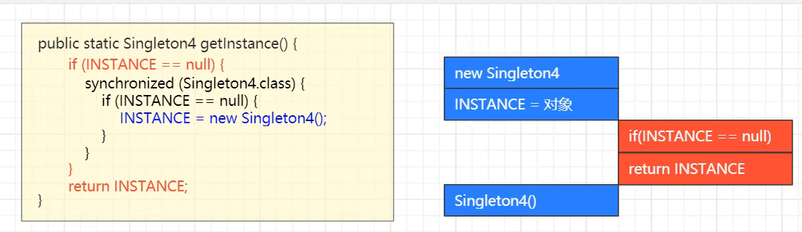
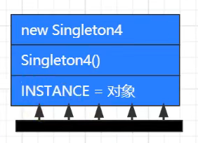

### 软件设计原则

把会变化的部分取出并封装起来，以便以后可以轻易地改动或者扩展此部分，而不影响需要变化的其他部分。

- 对接口编程而不是对实现编程。
- 优先使用对象组合而不是继承。

#### 组合和聚合的区别

聚合中的两种类(或实体)是可以单独存在的,不会相互影响;被关联的一方可以独立于关联一方,依赖性不强。 相反,组合中的两个实体(或者类)是高度依赖于彼此的,它们之间会相互影响。

#### 单一职责原则

一个类只做一种行为

#### 开闭原则

对拓展开放，对修改关闭。

#### 里氏代换原则

任何基类可以出现的地方，子类一定可以出现。子类可以扩展父类的功能。子类继承父类时，除添加新的方法完成新增功能外，尽量不要重写父类的方法。

如果通过重写父类的方法来完成新的功能，这样写起来虽然简单，但是整个继承体系的可复用性会比较差，特别是运用多态比较频繁时，程序运行出错的概率会非常大。

####  依赖倒转原则

高层模块不应该依赖低层模块，两者都应该依赖其抽象；抽象不应该依赖细节，细节应该依赖抽象。简单的说就是要求对抽象进行编程，不要对实现进行编程，这样就降低了客户与实现模块间的耦合。

#### 接口隔离原则

客户端不应该被迫依赖于它不使用的方法；一个类对另一个类的依赖应该建立在最小的接口上。

比如一个类实现一个接口，这个接口有两个方法，类只用得到其中的一个方法，会导致类被迫使用了另一个方法。违背了接口隔离原则。**解决办法：拆分接口，一个功能一个接口**

#### 迪米特  又叫最少知识原则

类似于中介，或者有需要做软件的公司不能直接找到程序员，而是找到软件公司，由软件公司来执行。如果两个软件实体无须直接通信，那么就不应当发生直接的相互调用，可以通过第三方转发该调用。其目的是降低类之间的耦合度，提高模块的相对独立性。

#### 合成复用原则  也就是策略模式

 尽量使用组合或者聚合能关系，其次才考虑使用继承。

通常类的复用分为继承复用和合成复用两种。

继承复用虽然有简单和易实现的优点，但它也存在以下缺点：

1. 继承复用破坏了类的封装性。因为继承会将父类的实现细节暴露给子类，父类对子类是透明的，所以这种复用又称为“白箱”复用。
2. 子类与父类的耦合度高。父类的实现的任何改变都会导致子类的实现发生变化，这不利于类的扩展与维护。
3. 它限制了复用的灵活性。从父类继承而来的实现是静态的，在编译时已经定义，所以在运行时不可能发生变化。


采用组合或聚合复用时，可以将已有对象纳入新对象中，使之成为新对象的一部分，新对象可以调用已有对象的功能，它有以下优点：

1. 它维持了类的封装性。因为成分对象的内部细节是新对象看不见的，所以这种复用又称为“黑箱”复用。
2. 对象间的耦合度低。可以在类的成员位置声明抽象。
3. 复用的灵活性高。这种复用可以在运行时动态进行，新对象可以动态地引用与成分对象类型相同的对象。

### 创建者模式

创建型模式的主要关注点是“怎样创建对象？”，它的主要特点是“将对象的创建与使用分离”。

这样可以降低系统的耦合度，使用者不需要关注对象的创建细节。

创建型模式分为：

* 单例模式
* 工厂方法模式
* 抽象工程模式
* 原型模式
* 建造者模式

## 单例模式五种实现方式

### 1.饿汉式

```java
private Singleton(){}
private static Singleton INSTANCE = null;
public static Singleton getInstance(){
    singleton = new Singleton();
    return singleton;
}
//饿汉式会有线程安全问题吗？
不会，因为是静态变量，是在方法区中完成赋值的，由JVM保证线程安全
```

1. 构造私有
2. 提供一个静态的成员变量
3. 定义一个静态成员方法，getInstance()获取静态的成员变量

只要类一初始化，实例就会被创建。  

- 破坏单例

  - 反射  

    1. 通过Constructor对象 调用getDeclaredConstructor()方法
    2. 再通过constructor.setAccessible(true)让私有的构造方法也可以被使用
    3. 最后通过constructor.newInstance()方法来创建实例

  

##### 怎么避免被反射破坏单例？                    可以进行一个实例的非空判断。

- 反序列化	

##### 怎么避免被反序列化破坏单例？

```java
public Object readsovle(){
    return Instance;
}
```

- Unsafe破坏

​          不可被避免

### 2.枚举饿汉式

定义一个INSTANCE对象即可，不会被反序列化和反射破坏枚举类单例

**饿汉式会有线程安全问题吗？**
不会，因为是静态变量，是在方法区中完成赋值的，由JVM保证线程安全

### 3.懒汉式

较饿汉式多了一个空判断 		非线程安全

```java
private Singleton(){}
private static Singleton INSTANCE = null;
public static Singleton getInstance(){
    if(INSTANCE == null){
        INSTANCE = new Singleton();
    }
    return INSTANCE;
}
```

### 4.DCL懒汉式

```java
private Singleton(){}
private static volatile Singleton INSTANCE = null;//volatile 为了保证有序性
public static Singleton getInstance(){
    if(INSTANCE == null){
        synchronized(Singleton.class){
            if(INSTANCE == null){
                INSTANCE = new Singleton();
            }
        }
    }
    return INSTANCE;
}
为什么要用volatile？
    如下图，蓝色受到互斥保护，但是红色的if同样可以被执行。在蓝色尚未完成构造前，红色直接返回了，此时就会出问题。
```



在对对象赋值操作后加一个内屏屏障，不允许重排序将其他指令放到赋值后面




### 5.内部类懒汉式

静态变量的赋值是在方法区中完成，所以不存在线程安全问题。

符合懒惰加载特征，没用到的时候不会加载创建单例对象。

在静态方法中才会使用到静态内部类中的单例对象。

```java
public class Singleton{
	private Singleton(){}
	private static class SingletonHolder{
        private static final Singleton INSTANCE = new Singleton();
	}
	public static getInstance(){
		return SingletonHolder.INSTANCE;
	}
}
```


##### JDK中哪些地方使用到了单例模式？

- RunTime类中使用到了饿汉式单例实现


- System中使用到了双检锁懒汉式单例实现

## 工厂模式

这种类型的设计模式属于创建型模式

在工厂模式中，我们在创建对象时不会对客户端暴露创建逻辑，并且是通过使用一个共同的接口来指向新创建的对象。

包含如下角色：

```markdown
- 抽象产品：定义了产品的规范，描述产品的主要特性和功能
- 具体产品：实现或者继承抽象产品的子类
- 具体工厂：提供创建产品的方法，调用者通过该方法来获取产品，而不是面向产品
```

**优点：** 1、一个调用者想创建一个对象，只要知道其名称就可以了。 2、扩展性高，如果想增加一个产品，只要扩展一个工厂类就可以。 3、屏蔽产品的具体实现，调用者只关心产品的接口。

**缺点：**每次增加一个产品时，都需要增加一个具体类和对象实现工厂，使得系统中类的个数成倍增加，在一定程度上增加了系统的复杂度，同时也增加了系统具体类的依赖。违背了“开闭原则”

## 抽象工厂模式

抽象工厂模式（Abstract Factory Pattern）是围绕一个超级工厂创建其他工厂。该超级工厂又称为其他工厂的工厂。这种类型的设计模式属于创建型模式

在抽象工厂模式中，接口是负责创建一个相关对象的工厂，不需要显式指定它们的类。每个生成的工厂都能按照工厂模式提供对象。

